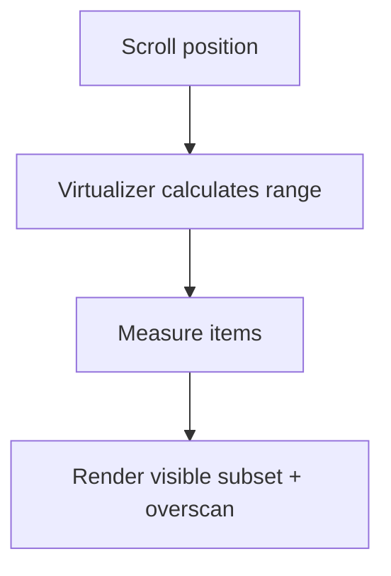

# TanStack Virtual và Các Trường Hợp Phức Tạp

[<- Quay lại Tuần 3 - Infinite Loading và Virtualization](./README.md)

## Vì sao bài này quan trọng

TanStack Virtual linh hoạt hơn cho các use case động, table phức tạp hoặc tích hợp sâu với layout riêng. Nó thiên về headless primitives hơn là component opinionated.

## Điều kiện trước

- Đã học hoặc đọc các khái niệm nền của Infinite Loading và Virtualization.
- Sẵn sàng ghi chú lại trade-off và câu hỏi thực chiến thay vì chỉ ghi nhớ định nghĩa.

## Core concepts

- dynamic measurements
- headless architecture
- scroll math

## Giải thích chi tiết

Phù hợp khi bạn cần kiểm soát behavior nhiều hơn.

Cần hiểu measurement và overscan để tuning tốt.

Tốt cho app có nhiều loại row hoặc container khác nhau.

## Sơ đồ

## Common mistakes

- Nhớ tên khái niệm nhưng không gắn nó với một bài toán sản phẩm cụ thể trong bài “TanStack Virtual và Các Trường Hợp Phức Tạp”.
- Tối ưu hoặc trừu tượng hóa quá sớm trước khi đo, trước khi nhìn rõ boundary và trước khi hiểu cost thật.
- Chỉ học cú pháp mà không mô tả được dòng chảy dữ liệu, trạng thái và trách nhiệm của từng tầng.

## Performance / debugging notes

- Khi debug, hãy luôn hỏi: điều gì kích hoạt thay đổi, điều gì thực sự tốn chi phí, và chi phí đó xảy ra ở client, server hay network.
- Ghi lại giả thuyết trước khi sửa. Sau đó đo lại để biết tối ưu có hiệu quả thật hay chỉ làm code phức tạp hơn.
- Nếu một vấn đề lặp lại nhiều lần, hãy nâng nó thành quy ước kiến trúc hoặc checklist cho dự án sau.

## Bài tập thực hành

1. Tích hợp nội dung của bài “TanStack Virtual và Các Trường Hợp Phức Tạp” vào một vertical slice nhỏ trong một catalog hoặc activity feed có scroll dài và dữ liệu lớn.
2. Liệt kê 3 failure modes hoặc implementation mistakes có thể xảy ra khi dùng “TanStack Virtual và Các Trường Hợp Phức Tạp”, kèm cách phát hiện sớm.
3. Viết một decision note: vì sao “TanStack Virtual và Các Trường Hợp Phức Tạp” nên được đặt ở boundary này thay vì boundary khác trong một catalog hoặc activity feed có scroll dài và dữ liệu lớn?
4. Xác định một cách đo hoặc kiểm chứng để biết việc áp dụng “TanStack Virtual và Các Trường Hợp Phức Tạp” đang mang lại lợi ích thật.

## Gợi ý

- Nên chọn một flow nhỏ nhưng hoàn chỉnh thay vì cố gắn công cụ vào toàn hệ thống.
- Failure mode tốt thường gắn với data inconsistency, performance cost hoặc boundary đặt sai chỗ.
- Measurement có thể là profiler, network timeline, error logs, Lighthouse hoặc checklist hành vi.

## Rubric tự đánh giá

- Có integration task rõ ràng chứ không chỉ mô tả lý thuyết.
- Failure modes và detection strategy thực tế, không hời hợt.
- Decision note nêu rõ trade-off và lý do chọn placement hiện tại.
- Measurement hoặc evidence đủ để kiểm chứng giải pháp.

## Review checklist

- Bạn có thể giải thích được bài “TanStack Virtual và Các Trường Hợp Phức Tạp” bằng ngôn ngữ của riêng mình.
- Bạn biết khái niệm nào là nền tảng, khái niệm nào là optimization, và khái niệm nào là production concern.
- Bạn có thể chỉ ra ít nhất một ví dụ thực tế nơi bài học này tạo khác biệt rõ ràng cho UX hoặc maintainability.

## Further reading / sources

- https://developer.mozilla.org/en-US/docs/Web/API/Intersection_Observer_API
- https://github.com/bvaughn/react-window
- https://tanstack.com/virtual/latest/docs/introduction
