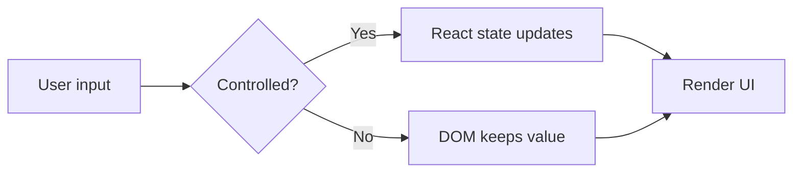

# Controlled vs Uncontrolled Components

[<- Quay lại Tuần 5 - Form Quy Mô Lớn](./README.md)

## Vì sao bài này quan trọng

Controlled input cho phép React giữ nguồn chân lý của dữ liệu; uncontrolled input dựa nhiều hơn vào DOM và refs. Không có lựa chọn nào mặc định thắng tuyệt đối, mà tùy vào mức độ kiểm soát, hiệu năng và tích hợp bạn cần.

## Điều kiện trước

- Đã học hoặc đọc các khái niệm nền của Form Quy Mô Lớn.
- Sẵn sàng ghi chú lại trade-off và câu hỏi thực chiến thay vì chỉ ghi nhớ định nghĩa.

## Core concepts

- input lifecycle
- single source of truth
- DOM state

## Giải thích chi tiết

Controlled mạnh ở validation tức thì và derived UI.

Uncontrolled có thể nhẹ hơn cho một số form lớn hoặc trường file/input native.

Quan trọng là consistency và khả năng bảo trì của toàn hệ thống form.

## Sơ đồ

## Common mistakes

- Nhớ tên khái niệm nhưng không gắn nó với một bài toán sản phẩm cụ thể trong bài “Controlled vs Uncontrolled Components”.
- Tối ưu hoặc trừu tượng hóa quá sớm trước khi đo, trước khi nhìn rõ boundary và trước khi hiểu cost thật.
- Chỉ học cú pháp mà không mô tả được dòng chảy dữ liệu, trạng thái và trách nhiệm của từng tầng.

## Performance / debugging notes

- Khi debug, hãy luôn hỏi: điều gì kích hoạt thay đổi, điều gì thực sự tốn chi phí, và chi phí đó xảy ra ở client, server hay network.
- Ghi lại giả thuyết trước khi sửa. Sau đó đo lại để biết tối ưu có hiệu quả thật hay chỉ làm code phức tạp hơn.
- Nếu một vấn đề lặp lại nhiều lần, hãy nâng nó thành quy ước kiến trúc hoặc checklist cho dự án sau.

## Bài tập thực hành

1. Vẽ lại mental model cho bài “Controlled vs Uncontrolled Components” bằng một sơ đồ của riêng bạn và giải thích lại bằng ngôn ngữ đời thường.
2. Tạo một demo nhỏ hoặc một đoạn code ngắn thể hiện rõ hành vi cốt lõi của “Controlled vs Uncontrolled Components” trong bối cảnh một onboarding hoặc compliance form nhiều bước.
3. Cố tình tạo một bug hoặc một hiểu lầm phổ biến liên quan đến “Controlled vs Uncontrolled Components”, sau đó viết cách bạn sẽ debug nó từng bước.
4. Viết một ghi chú system-design ngắn: nếu áp dụng “Controlled vs Uncontrolled Components” vào một onboarding hoặc compliance form nhiều bước, quyết định kiến trúc nào sẽ bị ảnh hưởng nhiều nhất?

## Gợi ý

- Bắt đầu từ một ví dụ thật nhỏ, đủ để bạn giải thích chính xác nguyên nhân và kết quả.
- Nếu sơ đồ chưa rõ, hãy vẽ thêm inputs, outputs và nơi state/thời điểm thay đổi.
- Trong design note, hãy chỉ ra ít nhất một trade-off giữa đơn giản và tối ưu.

## Rubric tự đánh giá

- Giải thích đúng khái niệm, không chỉ lặp lại định nghĩa.
- Demo hoặc ví dụ thể hiện đúng hành vi trọng tâm của bài.
- Có bug/debug path rõ ràng và reasoning hợp lý.
- Design note chạm tới một quyết định kiến trúc cụ thể, không nói chung chung.

## Review checklist

- Bạn có thể giải thích được bài “Controlled vs Uncontrolled Components” bằng ngôn ngữ của riêng mình.
- Bạn biết khái niệm nào là nền tảng, khái niệm nào là optimization, và khái niệm nào là production concern.
- Bạn có thể chỉ ra ít nhất một ví dụ thực tế nơi bài học này tạo khác biệt rõ ràng cho UX hoặc maintainability.

## Further reading / sources

- https://formik.org/docs/overview
- https://zod.dev/
- https://github.com/jquense/yup
