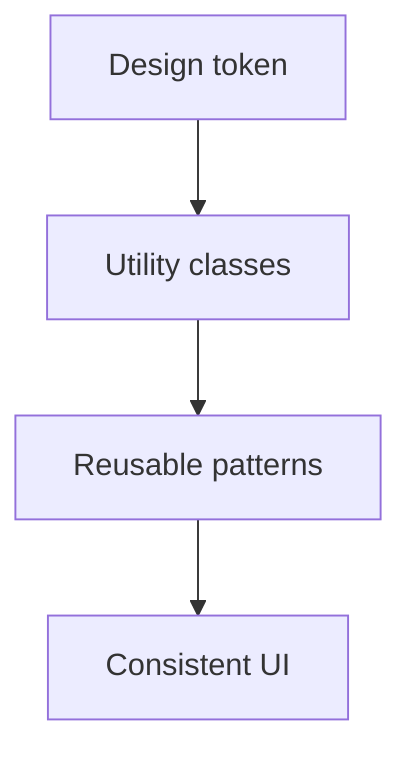

# Sử Dụng TailwindCSS Thực Chiến

[<- Quay lại Tuần 6 - Routing + UI Libraries](./README.md)

## Vì sao bài này quan trọng

Tailwind không chỉ là viết class dài trong JSX. Dùng tốt Tailwind nghĩa là bạn tổ chức spacing, color, typography, variants và component conventions rõ ràng để UI scale được.

## Điều kiện trước

- Đã học hoặc đọc các khái niệm nền của Routing + UI Libraries.
- Sẵn sàng ghi chú lại trade-off và câu hỏi thực chiến thay vì chỉ ghi nhớ định nghĩa.

## Core concepts

- utility classes
- design tokens
- composition

## Giải thích chi tiết

Tailwind mạnh khi đi cùng design tokens và pattern rõ.

Đừng dùng utility class như copy-paste support thôi.

Cần biết lúc nào nên trích component, lúc nào giữ utility tại chỗ.

## Sơ đồ

## Common mistakes

- Nhớ tên khái niệm nhưng không gắn nó với một bài toán sản phẩm cụ thể trong bài “Sử Dụng TailwindCSS Thực Chiến”.
- Tối ưu hoặc trừu tượng hóa quá sớm trước khi đo, trước khi nhìn rõ boundary và trước khi hiểu cost thật.
- Chỉ học cú pháp mà không mô tả được dòng chảy dữ liệu, trạng thái và trách nhiệm của từng tầng.

## Performance / debugging notes

- Khi debug, hãy luôn hỏi: điều gì kích hoạt thay đổi, điều gì thực sự tốn chi phí, và chi phí đó xảy ra ở client, server hay network.
- Ghi lại giả thuyết trước khi sửa. Sau đó đo lại để biết tối ưu có hiệu quả thật hay chỉ làm code phức tạp hơn.
- Nếu một vấn đề lặp lại nhiều lần, hãy nâng nó thành quy ước kiến trúc hoặc checklist cho dự án sau.

## Bài tập thực hành

1. Tích hợp nội dung của bài “Sử Dụng TailwindCSS Thực Chiến” vào một vertical slice nhỏ trong một settings portal có routing, layout và design system nhất quán.
2. Liệt kê 3 failure modes hoặc implementation mistakes có thể xảy ra khi dùng “Sử Dụng TailwindCSS Thực Chiến”, kèm cách phát hiện sớm.
3. Viết một decision note: vì sao “Sử Dụng TailwindCSS Thực Chiến” nên được đặt ở boundary này thay vì boundary khác trong một settings portal có routing, layout và design system nhất quán?
4. Xác định một cách đo hoặc kiểm chứng để biết việc áp dụng “Sử Dụng TailwindCSS Thực Chiến” đang mang lại lợi ích thật.

## Gợi ý

- Nên chọn một flow nhỏ nhưng hoàn chỉnh thay vì cố gắn công cụ vào toàn hệ thống.
- Failure mode tốt thường gắn với data inconsistency, performance cost hoặc boundary đặt sai chỗ.
- Measurement có thể là profiler, network timeline, error logs, Lighthouse hoặc checklist hành vi.

## Rubric tự đánh giá

- Có integration task rõ ràng chứ không chỉ mô tả lý thuyết.
- Failure modes và detection strategy thực tế, không hời hợt.
- Decision note nêu rõ trade-off và lý do chọn placement hiện tại.
- Measurement hoặc evidence đủ để kiểm chứng giải pháp.

## Review checklist

- Bạn có thể giải thích được bài “Sử Dụng TailwindCSS Thực Chiến” bằng ngôn ngữ của riêng mình.
- Bạn biết khái niệm nào là nền tảng, khái niệm nào là optimization, và khái niệm nào là production concern.
- Bạn có thể chỉ ra ít nhất một ví dụ thực tế nơi bài học này tạo khác biệt rõ ràng cho UX hoặc maintainability.

## Further reading / sources

- https://reactrouter.com/home
- https://mui.com/material-ui/getting-started/
- https://www.radix-ui.com/primitives
- https://ui.shadcn.com/docs
- https://tailwindcss.com/docs
- https://developer.mozilla.org/en-US/docs/Web/Accessibility
