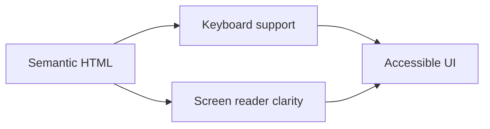

# Nền Tảng HTML Accessibility

[<- Quay lại Tuần 6 - Routing + UI Libraries](./README.md)

## Vì sao bài này quan trọng

Accessibility không phải lớp phủ sau cùng. Nếu HTML semantics, keyboard flow và ARIA fundamentals sai từ đầu, mọi UI polish sau đó đều có thể làm tăng nợ kỹ thuật.

## Điều kiện trước

- Đã học hoặc đọc các khái niệm nền của Routing + UI Libraries.
- Sẵn sàng ghi chú lại trade-off và câu hỏi thực chiến thay vì chỉ ghi nhớ định nghĩa.

## Core concepts

- semantics
- focus management
- screen reader mental model

## Giải thích chi tiết

Dùng element đúng semantics thường hiệu quả hơn thêm ARIA thủ công.

Focus order, visible labels và keyboard operability là nền tảng.

Accessibility tốt thường cũng làm UX tốt hơn cho tất cả người dùng.

## Sơ đồ

## Common mistakes

- Nhớ tên khái niệm nhưng không gắn nó với một bài toán sản phẩm cụ thể trong bài “Nền Tảng HTML Accessibility”.
- Tối ưu hoặc trừu tượng hóa quá sớm trước khi đo, trước khi nhìn rõ boundary và trước khi hiểu cost thật.
- Chỉ học cú pháp mà không mô tả được dòng chảy dữ liệu, trạng thái và trách nhiệm của từng tầng.

## Performance / debugging notes

- Khi debug, hãy luôn hỏi: điều gì kích hoạt thay đổi, điều gì thực sự tốn chi phí, và chi phí đó xảy ra ở client, server hay network.
- Ghi lại giả thuyết trước khi sửa. Sau đó đo lại để biết tối ưu có hiệu quả thật hay chỉ làm code phức tạp hơn.
- Nếu một vấn đề lặp lại nhiều lần, hãy nâng nó thành quy ước kiến trúc hoặc checklist cho dự án sau.

## Bài tập thực hành

1. Vẽ lại mental model cho bài “Nền Tảng HTML Accessibility” bằng một sơ đồ của riêng bạn và giải thích lại bằng ngôn ngữ đời thường.
2. Tạo một demo nhỏ hoặc một đoạn code ngắn thể hiện rõ hành vi cốt lõi của “Nền Tảng HTML Accessibility” trong bối cảnh một settings portal có routing, layout và design system nhất quán.
3. Cố tình tạo một bug hoặc một hiểu lầm phổ biến liên quan đến “Nền Tảng HTML Accessibility”, sau đó viết cách bạn sẽ debug nó từng bước.
4. Viết một ghi chú system-design ngắn: nếu áp dụng “Nền Tảng HTML Accessibility” vào một settings portal có routing, layout và design system nhất quán, quyết định kiến trúc nào sẽ bị ảnh hưởng nhiều nhất?

## Gợi ý

- Bắt đầu từ một ví dụ thật nhỏ, đủ để bạn giải thích chính xác nguyên nhân và kết quả.
- Nếu sơ đồ chưa rõ, hãy vẽ thêm inputs, outputs và nơi state/thời điểm thay đổi.
- Trong design note, hãy chỉ ra ít nhất một trade-off giữa đơn giản và tối ưu.

## Rubric tự đánh giá

- Giải thích đúng khái niệm, không chỉ lặp lại định nghĩa.
- Demo hoặc ví dụ thể hiện đúng hành vi trọng tâm của bài.
- Có bug/debug path rõ ràng và reasoning hợp lý.
- Design note chạm tới một quyết định kiến trúc cụ thể, không nói chung chung.

## Review checklist

- Bạn có thể giải thích được bài “Nền Tảng HTML Accessibility” bằng ngôn ngữ của riêng mình.
- Bạn biết khái niệm nào là nền tảng, khái niệm nào là optimization, và khái niệm nào là production concern.
- Bạn có thể chỉ ra ít nhất một ví dụ thực tế nơi bài học này tạo khác biệt rõ ràng cho UX hoặc maintainability.

## Further reading / sources

- https://reactrouter.com/home
- https://mui.com/material-ui/getting-started/
- https://www.radix-ui.com/primitives
- https://ui.shadcn.com/docs
- https://tailwindcss.com/docs
- https://developer.mozilla.org/en-US/docs/Web/Accessibility
