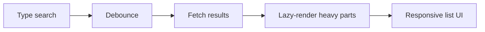

# Thực Hành: Listing Page với Lazy Loading + Debounce

[<- Quay lại Tuần 7 - Tối Ưu Hiệu Năng I](./README.md)

## Vì sao bài này quan trọng

Listing page là nơi nhiều kỹ thuật tối ưu gặp nhau: search, filter, pagination/infinite loading, code split, debounce và skeleton states. Đây là bài thực hành cực sát với SaaS dashboards và storefronts.

## Điều kiện trước

- Đã học hoặc đọc các khái niệm nền của Tối Ưu Hiệu Năng I.
- Sẵn sàng ghi chú lại trade-off và câu hỏi thực chiến thay vì chỉ ghi nhớ định nghĩa.

## Core concepts

- search UX
- filters
- progressive data loading

## Giải thích chi tiết

Nên thêm search box, filters, empty state và sort.

Đo perceived performance khi gõ tìm kiếm nhanh.

Ghi chú đâu là optimization do network, đâu là optimization do rendering.

## Sơ đồ



## Code ví dụ

```tsx
import { lazy, Suspense } from "react";

const ChartPanel = lazy(() => import("./ChartPanel"));

export function Dashboard() {
  return (
    <Suspense fallback={<p>Dang tai bieu do...</p>}>
      <ChartPanel />
    </Suspense>
  );
}
```

## Common mistakes

- Nhớ tên khái niệm nhưng không gắn nó với một bài toán sản phẩm cụ thể trong bài “Thực Hành: Listing Page với Lazy Loading + Debounce”.
- Tối ưu hoặc trừu tượng hóa quá sớm trước khi đo, trước khi nhìn rõ boundary và trước khi hiểu cost thật.
- Chỉ học cú pháp mà không mô tả được dòng chảy dữ liệu, trạng thái và trách nhiệm của từng tầng.

## Performance / debugging notes

- Khi debug, hãy luôn hỏi: điều gì kích hoạt thay đổi, điều gì thực sự tốn chi phí, và chi phí đó xảy ra ở client, server hay network.
- Ghi lại giả thuyết trước khi sửa. Sau đó đo lại để biết tối ưu có hiệu quả thật hay chỉ làm code phức tạp hơn.
- Nếu một vấn đề lặp lại nhiều lần, hãy nâng nó thành quy ước kiến trúc hoặc checklist cho dự án sau.

## Bài tập thực hành

1. Xây một phiên bản áp dụng của bài “Thực Hành: Listing Page với Lazy Loading + Debounce” trong bối cảnh một listing/search experience cần nhanh dưới tải tương tác liên tục.
2. Chốt scope, user flow và tiêu chí hoàn thành trước khi code.
3. Tạo ít nhất một artifact hệ thống như route map, data flow diagram, component boundary map hoặc cache plan.
4. Viết retrospective ngắn: điều gì khó nhất, điều gì sẽ làm khác nếu build lại, và trade-off nào bạn chấp nhận.

## Deliverables cần nộp

- Một prototype hoặc flow chạy được ở mức tối thiểu.
- Ít nhất một sơ đồ hoặc tài liệu kiến trúc đi kèm.
- Một checklist acceptance criteria do chính bạn tự định nghĩa và tự đánh giá.

## Gợi ý

- Bắt đầu bằng happy path nhỏ nhất nhưng thật sự chạy được.
- Nếu bài có nhiều phần, chọn 1-2 flow cốt lõi rồi làm sâu thay vì làm rộng.
- Artifact hệ thống nên đủ rõ để người khác đọc và tiếp tục build.

## Rubric tự đánh giá

- Scope thực hành rõ và có thể kiểm chứng.
- Artifact hệ thống không chỉ là phụ lục mà thực sự hỗ trợ reasoning.
- Bài làm cho thấy bạn hiểu trade-off chứ không chỉ ghép feature.
- Retrospective phản ánh được quyết định kỹ thuật có ý nghĩa.

## Review checklist

- Bạn có thể giải thích được bài “Thực Hành: Listing Page với Lazy Loading + Debounce” bằng ngôn ngữ của riêng mình.
- Bạn biết khái niệm nào là nền tảng, khái niệm nào là optimization, và khái niệm nào là production concern.
- Bạn có thể chỉ ra ít nhất một ví dụ thực tế nơi bài học này tạo khác biệt rõ ràng cho UX hoặc maintainability.

## Further reading / sources

- https://developer.mozilla.org/en-US/docs/Web/Performance
- https://react.dev/reference/react/lazy
- https://vite.dev/guide/
- https://webpack.js.org/concepts/
