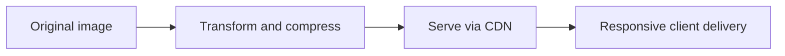

# Tối Ưu Hình Ảnh Theo Góc Nhìn CDN

[<- Quay lại Tuần 8 - Tối Ưu Hiệu Năng II + Dự Án Cuối](./README.md)

## Vì sao bài này quan trọng

Ảnh lớn, nhiều và tải sai kích thước có thể phá hỏng mọi nỗ lực tối ưu JavaScript. Cần nghĩ về format, responsive sizes, lazy loading và CDN delivery như một pipeline hoàn chỉnh.

## Điều kiện trước

- Đã học hoặc đọc các khái niệm nền của Tối Ưu Hiệu Năng II + Dự Án Cuối.
- Sẵn sàng ghi chú lại trade-off và câu hỏi thực chiến thay vì chỉ ghi nhớ định nghĩa.

## Core concepts

- responsive images
- formats
- delivery strategy

## Giải thích chi tiết

Đúng kích thước quan trọng hơn chỉ đổi format.

CDN giúp giảm latency và tối ưu caching.

Image placeholders và priority cần dùng có chủ đích.

## Sơ đồ

## Common mistakes

- Nhớ tên khái niệm nhưng không gắn nó với một bài toán sản phẩm cụ thể trong bài “Tối Ưu Hình Ảnh Theo Góc Nhìn CDN”.
- Tối ưu hoặc trừu tượng hóa quá sớm trước khi đo, trước khi nhìn rõ boundary và trước khi hiểu cost thật.
- Chỉ học cú pháp mà không mô tả được dòng chảy dữ liệu, trạng thái và trách nhiệm của từng tầng.

## Performance / debugging notes

- Khi debug, hãy luôn hỏi: điều gì kích hoạt thay đổi, điều gì thực sự tốn chi phí, và chi phí đó xảy ra ở client, server hay network.
- Ghi lại giả thuyết trước khi sửa. Sau đó đo lại để biết tối ưu có hiệu quả thật hay chỉ làm code phức tạp hơn.
- Nếu một vấn đề lặp lại nhiều lần, hãy nâng nó thành quy ước kiến trúc hoặc checklist cho dự án sau.

## Bài tập thực hành

1. Tích hợp nội dung của bài “Tối Ưu Hình Ảnh Theo Góc Nhìn CDN” vào một vertical slice nhỏ trong một analytics app dữ liệu lớn có performance budget rõ ràng.
2. Liệt kê 3 failure modes hoặc implementation mistakes có thể xảy ra khi dùng “Tối Ưu Hình Ảnh Theo Góc Nhìn CDN”, kèm cách phát hiện sớm.
3. Viết một decision note: vì sao “Tối Ưu Hình Ảnh Theo Góc Nhìn CDN” nên được đặt ở boundary này thay vì boundary khác trong một analytics app dữ liệu lớn có performance budget rõ ràng?
4. Xác định một cách đo hoặc kiểm chứng để biết việc áp dụng “Tối Ưu Hình Ảnh Theo Góc Nhìn CDN” đang mang lại lợi ích thật.

## Gợi ý

- Nên chọn một flow nhỏ nhưng hoàn chỉnh thay vì cố gắn công cụ vào toàn hệ thống.
- Failure mode tốt thường gắn với data inconsistency, performance cost hoặc boundary đặt sai chỗ.
- Measurement có thể là profiler, network timeline, error logs, Lighthouse hoặc checklist hành vi.

## Rubric tự đánh giá

- Có integration task rõ ràng chứ không chỉ mô tả lý thuyết.
- Failure modes và detection strategy thực tế, không hời hợt.
- Decision note nêu rõ trade-off và lý do chọn placement hiện tại.
- Measurement hoặc evidence đủ để kiểm chứng giải pháp.

## Review checklist

- Bạn có thể giải thích được bài “Tối Ưu Hình Ảnh Theo Góc Nhìn CDN” bằng ngôn ngữ của riêng mình.
- Bạn biết khái niệm nào là nền tảng, khái niệm nào là optimization, và khái niệm nào là production concern.
- Bạn có thể chỉ ra ít nhất một ví dụ thực tế nơi bài học này tạo khác biệt rõ ràng cho UX hoặc maintainability.

## Further reading / sources

- https://react.dev/reference/react-dom/client/hydrateRoot
- https://developer.chrome.com/docs/lighthouse/overview
- https://vite.dev/guide/
- https://webpack.js.org/concepts/
- https://rspack.dev/guide/start/introduction
