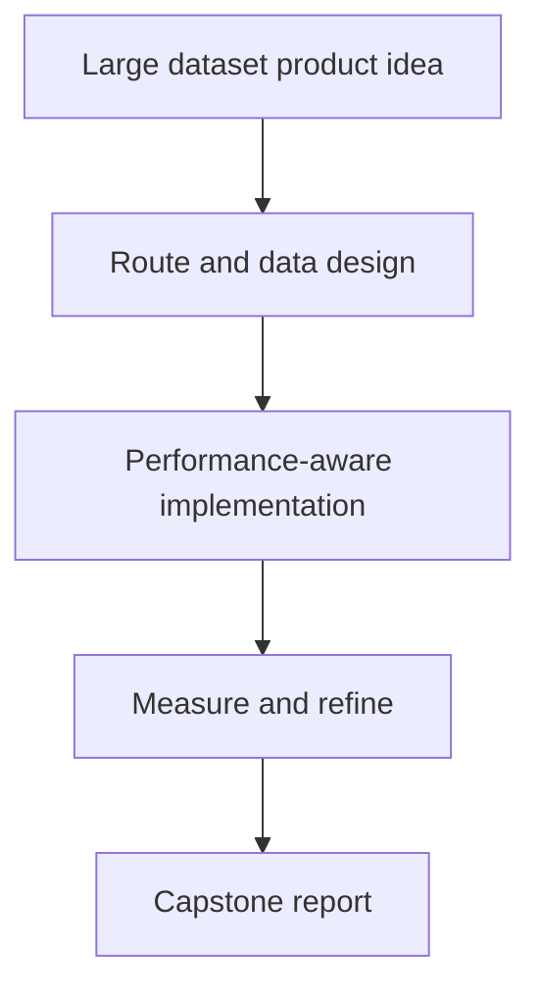

# Dự Án Cuối: App Dữ Liệu Lớn và Bundle Tối Ưu

[<- Quay lại Tuần 8 - Tối Ưu Hiệu Năng II + Dự Án Cuối](./README.md)

## Vì sao bài này quan trọng

Final project cần gom tất cả kiến thức từ tuần 1-8: rendering cost, list virtualization, caching, routing, forms, code splitting và asset optimization. Đây không chỉ là bài làm cho đẹp, mà là proof bạn có thể reason như một frontend engineer production.

## Điều kiện trước

- Đã học hoặc đọc các khái niệm nền của Tối Ưu Hiệu Năng II + Dự Án Cuối.
- Sẵn sàng ghi chú lại trade-off và câu hỏi thực chiến thay vì chỉ ghi nhớ định nghĩa.

## Core concepts

- large datasets
- performance architecture
- shipping strategy

## Giải thích chi tiết

Nên chọn domain có data nhiều: analytics, CRM, inventory, log viewer hoặc billing.

Thiết kế route map, data loading strategy và performance checklist trước khi code.

Báo cáo cuối nên có cả quyết định kiến trúc và số đo trước-sau nếu có.

## Sơ đồ

## Common mistakes

- Nhớ tên khái niệm nhưng không gắn nó với một bài toán sản phẩm cụ thể trong bài “Dự Án Cuối: App Dữ Liệu Lớn và Bundle Tối Ưu”.
- Tối ưu hoặc trừu tượng hóa quá sớm trước khi đo, trước khi nhìn rõ boundary và trước khi hiểu cost thật.
- Chỉ học cú pháp mà không mô tả được dòng chảy dữ liệu, trạng thái và trách nhiệm của từng tầng.

## Performance / debugging notes

- Khi debug, hãy luôn hỏi: điều gì kích hoạt thay đổi, điều gì thực sự tốn chi phí, và chi phí đó xảy ra ở client, server hay network.
- Ghi lại giả thuyết trước khi sửa. Sau đó đo lại để biết tối ưu có hiệu quả thật hay chỉ làm code phức tạp hơn.
- Nếu một vấn đề lặp lại nhiều lần, hãy nâng nó thành quy ước kiến trúc hoặc checklist cho dự án sau.

## Bài tập thực hành

1. Chọn một domain cụ thể như analytics, CRM, inventory, billing hoặc log viewer và viết product brief ngắn: người dùng là ai, họ cần làm gì, đâu là 2-3 flow quan trọng nhất.
2. Thiết kế route map, data loading strategy, component boundary diagram và performance budget cho ứng dụng đó.
3. Hiện thực hoặc mô phỏng ít nhất một vertical slice có dữ liệu lớn, rồi profile để xác định bottleneck chính.
4. Viết capstone report: baseline, vấn đề phát hiện được, tối ưu đã làm, trade-off đã chấp nhận, và việc gì sẽ làm tiếp nếu có thêm 1 tuần.

## Deliverables cần nộp

- Route map và flow map cho 2-3 màn hình quan trọng.
- Data loading plan và performance checklist.
- Ít nhất một measurement artifact: profiler note, Lighthouse note, bundle note hoặc video so sánh trước-sau.
- Capstone report từ 1-2 trang hoặc tương đương.

## Gợi ý

- Hãy chọn phạm vi đủ nhỏ để đo được, đủ lớn để có lý do tối ưu.
- Ưu tiên tối ưu một vấn đề thật rõ hơn là rải optimization khắp nơi.
- Nếu thiếu thời gian, hãy làm sâu một big list hoặc một heavy panel với evidence rõ ràng.

## Rubric tự đánh giá

- Có product scope rõ ràng và performance risk được nhận diện đúng.
- Route/data/component boundaries có logic rõ.
- Có evidence thực tế cho ít nhất một quyết định tối ưu.
- Capstone report giúp người đọc hiểu được tại sao app nhanh hơn hoặc ổn định hơn.

## Review checklist

- Bạn có thể giải thích được bài “Dự Án Cuối: App Dữ Liệu Lớn và Bundle Tối Ưu” bằng ngôn ngữ của riêng mình.
- Bạn biết khái niệm nào là nền tảng, khái niệm nào là optimization, và khái niệm nào là production concern.
- Bạn có thể chỉ ra ít nhất một ví dụ thực tế nơi bài học này tạo khác biệt rõ ràng cho UX hoặc maintainability.

## Further reading / sources

- https://react.dev/reference/react-dom/client/hydrateRoot
- https://developer.chrome.com/docs/lighthouse/overview
- https://vite.dev/guide/
- https://webpack.js.org/concepts/
- https://rspack.dev/guide/start/introduction
