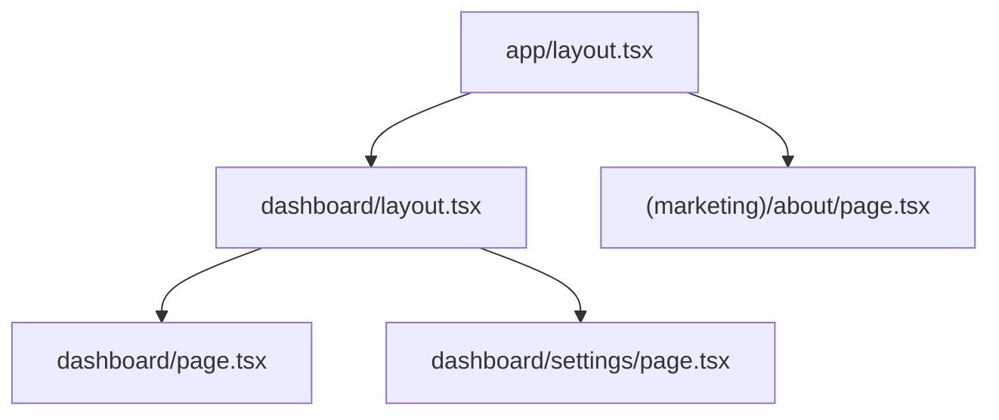

# Nền Tảng App Router

[<- Quay lại Tuần 9 - Next.js Foundations](./README.md)

## Vì sao bài này quan trọng

App Router là xương sống của Next.js hiện đại. Nó dùng file-system routing nhưng điều quan trọng hơn là cách nó tổ chức UI hierarchy, shared layouts và route-specific behavior.

## Điều kiện trước

- Biết các khái niệm JavaScript và frontend cơ bản.
- Sẵn sàng ghi chú lại trade-off và câu hỏi thực chiến thay vì chỉ ghi nhớ định nghĩa.

## Core concepts

- segments
- layouts
- templates
- route groups

## Giải thích chi tiết

`layout.tsx` giữ shared UI ổn định qua navigation.

`template.tsx` hữu ích khi cần remount behavior.

Route groups giúp tách kiến trúc mà không đổi URL.

## Sơ đồ



## Code ví dụ

```tsx
// app/dashboard/layout.tsx
export default function DashboardLayout({ children }: { children: React.ReactNode }) {
  return (
    <div className="grid min-h-screen grid-cols-[240px_1fr]">
      <aside>Sidebar</aside>
      <main>{children}</main>
    </div>
  );
}
```

## Common mistakes

- Nhớ tên khái niệm nhưng không gắn nó với một bài toán sản phẩm cụ thể trong bài “Nền Tảng App Router”.
- Tối ưu hoặc trừu tượng hóa quá sớm trước khi đo, trước khi nhìn rõ boundary và trước khi hiểu cost thật.
- Chỉ học cú pháp mà không mô tả được dòng chảy dữ liệu, trạng thái và trách nhiệm của từng tầng.

## Performance / debugging notes

- Khi debug, hãy luôn hỏi: điều gì kích hoạt thay đổi, điều gì thực sự tốn chi phí, và chi phí đó xảy ra ở client, server hay network.
- Ghi lại giả thuyết trước khi sửa. Sau đó đo lại để biết tối ưu có hiệu quả thật hay chỉ làm code phức tạp hơn.
- Nếu một vấn đề lặp lại nhiều lần, hãy nâng nó thành quy ước kiến trúc hoặc checklist cho dự án sau.

## Bài tập thực hành

1. Tích hợp nội dung của bài “Nền Tảng App Router” vào một vertical slice nhỏ trong một Next.js dashboard shell cho SaaS product.
2. Liệt kê 3 failure modes hoặc implementation mistakes có thể xảy ra khi dùng “Nền Tảng App Router”, kèm cách phát hiện sớm.
3. Viết một decision note: vì sao “Nền Tảng App Router” nên được đặt ở boundary này thay vì boundary khác trong một Next.js dashboard shell cho SaaS product?
4. Xác định một cách đo hoặc kiểm chứng để biết việc áp dụng “Nền Tảng App Router” đang mang lại lợi ích thật.

## Gợi ý

- Nên chọn một flow nhỏ nhưng hoàn chỉnh thay vì cố gắn công cụ vào toàn hệ thống.
- Failure mode tốt thường gắn với data inconsistency, performance cost hoặc boundary đặt sai chỗ.
- Measurement có thể là profiler, network timeline, error logs, Lighthouse hoặc checklist hành vi.

## Rubric tự đánh giá

- Có integration task rõ ràng chứ không chỉ mô tả lý thuyết.
- Failure modes và detection strategy thực tế, không hời hợt.
- Decision note nêu rõ trade-off và lý do chọn placement hiện tại.
- Measurement hoặc evidence đủ để kiểm chứng giải pháp.

## Review checklist

- Bạn có thể giải thích được bài “Nền Tảng App Router” bằng ngôn ngữ của riêng mình.
- Bạn biết khái niệm nào là nền tảng, khái niệm nào là optimization, và khái niệm nào là production concern.
- Bạn có thể chỉ ra ít nhất một ví dụ thực tế nơi bài học này tạo khác biệt rõ ràng cho UX hoặc maintainability.

## Further reading / sources

- https://nextjs.org/docs/app
- https://nextjs.org/docs/app/getting-started/project-structure
- https://react.dev/reference/rsc/server-components
