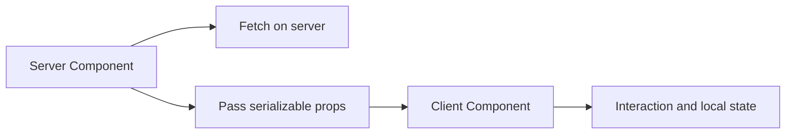

# Server Components vs Client Components

[<- Quay lại Tuần 9 - Next.js Foundations](./README.md)

## Vì sao bài này quan trọng

Trong App Router, component mặc định là server-first. Điều này đảo ngược thói quen SPA truyền thống và buộc bạn nghĩ rõ phần nào thật sự cần browser interactivity.

## Điều kiện trước

- Biết các khái niệm JavaScript và frontend cơ bản.
- Sẵn sàng ghi chú lại trade-off và câu hỏi thực chiến thay vì chỉ ghi nhớ định nghĩa.

## Core concepts

- boundary design
- serialization
- bundle impact

## Giải thích chi tiết

Server Components tốt cho data rendering và giảm client bundle.

Client Components dành cho state local, browser APIs và interactivity.

Boundary nhỏ và rõ sẽ giúp hiệu năng và maintainability cùng tốt.

## Sơ đồ



## Code ví dụ

```tsx
// app/dashboard/page.tsx
import SearchBox from "./search-box";

export default async function DashboardPage() {
  const data = await fetch("https://api.example.com/stats").then((r) => r.json());
  return (
    <section>
      <pre>{JSON.stringify(data, null, 2)}</pre>
      <SearchBox />
    </section>
  );
}
```

## Common mistakes

- Nhớ tên khái niệm nhưng không gắn nó với một bài toán sản phẩm cụ thể trong bài “Server Components vs Client Components”.
- Tối ưu hoặc trừu tượng hóa quá sớm trước khi đo, trước khi nhìn rõ boundary và trước khi hiểu cost thật.
- Chỉ học cú pháp mà không mô tả được dòng chảy dữ liệu, trạng thái và trách nhiệm của từng tầng.

## Performance / debugging notes

- Khi debug, hãy luôn hỏi: điều gì kích hoạt thay đổi, điều gì thực sự tốn chi phí, và chi phí đó xảy ra ở client, server hay network.
- Ghi lại giả thuyết trước khi sửa. Sau đó đo lại để biết tối ưu có hiệu quả thật hay chỉ làm code phức tạp hơn.
- Nếu một vấn đề lặp lại nhiều lần, hãy nâng nó thành quy ước kiến trúc hoặc checklist cho dự án sau.

## Bài tập thực hành

1. Vẽ lại mental model cho bài “Server Components vs Client Components” bằng một sơ đồ của riêng bạn và giải thích lại bằng ngôn ngữ đời thường.
2. Tạo một demo nhỏ hoặc một đoạn code ngắn thể hiện rõ hành vi cốt lõi của “Server Components vs Client Components” trong bối cảnh một Next.js dashboard shell cho SaaS product.
3. Cố tình tạo một bug hoặc một hiểu lầm phổ biến liên quan đến “Server Components vs Client Components”, sau đó viết cách bạn sẽ debug nó từng bước.
4. Viết một ghi chú system-design ngắn: nếu áp dụng “Server Components vs Client Components” vào một Next.js dashboard shell cho SaaS product, quyết định kiến trúc nào sẽ bị ảnh hưởng nhiều nhất?

## Gợi ý

- Bắt đầu từ một ví dụ thật nhỏ, đủ để bạn giải thích chính xác nguyên nhân và kết quả.
- Nếu sơ đồ chưa rõ, hãy vẽ thêm inputs, outputs và nơi state/thời điểm thay đổi.
- Trong design note, hãy chỉ ra ít nhất một trade-off giữa đơn giản và tối ưu.

## Rubric tự đánh giá

- Giải thích đúng khái niệm, không chỉ lặp lại định nghĩa.
- Demo hoặc ví dụ thể hiện đúng hành vi trọng tâm của bài.
- Có bug/debug path rõ ràng và reasoning hợp lý.
- Design note chạm tới một quyết định kiến trúc cụ thể, không nói chung chung.

## Review checklist

- Bạn có thể giải thích được bài “Server Components vs Client Components” bằng ngôn ngữ của riêng mình.
- Bạn biết khái niệm nào là nền tảng, khái niệm nào là optimization, và khái niệm nào là production concern.
- Bạn có thể chỉ ra ít nhất một ví dụ thực tế nơi bài học này tạo khác biệt rõ ràng cho UX hoặc maintainability.

## Further reading / sources

- https://nextjs.org/docs/app
- https://nextjs.org/docs/app/getting-started/project-structure
- https://react.dev/reference/rsc/server-components
