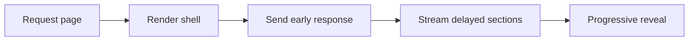

# Streaming và Suspense Với App Router

[<- Quay lại Tuần 10 - Data Fetching và Rendering trong Next.js](./README.md)

## Vì sao bài này quan trọng

Streaming cho phép người dùng thấy phần UI sẵn sàng trước khi toàn bộ trang hoàn tất. Suspense là công cụ chia nhỏ boundary loading để perceived performance cao hơn.

## Điều kiện trước

- Đã học hoặc đọc các khái niệm nền của Data Fetching và Rendering trong Next.js.
- Sẵn sàng ghi chú lại trade-off và câu hỏi thực chiến thay vì chỉ ghi nhớ định nghĩa.

## Core concepts

- progressive rendering
- fallback design
- route composition

## Giải thích chi tiết

Một boundary tốt giúp route có nhịp tải tự nhiên hơn.

Fallback nên mô phỏng bố cục thật để tránh layout jump.

Streaming có ích nhất ở trang có dữ liệu nhiều nguồn hoặc latency chênh nhau.

## Sơ đồ

## Common mistakes

- Nhớ tên khái niệm nhưng không gắn nó với một bài toán sản phẩm cụ thể trong bài “Streaming và Suspense Với App Router”.
- Tối ưu hoặc trừu tượng hóa quá sớm trước khi đo, trước khi nhìn rõ boundary và trước khi hiểu cost thật.
- Chỉ học cú pháp mà không mô tả được dòng chảy dữ liệu, trạng thái và trách nhiệm của từng tầng.

## Performance / debugging notes

- Khi debug, hãy luôn hỏi: điều gì kích hoạt thay đổi, điều gì thực sự tốn chi phí, và chi phí đó xảy ra ở client, server hay network.
- Ghi lại giả thuyết trước khi sửa. Sau đó đo lại để biết tối ưu có hiệu quả thật hay chỉ làm code phức tạp hơn.
- Nếu một vấn đề lặp lại nhiều lần, hãy nâng nó thành quy ước kiến trúc hoặc checklist cho dự án sau.

## Bài tập thực hành

1. Tích hợp nội dung của bài “Streaming và Suspense Với App Router” vào một vertical slice nhỏ trong một operations dashboard dùng App Router cho data reads và writes.
2. Liệt kê 3 failure modes hoặc implementation mistakes có thể xảy ra khi dùng “Streaming và Suspense Với App Router”, kèm cách phát hiện sớm.
3. Viết một decision note: vì sao “Streaming và Suspense Với App Router” nên được đặt ở boundary này thay vì boundary khác trong một operations dashboard dùng App Router cho data reads và writes?
4. Xác định một cách đo hoặc kiểm chứng để biết việc áp dụng “Streaming và Suspense Với App Router” đang mang lại lợi ích thật.

## Gợi ý

- Nên chọn một flow nhỏ nhưng hoàn chỉnh thay vì cố gắn công cụ vào toàn hệ thống.
- Failure mode tốt thường gắn với data inconsistency, performance cost hoặc boundary đặt sai chỗ.
- Measurement có thể là profiler, network timeline, error logs, Lighthouse hoặc checklist hành vi.

## Rubric tự đánh giá

- Có integration task rõ ràng chứ không chỉ mô tả lý thuyết.
- Failure modes và detection strategy thực tế, không hời hợt.
- Decision note nêu rõ trade-off và lý do chọn placement hiện tại.
- Measurement hoặc evidence đủ để kiểm chứng giải pháp.

## Review checklist

- Bạn có thể giải thích được bài “Streaming và Suspense Với App Router” bằng ngôn ngữ của riêng mình.
- Bạn biết khái niệm nào là nền tảng, khái niệm nào là optimization, và khái niệm nào là production concern.
- Bạn có thể chỉ ra ít nhất một ví dụ thực tế nơi bài học này tạo khác biệt rõ ràng cho UX hoặc maintainability.

## Further reading / sources

- https://nextjs.org/docs/app/getting-started/caching-and-revalidating
- https://nextjs.org/docs/app/building-your-application/data-fetching
- https://react.dev/reference/react/Suspense
