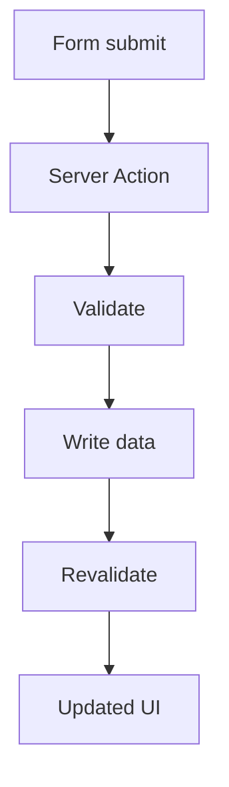

# Server Actions Cho Mutation và Form Handling

[<- Quay lại Tuần 10 - Data Fetching và Rendering trong Next.js](./README.md)

## Vì sao bài này quan trọng

Server Actions giúp bạn đặt mutation gần UI hơn nhưng vẫn chạy ở server boundary. Điều này đặc biệt mạnh cho form-heavy workflows miễn là bạn vẫn giữ validation, error handling và invalidation rõ ràng.

## Điều kiện trước

- Đã học hoặc đọc các khái niệm nền của Data Fetching và Rendering trong Next.js.
- Sẵn sàng ghi chú lại trade-off và câu hỏi thực chiến thay vì chỉ ghi nhớ định nghĩa.

## Core concepts

- server mutation
- form action
- cache invalidation

## Giải thích chi tiết

Server Actions không thay thế hoàn toàn Route Handlers hay API routes.

Validation server-side là bắt buộc.

Mỗi mutation nên chỉ rõ đường đi từ form đến cache refresh.

## Sơ đồ



## Code ví dụ

```tsx
async function createInvoice(formData: FormData) {
  "use server";
  const amount = formData.get("amount");
  // validate, write, revalidate
}

export default function Page() {
  return <form action={createInvoice}>{/* fields */}</form>;
}
```

## Common mistakes

- Nhớ tên khái niệm nhưng không gắn nó với một bài toán sản phẩm cụ thể trong bài “Server Actions Cho Mutation và Form Handling”.
- Tối ưu hoặc trừu tượng hóa quá sớm trước khi đo, trước khi nhìn rõ boundary và trước khi hiểu cost thật.
- Chỉ học cú pháp mà không mô tả được dòng chảy dữ liệu, trạng thái và trách nhiệm của từng tầng.

## Performance / debugging notes

- Khi debug, hãy luôn hỏi: điều gì kích hoạt thay đổi, điều gì thực sự tốn chi phí, và chi phí đó xảy ra ở client, server hay network.
- Ghi lại giả thuyết trước khi sửa. Sau đó đo lại để biết tối ưu có hiệu quả thật hay chỉ làm code phức tạp hơn.
- Nếu một vấn đề lặp lại nhiều lần, hãy nâng nó thành quy ước kiến trúc hoặc checklist cho dự án sau.

## Bài tập thực hành

1. Tích hợp nội dung của bài “Server Actions Cho Mutation và Form Handling” vào một vertical slice nhỏ trong một operations dashboard dùng App Router cho data reads và writes.
2. Liệt kê 3 failure modes hoặc implementation mistakes có thể xảy ra khi dùng “Server Actions Cho Mutation và Form Handling”, kèm cách phát hiện sớm.
3. Viết một decision note: vì sao “Server Actions Cho Mutation và Form Handling” nên được đặt ở boundary này thay vì boundary khác trong một operations dashboard dùng App Router cho data reads và writes?
4. Xác định một cách đo hoặc kiểm chứng để biết việc áp dụng “Server Actions Cho Mutation và Form Handling” đang mang lại lợi ích thật.

## Gợi ý

- Nên chọn một flow nhỏ nhưng hoàn chỉnh thay vì cố gắn công cụ vào toàn hệ thống.
- Failure mode tốt thường gắn với data inconsistency, performance cost hoặc boundary đặt sai chỗ.
- Measurement có thể là profiler, network timeline, error logs, Lighthouse hoặc checklist hành vi.

## Rubric tự đánh giá

- Có integration task rõ ràng chứ không chỉ mô tả lý thuyết.
- Failure modes và detection strategy thực tế, không hời hợt.
- Decision note nêu rõ trade-off và lý do chọn placement hiện tại.
- Measurement hoặc evidence đủ để kiểm chứng giải pháp.

## Review checklist

- Bạn có thể giải thích được bài “Server Actions Cho Mutation và Form Handling” bằng ngôn ngữ của riêng mình.
- Bạn biết khái niệm nào là nền tảng, khái niệm nào là optimization, và khái niệm nào là production concern.
- Bạn có thể chỉ ra ít nhất một ví dụ thực tế nơi bài học này tạo khác biệt rõ ràng cho UX hoặc maintainability.

## Further reading / sources

- https://nextjs.org/docs/app/getting-started/caching-and-revalidating
- https://nextjs.org/docs/app/building-your-application/data-fetching
- https://react.dev/reference/react/Suspense
