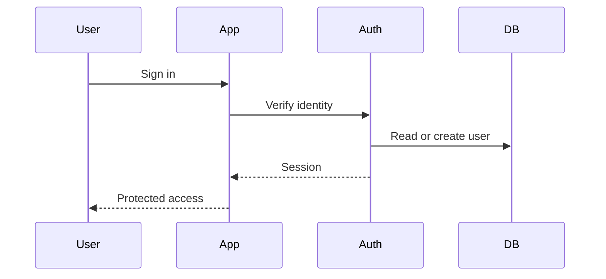

# Authentication và Sessions Với Auth.js

[<- Quay lại Tuần 11 - Auth, Database và System Flows](./README.md)

## Vì sao bài này quan trọng

Auth là cửa vào của toàn hệ thống. Nếu thiết kế session, guards và role model mơ hồ, mọi phần data access về sau sẽ chồng chéo và dễ tạo lỗ hổng.

## Điều kiện trước

- Đã học hoặc đọc các khái niệm nền của Auth, Database và System Flows.
- Sẵn sàng ghi chú lại trade-off và câu hỏi thực chiến thay vì chỉ ghi nhớ định nghĩa.

## Core concepts

- identity model
- session storage
- route protection

## Giải thích chi tiết

Cần phân biệt authentication và authorization.

Route protection phải sống ở server boundary đáng tin cậy.

Session strategy nên phản ánh loại sản phẩm và mức độ mở rộng mong muốn.

## Sơ đồ

## Common mistakes

- Nhớ tên khái niệm nhưng không gắn nó với một bài toán sản phẩm cụ thể trong bài “Authentication và Sessions Với Auth.js”.
- Tối ưu hoặc trừu tượng hóa quá sớm trước khi đo, trước khi nhìn rõ boundary và trước khi hiểu cost thật.
- Chỉ học cú pháp mà không mô tả được dòng chảy dữ liệu, trạng thái và trách nhiệm của từng tầng.

## Performance / debugging notes

- Khi debug, hãy luôn hỏi: điều gì kích hoạt thay đổi, điều gì thực sự tốn chi phí, và chi phí đó xảy ra ở client, server hay network.
- Ghi lại giả thuyết trước khi sửa. Sau đó đo lại để biết tối ưu có hiệu quả thật hay chỉ làm code phức tạp hơn.
- Nếu một vấn đề lặp lại nhiều lần, hãy nâng nó thành quy ước kiến trúc hoặc checklist cho dự án sau.

## Bài tập thực hành

1. Tích hợp nội dung của bài “Authentication và Sessions Với Auth.js” vào một vertical slice nhỏ trong một SaaS workspace có auth, database và async workflows.
2. Liệt kê 3 failure modes hoặc implementation mistakes có thể xảy ra khi dùng “Authentication và Sessions Với Auth.js”, kèm cách phát hiện sớm.
3. Viết một decision note: vì sao “Authentication và Sessions Với Auth.js” nên được đặt ở boundary này thay vì boundary khác trong một SaaS workspace có auth, database và async workflows?
4. Xác định một cách đo hoặc kiểm chứng để biết việc áp dụng “Authentication và Sessions Với Auth.js” đang mang lại lợi ích thật.

## Gợi ý

- Nên chọn một flow nhỏ nhưng hoàn chỉnh thay vì cố gắn công cụ vào toàn hệ thống.
- Failure mode tốt thường gắn với data inconsistency, performance cost hoặc boundary đặt sai chỗ.
- Measurement có thể là profiler, network timeline, error logs, Lighthouse hoặc checklist hành vi.

## Rubric tự đánh giá

- Có integration task rõ ràng chứ không chỉ mô tả lý thuyết.
- Failure modes và detection strategy thực tế, không hời hợt.
- Decision note nêu rõ trade-off và lý do chọn placement hiện tại.
- Measurement hoặc evidence đủ để kiểm chứng giải pháp.

## Review checklist

- Bạn có thể giải thích được bài “Authentication và Sessions Với Auth.js” bằng ngôn ngữ của riêng mình.
- Bạn biết khái niệm nào là nền tảng, khái niệm nào là optimization, và khái niệm nào là production concern.
- Bạn có thể chỉ ra ít nhất một ví dụ thực tế nơi bài học này tạo khác biệt rõ ràng cho UX hoặc maintainability.

## Further reading / sources

- https://authjs.dev/getting-started
- https://www.prisma.io/docs/guides/nextjs
- https://zod.dev/
- https://vercel.com/docs/storage
