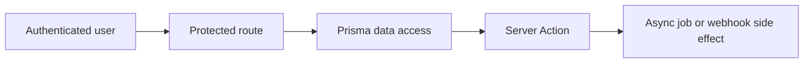

# Thực Hành: Module SaaS Có Auth, Roles, Data Access và Async Tasks

[<- Quay lại Tuần 11 - Auth, Database và System Flows](./README.md)

## Vì sao bài này quan trọng

Bài thực hành tuần 11 nên tạo một module thật giống sản phẩm: có workspace hoặc role, có entity trong DB, có form validate và có ít nhất một async task đi kèm. Đây là bài nối toàn bộ app sang tư duy backend-for-frontend đúng nghĩa.

## Điều kiện trước

- Đã học hoặc đọc các khái niệm nền của Auth, Database và System Flows.
- Sẵn sàng ghi chú lại trade-off và câu hỏi thực chiến thay vì chỉ ghi nhớ định nghĩa.

## Core concepts

- protected routes
- role checks
- data mutations

## Giải thích chi tiết

Chọn một domain cụ thể như projects, invoices hoặc tickets.

Viết rõ role nào làm được hành động nào.

Mỗi write flow cần có validation, authz và data refresh.

## Sơ đồ

## Common mistakes

- Nhớ tên khái niệm nhưng không gắn nó với một bài toán sản phẩm cụ thể trong bài “Thực Hành: Module SaaS Có Auth, Roles, Data Access và Async Tasks”.
- Tối ưu hoặc trừu tượng hóa quá sớm trước khi đo, trước khi nhìn rõ boundary và trước khi hiểu cost thật.
- Chỉ học cú pháp mà không mô tả được dòng chảy dữ liệu, trạng thái và trách nhiệm của từng tầng.

## Performance / debugging notes

- Khi debug, hãy luôn hỏi: điều gì kích hoạt thay đổi, điều gì thực sự tốn chi phí, và chi phí đó xảy ra ở client, server hay network.
- Ghi lại giả thuyết trước khi sửa. Sau đó đo lại để biết tối ưu có hiệu quả thật hay chỉ làm code phức tạp hơn.
- Nếu một vấn đề lặp lại nhiều lần, hãy nâng nó thành quy ước kiến trúc hoặc checklist cho dự án sau.

## Bài tập thực hành

1. Xây một phiên bản áp dụng của bài “Thực Hành: Module SaaS Có Auth, Roles, Data Access và Async Tasks” trong bối cảnh một SaaS workspace có auth, database và async workflows.
2. Chốt scope, user flow và tiêu chí hoàn thành trước khi code.
3. Tạo ít nhất một artifact hệ thống như route map, data flow diagram, component boundary map hoặc cache plan.
4. Viết retrospective ngắn: điều gì khó nhất, điều gì sẽ làm khác nếu build lại, và trade-off nào bạn chấp nhận.

## Deliverables cần nộp

- Một prototype hoặc flow chạy được ở mức tối thiểu.
- Ít nhất một sơ đồ hoặc tài liệu kiến trúc đi kèm.
- Một checklist acceptance criteria do chính bạn tự định nghĩa và tự đánh giá.

## Gợi ý

- Bắt đầu bằng happy path nhỏ nhất nhưng thật sự chạy được.
- Nếu bài có nhiều phần, chọn 1-2 flow cốt lõi rồi làm sâu thay vì làm rộng.
- Artifact hệ thống nên đủ rõ để người khác đọc và tiếp tục build.

## Rubric tự đánh giá

- Scope thực hành rõ và có thể kiểm chứng.
- Artifact hệ thống không chỉ là phụ lục mà thực sự hỗ trợ reasoning.
- Bài làm cho thấy bạn hiểu trade-off chứ không chỉ ghép feature.
- Retrospective phản ánh được quyết định kỹ thuật có ý nghĩa.

## Review checklist

- Bạn có thể giải thích được bài “Thực Hành: Module SaaS Có Auth, Roles, Data Access và Async Tasks” bằng ngôn ngữ của riêng mình.
- Bạn biết khái niệm nào là nền tảng, khái niệm nào là optimization, và khái niệm nào là production concern.
- Bạn có thể chỉ ra ít nhất một ví dụ thực tế nơi bài học này tạo khác biệt rõ ràng cho UX hoặc maintainability.

## Further reading / sources

- https://authjs.dev/getting-started
- https://www.prisma.io/docs/guides/nextjs
- https://zod.dev/
- https://vercel.com/docs/storage
