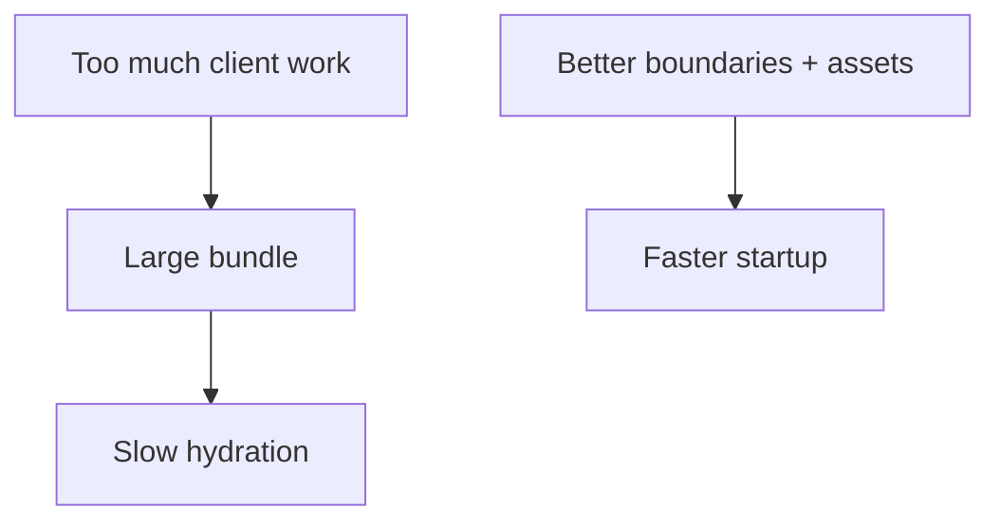

# Performance Tuning: RSC Boundaries, Bundles, Images và Fonts

[<- Quay lại Tuần 12 - Production Architecture với Next.js](./README.md)

## Vì sao bài này quan trọng

Hiệu năng của Next.js không chỉ ở một kỹ thuật đơn lẻ. Nó là tổng hòa giữa boundary server/client, kích thước bundle, chiến lược ảnh, font loading và mức độ interactivity trên từng route.

## Điều kiện trước

- Đã học hoặc đọc các khái niệm nền của Production Architecture với Next.js.
- Sẵn sàng ghi chú lại trade-off và câu hỏi thực chiến thay vì chỉ ghi nhớ định nghĩa.

## Core concepts

- bundle budget
- RSC islands
- asset delivery

## Giải thích chi tiết

Giảm client JavaScript thường cho lợi ích lớn nhất.

Fonts và images có thể phá startup performance nếu tải sai.

Performance budget nên được định nghĩa sớm.

## Sơ đồ

## Common mistakes

- Nhớ tên khái niệm nhưng không gắn nó với một bài toán sản phẩm cụ thể trong bài “Performance Tuning: RSC Boundaries, Bundles, Images và Fonts”.
- Tối ưu hoặc trừu tượng hóa quá sớm trước khi đo, trước khi nhìn rõ boundary và trước khi hiểu cost thật.
- Chỉ học cú pháp mà không mô tả được dòng chảy dữ liệu, trạng thái và trách nhiệm của từng tầng.

## Performance / debugging notes

- Khi debug, hãy luôn hỏi: điều gì kích hoạt thay đổi, điều gì thực sự tốn chi phí, và chi phí đó xảy ra ở client, server hay network.
- Ghi lại giả thuyết trước khi sửa. Sau đó đo lại để biết tối ưu có hiệu quả thật hay chỉ làm code phức tạp hơn.
- Nếu một vấn đề lặp lại nhiều lần, hãy nâng nó thành quy ước kiến trúc hoặc checklist cho dự án sau.

## Bài tập thực hành

1. Tích hợp nội dung của bài “Performance Tuning: RSC Boundaries, Bundles, Images và Fonts” vào một vertical slice nhỏ trong một nền tảng nhiều hệ thống cần vừa ship được vừa vận hành được.
2. Liệt kê 3 failure modes hoặc implementation mistakes có thể xảy ra khi dùng “Performance Tuning: RSC Boundaries, Bundles, Images và Fonts”, kèm cách phát hiện sớm.
3. Viết một decision note: vì sao “Performance Tuning: RSC Boundaries, Bundles, Images và Fonts” nên được đặt ở boundary này thay vì boundary khác trong một nền tảng nhiều hệ thống cần vừa ship được vừa vận hành được?
4. Xác định một cách đo hoặc kiểm chứng để biết việc áp dụng “Performance Tuning: RSC Boundaries, Bundles, Images và Fonts” đang mang lại lợi ích thật.

## Gợi ý

- Nên chọn một flow nhỏ nhưng hoàn chỉnh thay vì cố gắn công cụ vào toàn hệ thống.
- Failure mode tốt thường gắn với data inconsistency, performance cost hoặc boundary đặt sai chỗ.
- Measurement có thể là profiler, network timeline, error logs, Lighthouse hoặc checklist hành vi.

## Rubric tự đánh giá

- Có integration task rõ ràng chứ không chỉ mô tả lý thuyết.
- Failure modes và detection strategy thực tế, không hời hợt.
- Decision note nêu rõ trade-off và lý do chọn placement hiện tại.
- Measurement hoặc evidence đủ để kiểm chứng giải pháp.

## Review checklist

- Bạn có thể giải thích được bài “Performance Tuning: RSC Boundaries, Bundles, Images và Fonts” bằng ngôn ngữ của riêng mình.
- Bạn biết khái niệm nào là nền tảng, khái niệm nào là optimization, và khái niệm nào là production concern.
- Bạn có thể chỉ ra ít nhất một ví dụ thực tế nơi bài học này tạo khác biệt rõ ràng cho UX hoặc maintainability.

## Further reading / sources

- https://nextjs.org/docs/app/building-your-application/optimizing
- https://nextjs.org/docs/app/guides/testing
- https://nextjs.org/docs/app/guides/open-telemetry
- https://vercel.com/docs
