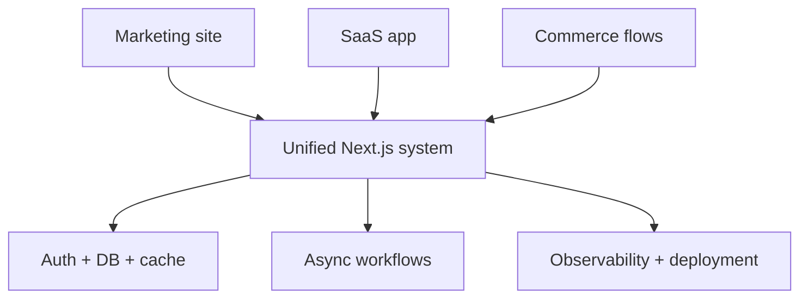

# Final Capstone: Multi-system App Cho SaaS, Content và Commerce

[<- Quay lại Tuần 12 - Production Architecture với Next.js](./README.md)

## Vì sao bài này quan trọng

Capstone cuối không chỉ là ghép feature. Nó là bài kiểm tra xem bạn đã học cách nghĩ về app như một hệ thống hoàn chỉnh hay chưa: route architecture, auth, DB, cache, async workflows, observability và deployment có khớp nhau không.

## Điều kiện trước

- Đã học hoặc đọc các khái niệm nền của Production Architecture với Next.js.
- Sẵn sàng ghi chú lại trade-off và câu hỏi thực chiến thay vì chỉ ghi nhớ định nghĩa.

## Core concepts

- system design
- route strategy
- operational readiness

## Giải thích chi tiết

Nên viết ra route map, data model, runtime choices và monitoring plan.

Capstone tốt phải giải thích được trade-off, không chỉ trình diễn giao diện.

Đây là nơi kiến thức 12 tuần gặp nhau.

## Sơ đồ

## Common mistakes

- Nhớ tên khái niệm nhưng không gắn nó với một bài toán sản phẩm cụ thể trong bài “Final Capstone: Multi-system App Cho SaaS, Content và Commerce”.
- Tối ưu hoặc trừu tượng hóa quá sớm trước khi đo, trước khi nhìn rõ boundary và trước khi hiểu cost thật.
- Chỉ học cú pháp mà không mô tả được dòng chảy dữ liệu, trạng thái và trách nhiệm của từng tầng.

## Performance / debugging notes

- Khi debug, hãy luôn hỏi: điều gì kích hoạt thay đổi, điều gì thực sự tốn chi phí, và chi phí đó xảy ra ở client, server hay network.
- Ghi lại giả thuyết trước khi sửa. Sau đó đo lại để biết tối ưu có hiệu quả thật hay chỉ làm code phức tạp hơn.
- Nếu một vấn đề lặp lại nhiều lần, hãy nâng nó thành quy ước kiến trúc hoặc checklist cho dự án sau.

## Bài tập thực hành

1. Viết product brief cho nền tảng gồm marketing site, authenticated SaaS area và commerce/content-like workflows: users, roles, non-functional goals, critical journeys.
2. Nộp architecture pack gồm route map, auth model, data model, API/contracts, cache strategy, runtime choices, observability plan và deployment plan.
3. Hiện thực hoặc mô tả thật chi tiết một vertical slice end-to-end từ UI -> server boundary -> data -> side effects -> monitoring.
4. Viết design review memo: 3 quyết định quan trọng nhất, 3 failure modes đáng lo nhất, và kế hoạch rollout/rollback nếu đưa vào production.

## Deliverables cần nộp

- Product brief ngắn nhưng rõ.
- Architecture pack có sơ đồ và decision notes.
- Role matrix hoặc access matrix.
- Monitoring + release checklist.
- Một vertical slice hoặc implementation plan đủ rõ để teammate tiếp tục.

## Gợi ý

- Không cần code hết mọi subsystem; một vertical slice đủ sâu có giá trị hơn rất nhiều.
- Nếu đang phân vân, hãy bắt đầu từ route map và ownership của từng khu vực.
- Đừng quên phần vận hành: logging, tracing, alerts, deployment environments và rollback.

## Rubric tự đánh giá

- System design nhất quán giữa route, data, auth, cache và runtime.
- Các trade-off quan trọng được nêu rõ chứ không né tránh.
- Capstone thể hiện tư duy production-ready, không chỉ là demo UI.
- Handoff quality đủ tốt để người khác dựa vào đó build tiếp.

## Review checklist

- Bạn có thể giải thích được bài “Final Capstone: Multi-system App Cho SaaS, Content và Commerce” bằng ngôn ngữ của riêng mình.
- Bạn biết khái niệm nào là nền tảng, khái niệm nào là optimization, và khái niệm nào là production concern.
- Bạn có thể chỉ ra ít nhất một ví dụ thực tế nơi bài học này tạo khác biệt rõ ràng cho UX hoặc maintainability.

## Further reading / sources

- https://nextjs.org/docs/app/building-your-application/optimizing
- https://nextjs.org/docs/app/guides/testing
- https://nextjs.org/docs/app/guides/open-telemetry
- https://vercel.com/docs
