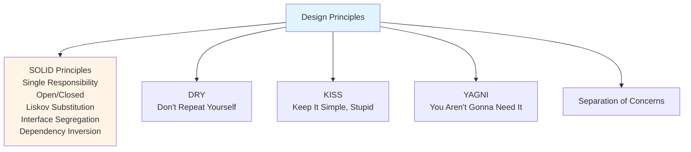
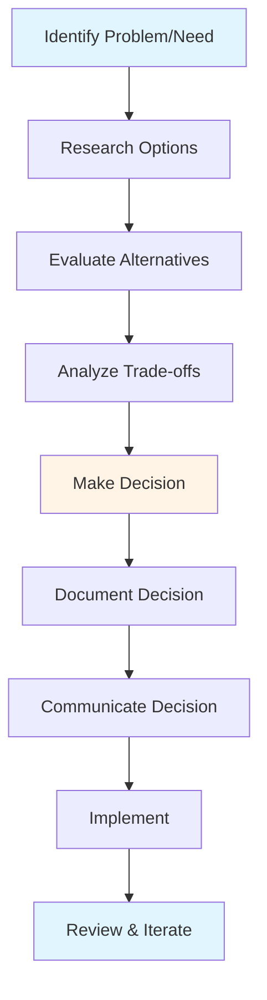
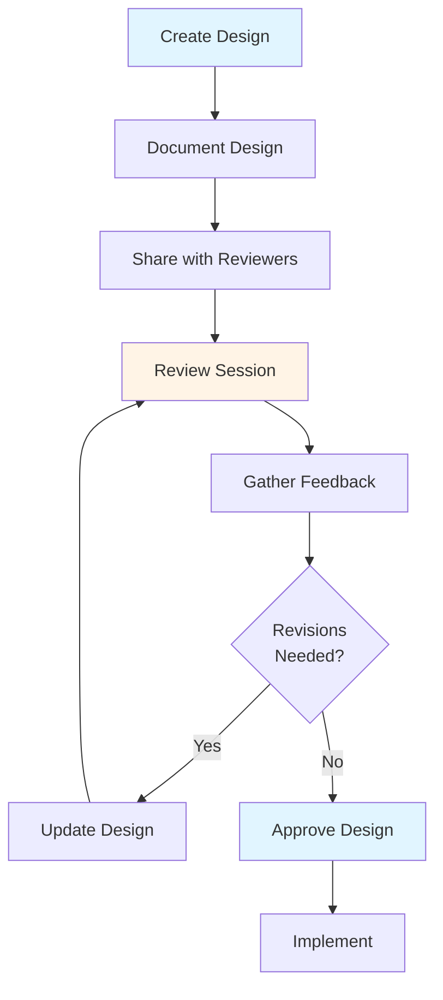
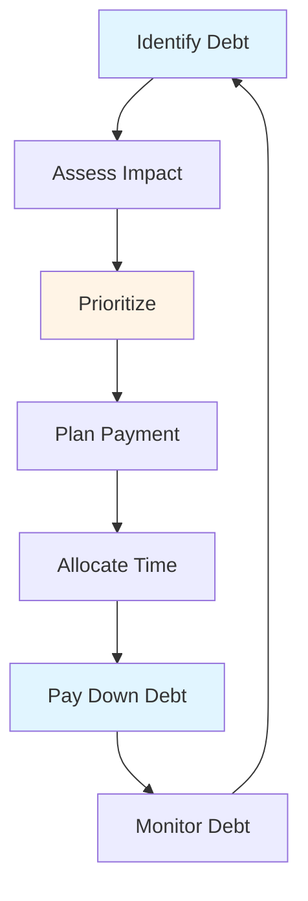

# Architecture & Technical Design Guide - Team Lead

## Table of Contents
1. [Introduction](#introduction)
2. [System Design Fundamentals](#system-design-fundamentals)
3. [Technical Decision Making Process](#technical-decision-making-process)
4. [Architecture Decision Records (ADRs)](#architecture-decision-records-adrs)
5. [Design Review Process](#design-review-process)
6. [Technical Debt Management](#technical-debt-management)
7. [Scalability & Performance](#scalability--performance)
8. [Best Practices](#best-practices)
9. [Common Pitfalls](#common-pitfalls)
10. [Summary](#summary)

---

## Introduction

As a Team Lead, you're responsible for the technical architecture and design decisions that shape your team's work. This guide covers system design, decision-making processes, and managing technical debt.

### Who This Guide Is For
- Team Leads making architecture decisions
- Senior developers designing systems
- Anyone involved in technical design
- Teams establishing design processes

### Key Learning Objectives
- Understand system design fundamentals
- Master technical decision-making process
- Learn to document decisions (ADRs)
- Conduct effective design reviews
- Manage technical debt
- Consider scalability and performance

---

## System Design Fundamentals

### What is System Design?

System design is the process of defining the architecture, components, modules, interfaces, and data for a system to satisfy specified requirements.

### Design Principles



### Key Design Considerations

#### 1. Functionality
- Does it meet requirements?
- Are all use cases covered?
- Are edge cases handled?

#### 2. Scalability
- Can it handle growth?
- What are bottlenecks?
- How does it scale?

#### 3. Performance
- Is it fast enough?
- Are there optimizations?
- What are performance targets?

#### 4. Maintainability
- Is it easy to understand?
- Is it easy to modify?
- Is it well-documented?

#### 5. Reliability
- Is it fault-tolerant?
- How does it handle failures?
- What's the recovery strategy?

#### 6. Security
- Are there vulnerabilities?
- Is data protected?
- Are access controls correct?

---

## Technical Decision Making Process

### Decision-Making Framework



### Step-by-Step Process

#### 1. Understand the Problem
- What problem are we solving?
- What are the requirements?
- What are the constraints?
- What's the context?

#### 2. Research Options
- What are possible solutions?
- What have others done?
- What are best practices?
- What technologies exist?

#### 3. Evaluate Alternatives
- List pros and cons
- Consider trade-offs
- Evaluate risks
- Assess feasibility

#### 4. Make Decision
- Choose best option
- Consider team capabilities
- Balance short and long-term
- Get input from team

#### 5. Document Decision
- Write ADR
- Explain rationale
- Record alternatives
- Note trade-offs

#### 6. Communicate
- Share with team
- Explain reasoning
- Answer questions
- Get buy-in

#### 7. Implement & Review
- Implement decision
- Monitor results
- Review effectiveness
- Adjust if needed

---

## Architecture Decision Records (ADRs)

### What are ADRs?

Architecture Decision Records are documents that capture important architectural decisions, the context behind them, and their consequences.

### ADR Structure

```markdown
# ADR-001: [Title]

## Status
[Proposed | Accepted | Deprecated | Superseded]

## Context
[What is the issue we're addressing?]

## Decision
[What decision are we making?]

## Consequences
[What are the implications?]

## Alternatives Considered
[What other options did we consider?]

## Notes
[Additional information]
```

### ADR Template

```markdown
# ADR-XXX: [Decision Title]

**Date**: [Date]
**Status**: [Status]
**Deciders**: [Team/Individuals]

## Context

[Describe the issue motivating this decision]

## Decision

[State the decision]

## Rationale

[Explain why this decision was made]

## Alternatives Considered

### Option 1: [Name]
- Pros: [List]
- Cons: [List]
- Why not chosen: [Reason]

### Option 2: [Name]
- Pros: [List]
- Cons: [List]
- Why not chosen: [Reason]

## Consequences

### Positive
- [Positive outcome 1]
- [Positive outcome 2]

### Negative
- [Negative outcome 1]
- [Negative outcome 2]

### Risks
- [Risk 1]
- [Risk 2]

## Implementation Notes

[How will this be implemented?]

## References

[Links to relevant resources]
```

### When to Create ADRs

- **Architecture changes**: Major system changes
- **Technology choices**: New frameworks, tools
- **Design patterns**: Significant pattern adoption
- **Trade-off decisions**: Important compromises
- **Reversible decisions**: Decisions that might change

### ADR Best Practices

- **Keep them simple**: Clear and concise
- **Update status**: Keep current
- **Review regularly**: Revisit decisions
- **Link related**: Connect related ADRs
- **Make accessible**: Easy to find

---

## Design Review Process

### Design Review Purpose

Design reviews ensure that technical designs are sound, well-thought-out, and aligned with architecture before implementation.

### Review Process



### Design Review Checklist

#### Architecture
- [ ] Does it fit overall architecture?
- [ ] Are patterns used appropriately?
- [ ] Is it scalable?
- [ ] Is it maintainable?

#### Design Quality
- [ ] Is it well-designed?
- [ ] Are principles followed?
- [ ] Is it simple enough?
- [ ] Is it extensible?

#### Technical Considerations
- [ ] Are performance implications considered?
- [ ] Are security concerns addressed?
- [ ] Is error handling planned?
- [ ] Are edge cases covered?

#### Implementation
- [ ] Is it feasible?
- [ ] Are dependencies clear?
- [ ] Is testing strategy defined?
- [ ] Is migration plan clear?

### Review Best Practices

- **Review early**: Before implementation
- **Include right people**: Relevant stakeholders
- **Be constructive**: Helpful feedback
- **Document outcomes**: Record decisions
- **Follow up**: Ensure concerns addressed

---

## Technical Debt Management

### What is Technical Debt?

Technical debt is the implied cost of additional rework caused by choosing an easy solution now instead of a better approach that would take longer.

### Types of Technical Debt

#### 1. Code Debt
- Poor code quality
- Code smells
- Duplication
- Complexity

#### 2. Design Debt
- Poor architecture
- Tight coupling
- Missing abstractions
- Design smells

#### 3. Test Debt
- Low test coverage
- Poor test quality
- Missing tests
- Flaky tests

#### 4. Documentation Debt
- Missing documentation
- Outdated docs
- Unclear documentation
- Missing ADRs

### Managing Technical Debt



### Debt Management Strategies

#### 1. Prevention
- Code reviews
- Design reviews
- Standards enforcement
- Regular refactoring

#### 2. Tracking
- Maintain debt backlog
- Track debt items
- Monitor debt trends
- Regular assessment

#### 3. Payment
- Allocate time regularly
- Include in sprint planning
- Dedicated refactoring sprints
- Pay as you go

#### 4. Communication
- Make debt visible
- Explain impact
- Get buy-in
- Report progress

---

## Scalability & Performance

### Scalability Considerations

#### Horizontal vs. Vertical Scaling
- **Horizontal**: Add more servers
- **Vertical**: Add more resources to server

#### Scalability Patterns
- **Load balancing**: Distribute load
- **Caching**: Reduce database load
- **CDN**: Distribute content
- **Database sharding**: Split data
- **Microservices**: Independent scaling

### Performance Considerations

#### Performance Targets
- Response time goals
- Throughput requirements
- Resource usage limits
- Latency requirements

#### Optimization Strategies
- **Caching**: Reduce computation
- **Database optimization**: Query optimization
- **Async processing**: Non-blocking operations
- **Connection pooling**: Reuse connections
- **Compression**: Reduce data transfer

### Design for Scale

- **Start simple**: Don't over-engineer
- **Measure first**: Profile before optimizing
- **Design for growth**: Consider future needs
- **Monitor performance**: Track metrics
- **Plan capacity**: Anticipate growth

---

## Best Practices

### Design Best Practices

1. **Start Simple**: Don't over-engineer
2. **Design for Change**: Make it extensible
3. **Consider Trade-offs**: Balance factors
4. **Document Decisions**: Write ADRs
5. **Review Designs**: Get feedback
6. **Iterate**: Refine as you learn
7. **Measure**: Validate assumptions

### Decision-Making Best Practices

1. **Involve Team**: Get input
2. **Research Thoroughly**: Understand options
3. **Consider Long-term**: Think ahead
4. **Document**: Record decisions
5. **Communicate**: Share reasoning
6. **Review**: Revisit decisions

---

## Common Pitfalls

### Mistakes to Avoid

1. **Over-engineering**: Too complex solutions
2. **Under-engineering**: Not thinking ahead
3. **Not Documenting**: Decisions forgotten
4. **Ignoring Debt**: Debt accumulates
5. **Not Reviewing**: Poor designs approved
6. **Premature Optimization**: Optimizing too early
7. **Not Considering Scale**: Design doesn't scale

---

## Summary

### Key Takeaways

1. **System design** requires balancing multiple concerns
2. **Technical decisions** should follow a structured process
3. **ADRs** document important architectural decisions
4. **Design reviews** ensure quality before implementation
5. **Technical debt** must be actively managed
6. **Scalability and performance** should be considered from the start

### Next Steps

- Review **[Core Responsibilities Guide](./CORE_RESPONSIBILITIES_GUIDE.md)** for role context
- Study **[Problem Solving & Troubleshooting Guide](./PROBLEM_SOLVING_TROUBLESHOOTING_GUIDE.md)** for problem-solving approaches
- Explore **[Templates & Checklists Guide](./TEMPLATES_CHECKLISTS_GUIDE.md)** for ADR templates

---

**Remember**: Good architecture enables teams to move fast while maintaining quality. Design for change, document decisions, and manage debt proactively.


