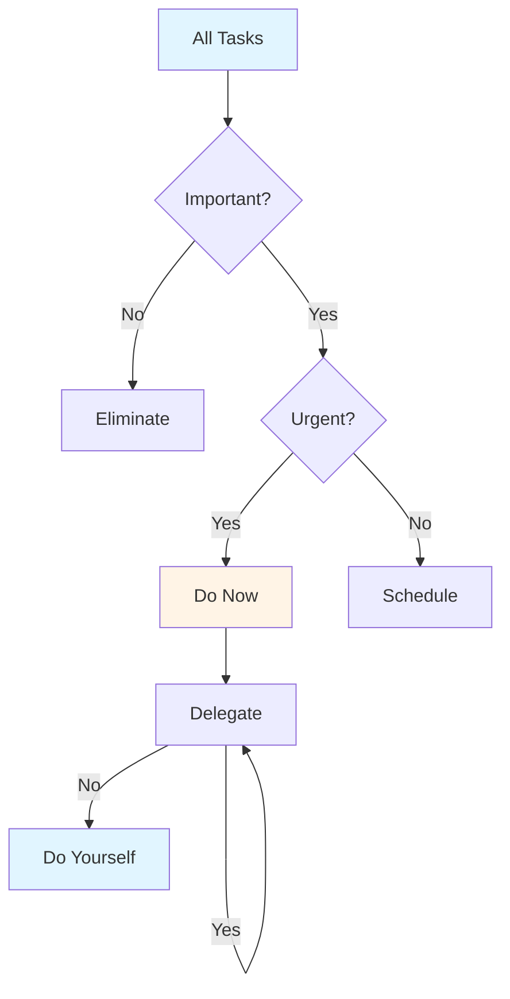
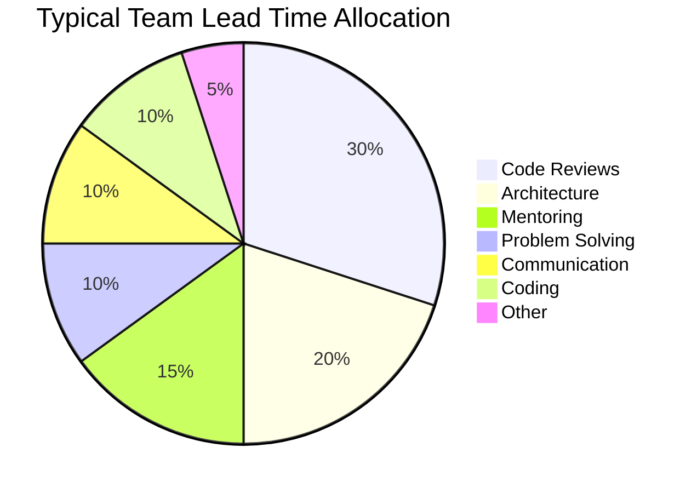
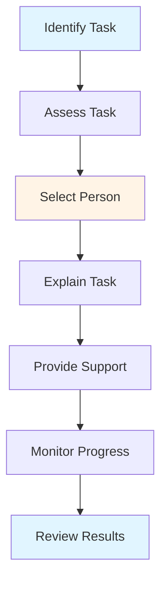
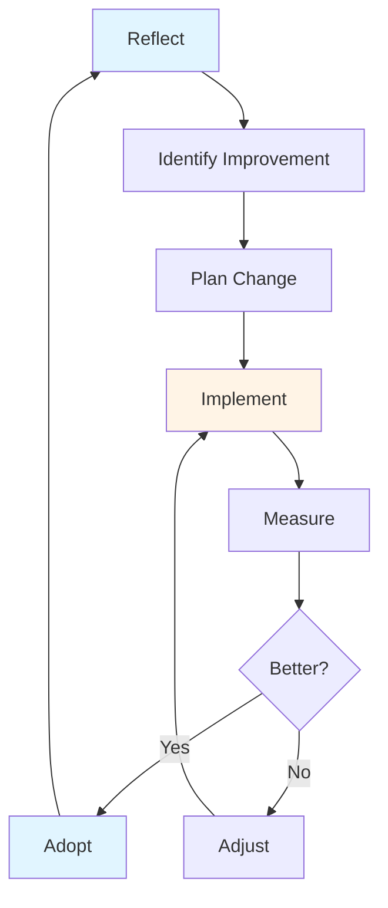
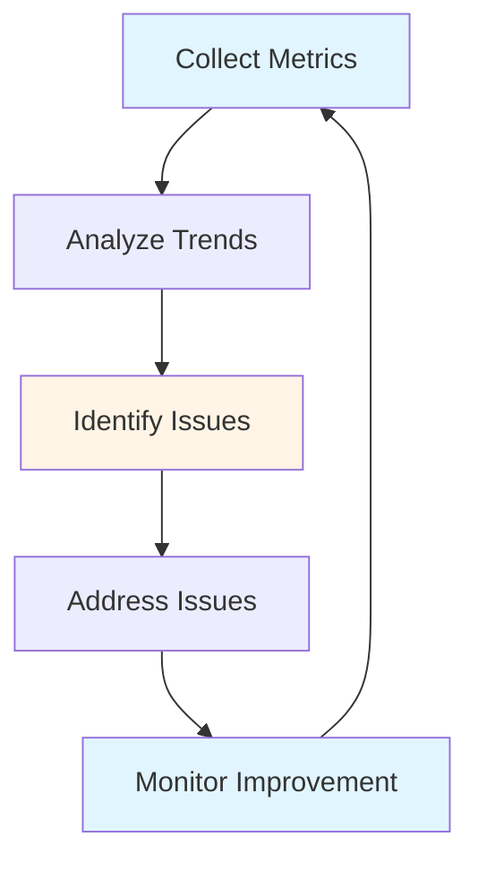

# Best Practices & Common Pitfalls Guide - Team Lead

## Table of Contents
1. [Introduction](#introduction)
2. [Time Management](#time-management)
3. [Balancing Coding vs. Leadership](#balancing-coding-vs-leadership)
4. [Delegation Strategies](#delegation-strategies)
5. [Continuous Improvement](#continuous-improvement)
6. [Knowledge Management](#knowledge-management)
7. [Team Health Metrics](#team-health-metrics)
8. [Common Pitfalls](#common-pitfalls)
9. [Summary](#summary)

---

## Introduction

This guide consolidates best practices for Team Leads and highlights common pitfalls to avoid. Learning from others' experiences helps you avoid mistakes and adopt proven approaches.

### Who This Guide Is For
- Team Leads seeking best practices
- New Team Leads learning the role
- Experienced Team Leads reviewing practices
- Anyone avoiding common mistakes

### Key Learning Objectives
- Master time management
- Balance coding and leadership
- Delegate effectively
- Drive continuous improvement
- Manage knowledge
- Monitor team health
- Avoid common pitfalls

---

## Time Management

### Time Management Principles

#### 1. Prioritize
- **Important vs. Urgent**: Focus on important
- **High Impact**: Prioritize high-impact work
- **Say No**: Decline non-essential requests
- **Delegate**: Delegate when appropriate

#### 2. Time Blocking
- **Block Calendar**: Schedule focus time
- **Batch Tasks**: Group similar activities
- **Protect Time**: Guard focus time
- **Review Regularly**: Adjust as needed

#### 3. Eliminate Waste
- **Reduce Meetings**: Only essential meetings
- **Limit Interruptions**: Set boundaries
- **Avoid Multitasking**: Focus on one thing
- **Streamline Processes**: Remove inefficiencies

### Time Management Framework

### Time Management Best Practices

1. **Plan Daily**: Start with priorities
2. **Block Time**: Schedule focus time
3. **Batch Tasks**: Group similar work
4. **Limit Meetings**: Only essential
5. **Review Weekly**: Adjust approach

---

## Balancing Coding vs. Leadership

### The Balance Challenge

Team Leads need to balance hands-on coding with leadership responsibilities. Finding the right balance is crucial.

### Time Allocation

### Balancing Strategies

#### 1. Prioritize Leadership
- **When**: Team needs guidance
- **Focus**: Mentoring, reviews, planning
- **Coding**: Minimal, critical only

#### 2. Balance Approach
- **When**: Stable team
- **Focus**: Mix of both
- **Coding**: 20-30% of time

#### 3. Technical Focus
- **When**: Critical technical work
- **Focus**: Architecture, complex problems
- **Coding**: 40-50% of time

### Best Practices

1. **Assess Needs**: What does team need?
2. **Adjust Flexibly**: Change as needed
3. **Don't Abandon Coding**: Stay technical
4. **Don't Ignore Leadership**: Lead effectively
5. **Communicate**: Set expectations

---

## Delegation Strategies

### When to Delegate

#### Delegate When:
- **Team Member Can Do**: Within capabilities
- **Learning Opportunity**: Growth opportunity
- **Not Critical**: Not blocking critical work
- **Time Available**: Team member has time

#### Don't Delegate When:
- **Critical Decision**: Requires your judgment
- **Too Complex**: Beyond team capabilities
- **Urgent**: Immediate attention needed
- **Your Responsibility**: Core responsibility

### Delegation Process

### Delegation Best Practices

1. **Be Clear**: Explain expectations
2. **Provide Context**: Share background
3. **Give Authority**: Allow decision-making
4. **Support**: Be available for help
5. **Trust**: Trust team members
6. **Review**: Check results, provide feedback

---

## Continuous Improvement

### Improvement Mindset

#### 1. Reflect Regularly
- **Daily**: End-of-day reflection
- **Weekly**: Weekly review
- **Sprint**: Sprint retrospective
- **Quarterly**: Quarterly review

#### 2. Identify Improvements
- **What Worked**: Keep doing
- **What Didn't**: Stop doing
- **What to Try**: New approaches
- **What to Improve**: Enhance existing

#### 3. Implement Changes
- **Start Small**: Small experiments
- **Measure Impact**: Track results
- **Iterate**: Refine approach
- **Scale**: Expand successful changes

### Improvement Framework

### Improvement Best Practices

1. **Be Open**: Open to feedback
2. **Experiment**: Try new approaches
3. **Measure**: Track improvements
4. **Learn**: Learn from failures
5. **Share**: Share learnings

---

## Knowledge Management

### Knowledge Management Strategy

#### 1. Capture Knowledge
- **Document Decisions**: ADRs, decisions
- **Write Documentation**: Processes, guides
- **Share Learnings**: Retrospectives, posts
- **Record Solutions**: Problem solutions

#### 2. Organize Knowledge
- **Structure**: Logical organization
- **Index**: Easy to find
- **Tag**: Categorize content
- **Version**: Track changes

#### 3. Share Knowledge
- **Make Accessible**: Easy to access
- **Promote**: Encourage use
- **Update**: Keep current
- **Review**: Regular review

### Knowledge Management Tools

- **Documentation**: Wikis, docs
- **Code Comments**: Inline documentation
- **ADRs**: Architecture decisions
- **Runbooks**: Operational procedures
- **Knowledge Base**: Centralized knowledge

---

## Team Health Metrics

### Key Metrics

#### 1. Productivity Metrics
- **Velocity**: Story points per sprint
- **Throughput**: Tasks completed
- **Cycle Time**: Time to complete
- **Lead Time**: Time from request to delivery

#### 2. Quality Metrics
- **Defect Rate**: Bugs per release
- **Test Coverage**: Code coverage
- **Code Review Time**: Review turnaround
- **Technical Debt**: Debt items

#### 3. Team Metrics
- **Satisfaction**: Team satisfaction
- **Retention**: Team retention
- **Engagement**: Team engagement
- **Growth**: Skill development

#### 4. Process Metrics
- **Sprint Success**: Sprint goal achievement
- **Estimation Accuracy**: Actual vs. estimated
- **Blockers**: Number of blockers
- **Risks**: Risk materialization

### Monitoring Team Health

---

## Common Pitfalls

### Leadership Pitfalls

#### 1. Micromanagement
- **Problem**: Over-controlling team work
- **Impact**: Demotivates team, reduces efficiency
- **Solution**: Delegate, trust team, set boundaries

#### 2. Not Delegating
- **Problem**: Doing everything yourself
- **Impact**: Burnout, team doesn't grow
- **Solution**: Identify delegable tasks, trust team

#### 3. Poor Communication
- **Problem**: Not sharing information
- **Impact**: Confusion, mistakes, low trust
- **Solution**: Communicate proactively, regularly

#### 4. Ignoring Team Development
- **Problem**: Not investing in team growth
- **Impact**: Stagnant skills, high turnover
- **Solution**: Make mentoring priority, invest time

### Technical Pitfalls

#### 5. Over-engineering
- **Problem**: Too complex solutions
- **Impact**: Wasted time, maintenance burden
- **Solution**: Start simple, add complexity when needed

#### 6. Ignoring Technical Debt
- **Problem**: Not managing debt
- **Impact**: Accumulating problems, slower development
- **Solution**: Track debt, allocate time, pay down

#### 7. Not Staying Current
- **Problem**: Falling behind technology
- **Impact**: Poor decisions, outdated skills
- **Solution**: Continuous learning, stay updated

### Process Pitfalls

#### 8. No Process
- **Problem**: Lack of structure
- **Impact**: Chaos, inefficiency
- **Solution**: Establish processes, document

#### 9. Too Much Process
- **Problem**: Over-processed
- **Impact**: Slows down, bureaucracy
- **Solution**: Simplify, remove unnecessary

#### 10. Not Adapting
- **Problem**: Rigid approach
- **Impact**: Doesn't fit situation
- **Solution**: Be flexible, adapt to context

### Personal Pitfalls

#### 11. Burning Out
- **Problem**: Working too much
- **Impact**: Health issues, poor performance
- **Solution**: Set boundaries, take breaks, delegate

#### 12. Not Asking for Help
- **Problem**: Trying to do everything alone
- **Impact**: Struggling, not getting help
- **Solution**: Ask for help, build network

#### 13. Not Learning
- **Problem**: Not improving
- **Impact**: Stagnant, outdated
- **Solution**: Continuous learning, seek feedback

---

## Summary

### Key Takeaways

1. **Time management** requires prioritization and focus
2. **Balancing coding and leadership** is an ongoing challenge
3. **Delegation** is essential for scaling impact
4. **Continuous improvement** drives team growth
5. **Knowledge management** preserves and shares knowledge
6. **Team health metrics** help monitor team well-being
7. **Common pitfalls** can be avoided with awareness

### Next Steps

- Review **[Core Responsibilities Guide](./CORE_RESPONSIBILITIES_GUIDE.md)** for role fundamentals
- Study **[Daily/Weekly Processes Guide](./DAILY_WEEKLY_PROCESSES_GUIDE.md)** for time management
- Explore **[Real-World Scenarios Guide](./REAL_WORLD_SCENARIOS_GUIDE.md)** for practical examples

---

**Remember**: Best practices are guidelines, not rules. Adapt to your context, learn from mistakes, and continuously improve.

