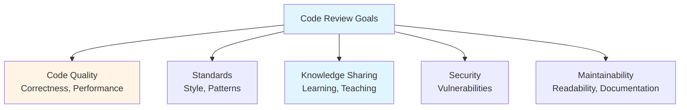
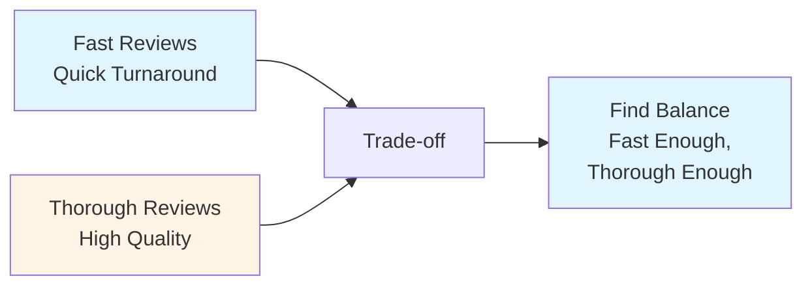
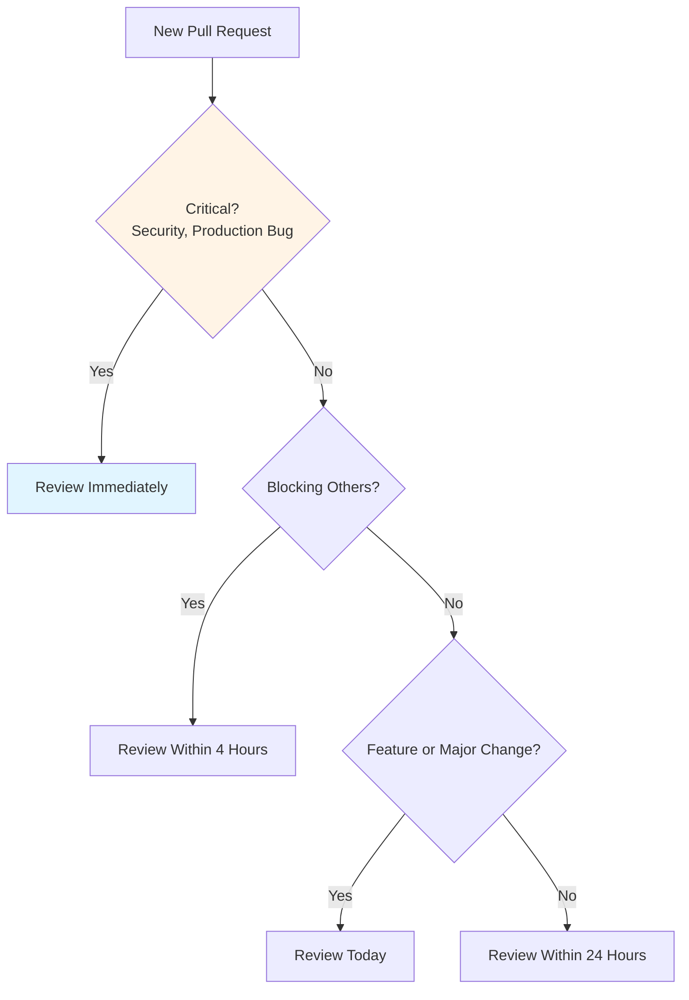

# Code Review Excellence Guide - Team Lead

## Table of Contents
1. [Introduction](#introduction)
2. [Code Review Fundamentals](#code-review-fundamentals)
3. [Review Checklist](#review-checklist)
4. [Providing Feedback](#providing-feedback)
5. [Teaching Through Reviews](#teaching-through-reviews)
6. [Balancing Speed vs. Quality](#balancing-speed-vs-quality)
7. [Review Prioritization](#review-prioritization)
8. [Code Review Tools](#code-review-tools)
9. [Common Review Scenarios](#common-review-scenarios)
10. [Best Practices](#best-practices)
11. [Common Pitfalls](#common-pitfalls)
12. [Summary](#summary)

---

## Introduction

Code reviews are one of the most impactful activities a Team Lead performs. They ensure code quality, teach best practices, and maintain consistency across the team. This guide covers everything you need to excel at code reviews.

### Who This Guide Is For
- Team Leads conducting code reviews
- Senior developers reviewing code
- Anyone wanting to improve review skills
- Teams establishing review processes

### Key Learning Objectives
- Understand code review fundamentals
- Master review checklist and standards
- Learn to provide constructive feedback
- Balance speed and quality
- Use reviews as teaching opportunities
- Leverage tools effectively

---

## Code Review Fundamentals

### What is Code Review?

Code review is the process of examining code changes to ensure quality, correctness, and adherence to standards before merging into the codebase.

### Goals of Code Review



### Benefits

- **Catch Bugs**: Find issues before production
- **Improve Quality**: Ensure code meets standards
- **Share Knowledge**: Teach and learn from each other
- **Maintain Consistency**: Keep codebase uniform
- **Build Team**: Strengthen team collaboration

---

## Review Checklist

### Comprehensive Review Checklist

#### 1. Correctness
- [ ] Does the code work as intended?
- [ ] Are edge cases handled?
- [ ] Are error cases handled?
- [ ] Is the logic correct?
- [ ] Are there potential bugs?

#### 2. Code Quality
- [ ] Is the code readable?
- [ ] Is it well-structured?
- [ ] Are functions/classes appropriately sized?
- [ ] Is there unnecessary complexity?
- [ ] Can it be simplified?

#### 3. Standards & Style
- [ ] Does it follow coding standards?
- [ ] Is naming consistent?
- [ ] Is formatting consistent?
- [ ] Are conventions followed?
- [ ] Does it match team style?

#### 4. Tests
- [ ] Are there adequate tests?
- [ ] Do tests cover edge cases?
- [ ] Are tests well-written?
- [ ] Is test coverage sufficient?
- [ ] Do tests actually test the right things?

#### 5. Performance
- [ ] Are there performance concerns?
- [ ] Is it efficient?
- [ ] Are there unnecessary operations?
- [ ] Could it be optimized?
- [ ] Is it scalable?

#### 6. Security
- [ ] Are there security vulnerabilities?
- [ ] Is input validated?
- [ ] Is output sanitized?
- [ ] Are secrets handled properly?
- [ ] Is authentication/authorization correct?

#### 7. Documentation
- [ ] Is code self-documenting?
- [ ] Are comments needed and helpful?
- [ ] Is API documented?
- [ ] Are complex parts explained?
- [ ] Is README updated if needed?

#### 8. Architecture & Design
- [ ] Does it fit architecture?
- [ ] Are design patterns used appropriately?
- [ ] Is it maintainable?
- [ ] Does it follow SOLID principles?
- [ ] Is it extensible?

---

## Providing Feedback

### Feedback Principles

#### 1. Be Constructive
- Focus on code, not person
- Suggest improvements
- Explain why changes are needed
- Offer alternatives
- Be respectful

#### 2. Be Specific
- Point to exact lines
- Explain the issue clearly
- Provide examples
- Show what's wrong
- Suggest fixes

#### 3. Be Balanced
- Acknowledge good work
- Point out positives
- Don't only criticize
- Recognize effort
- Celebrate improvements

### Feedback Types

#### Must-Fix (Blocking)
- Bugs that will cause issues
- Security vulnerabilities
- Breaking changes
- Performance problems
- Architecture violations

#### Should-Fix (Important)
- Code quality issues
- Standards violations
- Missing tests
- Documentation gaps
- Design improvements

#### Nice-to-Fix (Optional)
- Style preferences
- Minor optimizations
- Small refactorings
- Documentation enhancements
- Future improvements

### Feedback Format

**Good Feedback Example**:
```
The error handling here could be improved. Currently, if the API call fails, 
the error is silently ignored. Consider:

1. Logging the error for debugging
2. Returning an error to the caller
3. Handling retries for transient failures

This would help with debugging production issues.
```

**Poor Feedback Example**:
```
This is wrong. Fix it.
```

---

## Teaching Through Reviews

### Using Reviews as Teaching Opportunities

#### 1. Explain Why
- Don't just say what's wrong
- Explain the reasoning
- Share best practices
- Provide context
- Link to resources

#### 2. Share Patterns
- Point out good patterns
- Suggest better patterns
- Explain pattern benefits
- Show examples
- Reference documentation

#### 3. Ask Questions
- Encourage thinking
- Guide to solution
- Don't just give answers
- Promote learning
- Build understanding

#### 4. Provide Resources
- Link to documentation
- Share articles
- Reference examples
- Point to standards
- Suggest learning materials

### Example Teaching Review

```
Good start! A few suggestions:

1. Consider using a factory pattern here instead of multiple if statements. 
   This would make it easier to add new types in the future. 
   See: [link to pattern documentation]

2. The error handling could be more specific. Instead of catching Exception, 
   catch the specific exceptions that can occur. This makes the code more 
   maintainable and easier to debug.

3. Great use of dependency injection! This makes the code testable.

Keep up the good work!
```

---

## Balancing Speed vs. Quality

### The Trade-off



### Strategies

#### 1. Prioritize Reviews
- Critical changes: Thorough review
- Simple changes: Quick review
- Complex changes: Detailed review
- Routine changes: Standard review

#### 2. Set Expectations
- Define review timeframes
- Communicate priorities
- Set SLA targets
- Be transparent

#### 3. Use Tools
- Automated checks (linting, tests)
- Review templates
- Checklists
- Automation

#### 4. Delegate When Appropriate
- Have others review simple changes
- Share review load
- Trust team members
- Build review capability

### Review Timeframes

- **Critical**: 1-2 hours (security, production bugs)
- **High Priority**: 4-8 hours (features, major changes)
- **Standard**: 24 hours (normal changes)
- **Low Priority**: 48 hours (minor fixes, docs)

---

## Review Prioritization

### Prioritization Framework



### Priority Levels

#### P0 - Critical (Review Now)
- Security vulnerabilities
- Production bugs
- Breaking changes
- Deployment blockers

#### P1 - High (Review Within 4 Hours)
- Blocking other work
- Major features
- Architecture changes
- Performance critical

#### P2 - Standard (Review Within 24 Hours)
- Normal features
- Bug fixes
- Refactoring
- Improvements

#### P3 - Low (Review Within 48 Hours)
- Documentation
- Minor fixes
- Style changes
- Non-critical updates

---

## Code Review Tools

### Popular Tools

#### GitHub
- Inline comments
- Review requests
- Approval workflow
- CI integration
- Discussion threads

#### GitLab
- Merge request reviews
- Inline comments
- Approval system
- CI/CD integration
- Code quality reports

#### Bitbucket
- Pull request reviews
- Inline comments
- Approval workflow
- CI integration

### Automation Tools

#### Static Analysis
- **SonarQube**: Code quality analysis
- **ESLint/TSLint**: JavaScript/TypeScript linting
- **Checkstyle**: Java code style
- **RuboCop**: Ruby style guide

#### Test Coverage
- **Coverage tools**: Ensure test coverage
- **Coverage reports**: Visualize coverage
- **Coverage gates**: Block low coverage

#### Security Scanning
- **Snyk**: Dependency vulnerability scanning
- **OWASP**: Security analysis
- **Dependabot**: Dependency updates

---

## Common Review Scenarios

### Scenario 1: Junior Developer's First PR

**Approach**:
- Be encouraging and supportive
- Explain concepts thoroughly
- Provide learning resources
- Celebrate small wins
- Don't overwhelm with feedback

### Scenario 2: Complex Architecture Change

**Approach**:
- Review design first
- Discuss approach before implementation
- Focus on architecture concerns
- Consider long-term implications
- Document decisions

### Scenario 3: Urgent Production Fix

**Approach**:
- Prioritize correctness
- Quick but thorough review
- Focus on fix, not perfection
- Ensure tests
- Follow up with improvements

### Scenario 4: Large Refactoring

**Approach**:
- Review incrementally if possible
- Focus on maintainability
- Ensure tests cover changes
- Verify no regressions
- Document rationale

---

## Best Practices

### Review Best Practices

1. **Review Promptly**: Don't let PRs sit
2. **Be Thorough**: Check all aspects
3. **Be Constructive**: Helpful feedback
4. **Explain Why**: Share reasoning
5. **Balance**: Speed and quality
6. **Teach**: Use as learning opportunity
7. **Approve When Ready**: Don't block unnecessarily
8. **Follow Up**: Check on changes

### Process Best Practices

1. **Small PRs**: Keep changes focused
2. **Clear Descriptions**: Explain what and why
3. **Tests Required**: Ensure adequate tests
4. **CI Passing**: All checks must pass
5. **Documentation**: Update docs when needed

---

## Common Pitfalls

### Mistakes to Avoid

1. **Nitpicking**: Focusing on minor style issues
2. **Being Harsh**: Demeaning or disrespectful
3. **Blocking Unnecessarily**: Perfectionism
4. **Not Explaining**: Vague feedback
5. **Ignoring Context**: Not considering situation
6. **Too Slow**: Delaying team progress
7. **Not Following Up**: Abandoning reviews

---

## Summary

### Key Takeaways

1. **Code reviews** are critical for quality and team development
2. **Use checklist** to ensure thorough reviews
3. **Provide constructive feedback** that helps developers learn
4. **Balance speed and quality** based on priority
5. **Use reviews as teaching opportunities** to build team capability
6. **Leverage tools** to automate and streamline reviews

### Next Steps

- Review **[Core Responsibilities Guide](./CORE_RESPONSIBILITIES_GUIDE.md)** for role context
- Study **[Daily/Weekly Processes Guide](./DAILY_WEEKLY_PROCESSES_GUIDE.md)** for review workflow
- Explore **[Templates & Checklists Guide](./TEMPLATES_CHECKLISTS_GUIDE.md)** for review templates

---

**Remember**: Code reviews are about building better code and better developers. Be constructive, be helpful, and be timely.


