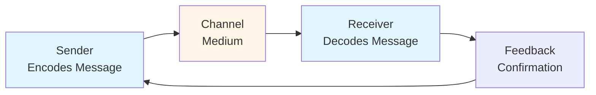
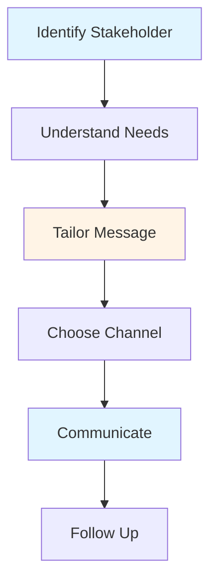
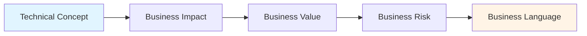

# Communication & Coordination Guide - Team Lead

## Table of Contents
1. [Introduction](#introduction)
2. [Communication Fundamentals](#communication-fundamentals)
3. [Stakeholder Communication](#stakeholder-communication)
4. [Translating Technical to Business](#translating-technical-to-business)
5. [Cross-Team Coordination](#cross-team-coordination)
6. [Status Reporting](#status-reporting)
7. [Technical Documentation](#technical-documentation)
8. [Meeting Facilitation](#meeting-facilitation)
9. [Best Practices](#best-practices)
10. [Common Pitfalls](#common-pitfalls)
11. [Summary](#summary)

---

## Introduction

Effective communication is essential for Team Leads. You need to communicate with team members, stakeholders, other teams, and management. This guide covers communication strategies, coordination techniques, and documentation practices.

### Who This Guide Is For
- Team Leads communicating with stakeholders
- Developers transitioning to leadership
- Anyone coordinating across teams
- Teams improving communication

### Key Learning Objectives
- Understand communication fundamentals
- Master stakeholder communication
- Translate technical concepts to business language
- Coordinate effectively across teams
- Create effective status reports
- Write clear technical documentation

---

## Communication Fundamentals

### Communication Model



### Communication Principles

#### 1. Clarity
- Use simple language
- Be specific
- Avoid jargon (when appropriate)
- Provide examples
- Confirm understanding

#### 2. Completeness
- Include all necessary information
- Provide context
- Answer questions
- Don't leave gaps
- Follow up if needed

#### 3. Conciseness
- Be brief but complete
- Get to the point
- Remove unnecessary information
- Respect time
- Focus on key points

#### 4. Consideration
- Consider audience
- Think about impact
- Be respectful
- Show empathy
- Build relationships

### Communication Channels

#### Face-to-Face
- **Best for**: Complex topics, sensitive issues, relationship building
- **When**: Important decisions, conflicts, personal matters
- **Pros**: Rich communication, immediate feedback
- **Cons**: Requires scheduling, not always possible

#### Video Calls
- **Best for**: Remote teams, visual discussions
- **When**: Regular meetings, presentations
- **Pros**: Visual cues, remote-friendly
- **Cons**: Technical issues, less personal

#### Chat/Slack
- **Best for**: Quick questions, updates, async communication
- **When**: Non-urgent, simple questions
- **Pros**: Fast, async, searchable
- **Cons**: Can be overwhelming, less personal

#### Email
- **Best for**: Formal communication, documentation, async
- **When**: Important decisions, status updates, external
- **Pros**: Documented, formal, async
- **Cons**: Can be slow, easy to ignore

#### Documentation
- **Best for**: Knowledge sharing, reference, onboarding
- **When**: Processes, decisions, knowledge
- **Pros**: Permanent, searchable, scalable
- **Cons**: Requires maintenance, may not be read

---

## Stakeholder Communication

### Understanding Stakeholders

#### Types of Stakeholders

1. **Project Managers**
   - Need: Status, risks, timelines
   - Focus: Delivery, scope, schedule
   - Communication: Regular updates, risks

2. **Product Managers**
   - Need: Technical feasibility, trade-offs
   - Focus: Features, user value
   - Communication: Technical constraints, options

3. **Business Stakeholders**
   - Need: Business impact, risks
   - Focus: Value, ROI, risks
   - Communication: Business language, impact

4. **Engineering Management**
   - Need: Team status, technical health
   - Focus: Team, quality, process
   - Communication: Technical details, team health

### Stakeholder Communication Framework



### Communication Strategies

#### 1. Regular Updates
- **Frequency**: Weekly or bi-weekly
- **Format**: Status report or meeting
- **Content**: Progress, risks, next steps
- **Channel**: Email or meeting

#### 2. Proactive Communication
- **When**: Issues arise, risks identified
- **How**: Immediate notification
- **What**: Issue, impact, plan
- **Why**: Build trust, manage expectations

#### 3. Transparent Communication
- **Be Honest**: Don't hide problems
- **Share Context**: Provide background
- **Explain Trade-offs**: Help understand decisions
- **Admit Uncertainty**: When you don't know

---

## Translating Technical to Business

### The Translation Challenge

Technical concepts need to be explained in business terms that stakeholders understand and care about.

### Translation Framework



### Translation Techniques

#### 1. Use Analogies
- **Technical**: "Database connection pooling"
- **Business**: "Like a carpool - reusing connections instead of creating new ones saves time and resources"

#### 2. Focus on Impact
- **Technical**: "Refactoring legacy code"
- **Business**: "Improving code quality to reduce bugs and speed up future development"

#### 3. Use Business Metrics
- **Technical**: "API response time improved by 200ms"
- **Business**: "Users experience faster page loads, improving satisfaction"

#### 4. Explain Trade-offs
- **Technical**: "Using microservices increases complexity"
- **Business**: "More complex architecture, but enables independent scaling and faster feature development"

### Common Translations

| Technical Term | Business Translation |
|----------------|---------------------|
| Technical debt | Future cost of shortcuts |
| Refactoring | Improving code quality |
| Performance optimization | Making it faster |
| Scalability | Ability to handle growth |
| Architecture | System design |
| Bug fix | Problem resolution |
| Feature | New capability |

---

## Cross-Team Coordination

### Coordination Challenges

- **Dependencies**: Teams depend on each other
- **Alignment**: Ensuring teams work together
- **Communication**: Keeping everyone informed
- **Conflicts**: Resolving disagreements
- **Timing**: Coordinating schedules

### Coordination Strategies

#### 1. Regular Sync Meetings
- **Purpose**: Align on dependencies and progress
- **Frequency**: Weekly or bi-weekly
- **Participants**: Key team members
- **Agenda**: Dependencies, blockers, progress

#### 2. Shared Documentation
- **Purpose**: Document interfaces and agreements
- **Content**: APIs, contracts, processes
- **Location**: Shared wiki or docs
- **Maintenance**: Keep updated

#### 3. Communication Channels
- **Purpose**: Quick coordination
- **Channels**: Slack channels, email lists
- **Rules**: When to use which channel
- **Etiquette**: Response expectations

#### 4. Interface Contracts
- **Purpose**: Define team boundaries
- **Content**: APIs, data formats, SLAs
- **Process**: Review and approval
- **Versioning**: Handle changes

### Coordination Best Practices

1. **Be Proactive**: Communicate early
2. **Document Agreements**: Write down decisions
3. **Follow Up**: Ensure commitments met
4. **Escalate Early**: Don't let issues fester
5. **Build Relationships**: Know your counterparts

---

## Status Reporting

### Status Report Purpose

Status reports keep stakeholders informed about progress, risks, and next steps.

### Status Report Structure

#### 1. Executive Summary
- High-level status
- Key achievements
- Major risks
- Next steps

#### 2. Progress
- What was accomplished
- What's in progress
- What's planned
- Metrics and milestones

#### 3. Risks and Issues
- Current risks
- Mitigation plans
- Blockers
- Escalations

#### 4. Next Steps
- Upcoming work
- Dependencies
- Decisions needed
- Timeline

### Status Report Template

```markdown
# Status Report - [Project/Team] - [Date]

## Executive Summary
[One paragraph summary]

## Progress This Week
- [Achievement 1]
- [Achievement 2]
- [Achievement 3]

## Metrics
- [Metric 1]: [Value]
- [Metric 2]: [Value]

## Risks and Issues
- [Risk 1]: [Status, Mitigation]
- [Issue 1]: [Status, Plan]

## Next Week
- [Planned work 1]
- [Planned work 2]
- [Decision needed]

## Dependencies
- [Dependency 1]: [Status]
- [Dependency 2]: [Status]
```

### Status Reporting Best Practices

1. **Be Consistent**: Regular schedule
2. **Be Honest**: Don't hide problems
3. **Be Concise**: Focus on key points
4. **Be Actionable**: Include next steps
5. **Be Visual**: Use charts when helpful

---

## Technical Documentation

### Documentation Types

#### 1. Architecture Documentation
- System design
- Component diagrams
- Data flow
- Technology choices

#### 2. API Documentation
- Endpoints
- Request/response formats
- Authentication
- Examples

#### 3. Process Documentation
- Development processes
- Deployment procedures
- Incident response
- Onboarding guides

#### 4. Code Documentation
- Code comments
- README files
- Function documentation
- Examples

### Documentation Best Practices

1. **Write for Audience**: Consider who will read it
2. **Keep Updated**: Maintain documentation
3. **Use Examples**: Show, don't just tell
4. **Be Clear**: Simple, direct language
5. **Make Searchable**: Good structure and indexing

---

## Meeting Facilitation

### Facilitating Effective Meetings

#### Before Meeting
- **Set Agenda**: Define topics
- **Invite Right People**: Include key stakeholders
- **Prepare Materials**: Share in advance
- **Set Time**: Appropriate duration

#### During Meeting
- **Start on Time**: Respect schedules
- **Keep Focused**: Stay on agenda
- **Encourage Participation**: Get everyone involved
- **Take Notes**: Record decisions
- **End on Time**: Respect time limits

#### After Meeting
- **Send Summary**: Recap decisions
- **Share Action Items**: Who does what
- **Follow Up**: Ensure completion

### Meeting Best Practices

1. **Have Purpose**: Every meeting needs a goal
2. **Be Prepared**: Come ready to contribute
3. **Be Present**: Focus on meeting
4. **Be Respectful**: Value everyone's time
5. **Follow Up**: Complete action items

---

## Best Practices

### Communication Best Practices

1. **Be Clear**: Use simple, direct language
2. **Be Proactive**: Communicate early and often
3. **Be Honest**: Don't hide problems
4. **Be Respectful**: Consider others
5. **Be Responsive**: Reply in timely manner
6. **Listen**: Understand before responding

### Coordination Best Practices

1. **Communicate Early**: Don't wait for problems
2. **Document Agreements**: Write down decisions
3. **Follow Up**: Ensure commitments met
4. **Build Relationships**: Know your counterparts
5. **Escalate Early**: Don't let issues fester

---

## Common Pitfalls

### Mistakes to Avoid

1. **Too Technical**: Jargon overload
2. **Not Communicating**: Keeping information to yourself
3. **Poor Timing**: Communicating too late
4. **Wrong Channel**: Using inappropriate medium
5. **Not Listening**: Not understanding others
6. **No Follow-up**: Not ensuring understanding

---

## Summary

### Key Takeaways

1. **Communication** is fundamental to Team Lead success
2. **Stakeholder communication** requires understanding their needs
3. **Translation** from technical to business is essential
4. **Coordination** across teams needs structure
5. **Status reporting** keeps stakeholders informed
6. **Documentation** preserves knowledge

### Next Steps

- Review **[Core Responsibilities Guide](./CORE_RESPONSIBILITIES_GUIDE.md)** for role context
- Study **[Daily/Weekly Processes Guide](./DAILY_WEEKLY_PROCESSES_GUIDE.md)** for communication workflows
- Explore **[Team Dynamics Guide](./TEAM_DYNAMICS_GUIDE.md)** for team communication

---

**Remember**: Good communication is about understanding your audience and delivering the right message through the right channel at the right time.


