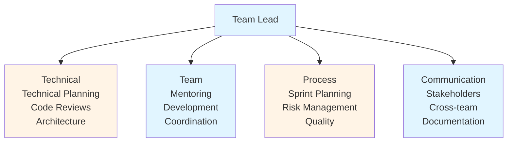
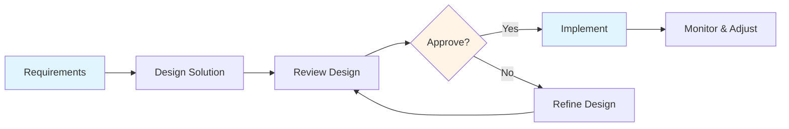
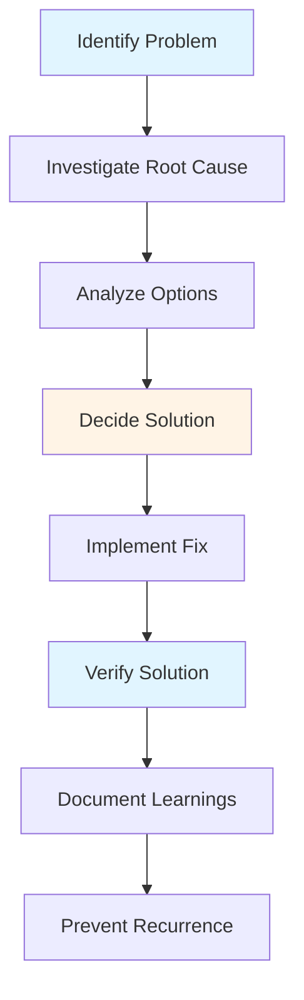
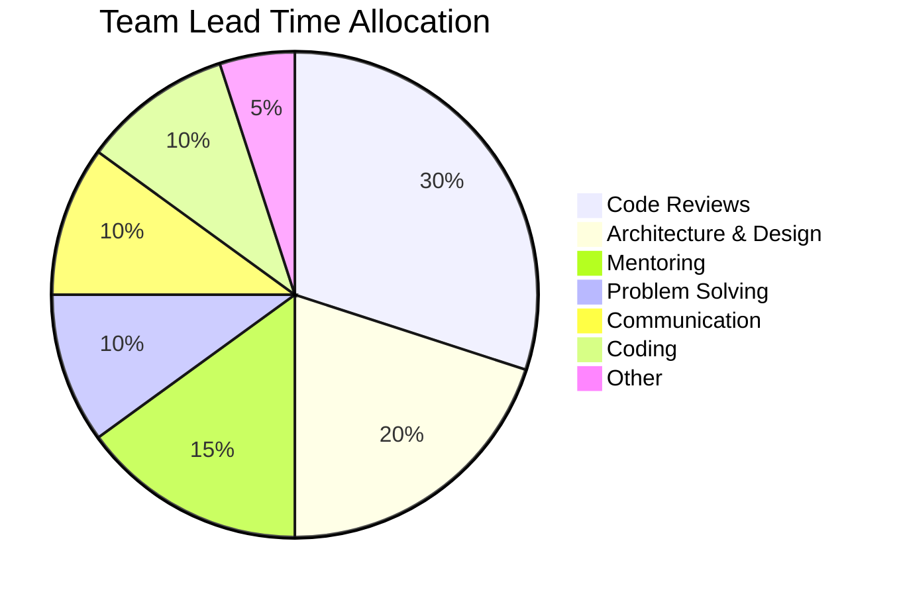

# Core Responsibilities Guide - Team Lead

## Table of Contents
1. [Introduction](#introduction)
2. [What is a Team Lead?](#what-is-a-team-lead)
3. [Role Distinctions](#role-distinctions)
4. [Core Responsibilities](#core-responsibilities)
5. [Technical Planning & Architecture](#technical-planning--architecture)
6. [Code Reviews & Quality Assurance](#code-reviews--quality-assurance)
7. [Mentoring & Team Development](#mentoring--team-development)
8. [Problem Solving & Troubleshooting](#problem-solving--troubleshooting)
9. [Technical Decision Making](#technical-decision-making)
10. [Communication & Coordination](#communication--coordination)
11. [Time Allocation](#time-allocation)
12. [Best Practices](#best-practices)
13. [Common Pitfalls](#common-pitfalls)
14. [Summary](#summary)

---

## Introduction

Understanding your core responsibilities is fundamental to being an effective Team Lead. This guide defines the role, distinguishes it from related positions, and details the key responsibilities you'll need to master.

### Who This Guide Is For
- New Team Leads starting their leadership journey
- Developers considering a Team Lead role
- Experienced Team Leads reviewing responsibilities
- Engineering managers understanding the role

### Key Learning Objectives
- Understand what a Team Lead is and does
- Distinguish Team Lead from Tech Lead and Engineering Manager
- Learn core responsibilities in detail
- Understand time allocation priorities
- Apply best practices and avoid common pitfalls

---

## What is a Team Lead?

A **Team Lead** (also called **Tech Lead**) is a senior developer who takes on leadership responsibilities while remaining hands-on with code. They bridge the gap between individual contributors and management, focusing on technical excellence, team development, and project delivery.

### Key Characteristics

- **Technical Expert**: Deep technical knowledge and coding ability
- **Team Leader**: Guides and develops team members
- **Decision Maker**: Makes technical decisions and trade-offs
- **Communicator**: Translates between technical and business domains
- **Problem Solver**: Resolves complex technical and team issues

### The Dual Nature

Team Leads operate in two worlds:
1. **Technical**: Writing code, reviewing code, designing systems
2. **Leadership**: Mentoring, coordinating, communicating, planning

Balancing these two aspects is one of the biggest challenges of the role.

---

## Role Distinctions

### Team Lead vs. Tech Lead

**Team Lead**:
- Focuses on team management and development
- More people-oriented
- Handles team dynamics and coordination
- Often reports to Engineering Manager

**Tech Lead**:
- Focuses on technical direction and architecture
- More technology-oriented
- Handles technical decisions and standards
- May not have direct reports

**In Practice**: These terms are often used interchangeably, and many roles combine both aspects.

### Team Lead vs. Engineering Manager

| Aspect | Team Lead | Engineering Manager |
|--------|-----------|---------------------|
| **Coding** | Hands-on coding (30-50%) | Minimal/no coding |
| **People Management** | Indirect (mentoring) | Direct (performance reviews, hiring) |
| **Focus** | Technical + Team | People + Process |
| **Scope** | Single team | Multiple teams/department |
| **Time Horizon** | Sprint to quarter | Quarter to year |

### Team Lead vs. Senior Developer

**Senior Developer**:
- Focuses on individual contribution
- Deep technical expertise
- May mentor informally
- No formal leadership responsibilities

**Team Lead**:
- All of the above, plus:
- Formal leadership responsibilities
- Team coordination
- Technical decision making
- Cross-functional communication

---

## Core Responsibilities

### Responsibility Overview

### Six Core Responsibility Areas

1. **Technical Planning & Architecture**
2. **Code Reviews & Quality Assurance**
3. **Mentoring & Team Development**
4. **Problem Solving & Troubleshooting**
5. **Technical Decision Making**
6. **Communication & Coordination**

---

## Technical Planning & Architecture

### Overview

Team Leads are responsible for the technical direction of their team's work. This includes planning, architecture, and ensuring technical quality.

### Key Activities

#### 1. Technical Planning
- Break down features into technical tasks
- Estimate complexity and effort
- Identify technical risks
- Plan technical dependencies
- Create technical roadmaps

#### 2. Architecture & Design
- Design system architecture
- Create technical specifications
- Review and approve designs
- Ensure scalability and maintainability
- Balance short-term needs vs. long-term vision

#### 3. Technical Standards
- Establish coding standards
- Define best practices
- Create technical guidelines
- Ensure consistency across team
- Document technical decisions

### Process

### Best Practices

- **Think Ahead**: Consider future requirements and scalability
- **Document Decisions**: Use Architecture Decision Records (ADRs)
- **Involve Team**: Get input from team members
- **Balance Trade-offs**: Consider time, quality, and technical debt
- **Stay Current**: Keep up with technology trends

---

## Code Reviews & Quality Assurance

### Overview

Code reviews are one of the most visible and impactful responsibilities of a Team Lead. They ensure code quality, teach best practices, and maintain consistency.

### Key Activities

#### 1. Code Review
- Review all pull requests (especially critical changes)
- Provide constructive feedback
- Ensure code follows standards
- Check for bugs and issues
- Verify test coverage

#### 2. Quality Assurance
- Maintain code quality metrics
- Identify quality trends
- Address technical debt
- Ensure test coverage
- Monitor code health

#### 3. Teaching Through Reviews
- Explain why changes are needed
- Share knowledge and patterns
- Guide junior developers
- Promote best practices
- Build team capabilities

### Review Focus Areas

- **Correctness**: Does it work correctly?
- **Quality**: Is it well-written?
- **Standards**: Does it follow conventions?
- **Tests**: Are there adequate tests?
- **Documentation**: Is it documented?
- **Performance**: Are there performance concerns?
- **Security**: Are there security issues?

### Best Practices

- **Be Constructive**: Focus on code, not person
- **Explain Why**: Help developers understand
- **Balance Speed & Quality**: Don't block unnecessarily
- **Prioritize**: Focus on high-impact reviews
- **Teach**: Use reviews as teaching opportunities

---

## Mentoring & Team Development

### Overview

Team Leads are responsible for developing their team members' skills and careers. This is both a responsibility and an investment in team capability.

### Key Activities

#### 1. Mentoring
- Pair programming sessions
- One-on-one technical discussions
- Code review guidance
- Career development conversations
- Skill development planning

#### 2. Knowledge Sharing
- Technical workshops
- Code walkthroughs
- Architecture discussions
- Best practices sessions
- Learning opportunities

#### 3. Team Development
- Identify skill gaps
- Create development plans
- Provide growth opportunities
- Recognize achievements
- Build team capabilities

### Mentoring Approaches

- **Pair Programming**: Work together on code
- **Code Reviews**: Teach through feedback
- **Technical Discussions**: Explain concepts and decisions
- **Workshops**: Share knowledge with team
- **Career Guidance**: Help with career development

### Best Practices

- **Be Available**: Make time for team members
- **Tailor Approach**: Adapt to individual needs
- **Be Patient**: Allow time for learning
- **Celebrate Growth**: Recognize improvements
- **Create Opportunities**: Give challenging assignments

---

## Problem Solving & Troubleshooting

### Overview

Team Leads are often called upon to solve the most complex technical problems. This requires deep technical knowledge, analytical thinking, and systematic approaches.

### Key Activities

#### 1. Problem Investigation
- Root cause analysis
- Debugging complex issues
- Performance investigation
- System troubleshooting
- Incident response

#### 2. Solution Development
- Design solutions
- Evaluate alternatives
- Make technical decisions
- Implement fixes
- Verify solutions

#### 3. Prevention
- Identify patterns
- Improve processes
- Add monitoring
- Document learnings
- Prevent recurrence

### Problem-Solving Process

### Best Practices

- **Systematic Approach**: Use structured problem-solving methods
- **Root Cause Focus**: Don't just fix symptoms
- **Document Everything**: Keep notes and learnings
- **Involve Team**: Get help when needed
- **Learn from Incidents**: Improve based on experience

---

## Technical Decision Making

### Overview

Team Leads make numerous technical decisions daily. These decisions impact code quality, team productivity, and long-term maintainability.

### Key Activities

#### 1. Technology Decisions
- Evaluate technologies
- Choose tools and frameworks
- Make architecture decisions
- Select libraries and dependencies
- Decide on technical standards

#### 2. Trade-off Analysis
- Balance competing concerns
- Consider short vs. long-term
- Evaluate costs and benefits
- Assess risks
- Make informed decisions

#### 3. Decision Documentation
- Document decisions (ADRs)
- Explain rationale
- Record alternatives considered
- Update as needed
- Share with team

### Decision-Making Framework

1. **Understand Context**: What's the problem?
2. **Gather Information**: Research options
3. **Evaluate Alternatives**: Compare options
4. **Consider Trade-offs**: Balance factors
5. **Make Decision**: Choose best option
6. **Document**: Record decision and rationale
7. **Communicate**: Share with team
8. **Review**: Revisit if needed

### Best Practices

- **Involve Team**: Get input from team members
- **Document Decisions**: Use ADRs
- **Consider Long-term**: Think beyond immediate needs
- **Be Decisive**: Don't over-analyze
- **Review Regularly**: Revisit decisions as context changes

---

## Communication & Coordination

### Overview

Effective communication is essential for Team Leads. You need to communicate with team members, stakeholders, other teams, and management.

### Key Activities

#### 1. Team Communication
- Daily stand-ups
- Technical discussions
- One-on-one meetings
- Team meetings
- Status updates

#### 2. Stakeholder Communication
- Translate technical to business language
- Provide status updates
- Explain technical constraints
- Manage expectations
- Report progress

#### 3. Cross-Team Coordination
- Coordinate with other teams
- Resolve dependencies
- Share knowledge
- Align on standards
- Collaborate on solutions

### Communication Channels

- **Face-to-Face**: Most effective for complex topics
- **Video Calls**: For remote teams
- **Chat/Slack**: Quick questions and updates
- **Email**: Formal communication and documentation
- **Documentation**: Written knowledge sharing

### Best Practices

- **Be Clear**: Use simple language
- **Be Proactive**: Communicate early and often
- **Listen**: Understand others' perspectives
- **Adapt Style**: Match audience needs
- **Document**: Write important decisions

---

## Time Allocation

### Typical Time Distribution

### Weekly Breakdown (40 hours)

- **Code Reviews** (12 hours): Reviewing pull requests, providing feedback
- **Architecture & Design** (8 hours): Planning, designing, reviewing designs
- **Mentoring** (6 hours): One-on-ones, pair programming, workshops
- **Problem Solving** (4 hours): Debugging, troubleshooting, incident response
- **Communication** (4 hours): Meetings, status updates, coordination
- **Coding** (4 hours): Hands-on development work
- **Other** (2 hours): Documentation, admin, learning

### Adjusting Allocation

Time allocation should adjust based on:
- **Team Size**: Larger teams need more coordination
- **Team Experience**: Junior teams need more mentoring
- **Project Phase**: Planning needs more architecture time
- **Incidents**: Production issues need immediate attention
- **Personal Preference**: Balance coding vs. leadership

---

## Best Practices

### Core Best Practices

1. **Lead by Example**
   - Write quality code
   - Follow best practices
   - Demonstrate values
   - Show commitment

2. **Empower Team**
   - Delegate appropriately
   - Trust team members
   - Provide autonomy
   - Support decisions

3. **Communicate Clearly**
   - Be transparent
   - Share context
   - Explain decisions
   - Listen actively

4. **Focus on Quality**
   - Maintain standards
   - Review thoroughly
   - Address technical debt
   - Improve continuously

5. **Develop Team**
   - Invest in mentoring
   - Create opportunities
   - Recognize growth
   - Build capabilities

---

## Common Pitfalls

### Mistakes to Avoid

1. **Micromanaging**
   - **Problem**: Over-controlling team work
   - **Solution**: Delegate and trust team

2. **Ignoring Leadership**
   - **Problem**: Focusing only on coding
   - **Solution**: Balance technical and leadership

3. **Poor Communication**
   - **Problem**: Not sharing information
   - **Solution**: Communicate proactively

4. **Not Delegating**
   - **Problem**: Doing everything yourself
   - **Solution**: Delegate appropriately

5. **Ignoring Team Development**
   - **Problem**: Not investing in team growth
   - **Solution**: Make mentoring a priority

6. **Burning Out**
   - **Problem**: Taking on too much
   - **Solution**: Set boundaries, delegate

---

## Summary

### Key Takeaways

1. **Team Lead** is a dual role combining technical expertise and leadership
2. **Core responsibilities** include technical planning, code reviews, mentoring, problem solving, decision making, and communication
3. **Time allocation** should balance coding (10-20%) with leadership activities (80-90%)
4. **Best practices** include leading by example, empowering team, clear communication, quality focus, and team development
5. **Common pitfalls** include micromanaging, ignoring leadership, poor communication, not delegating, and burning out

### Next Steps

- Review **[Daily/Weekly Processes Guide](./DAILY_WEEKLY_PROCESSES_GUIDE.md)** for workflow details
- Study **[Code Review Excellence Guide](./CODE_REVIEW_EXCELLENCE_GUIDE.md)** for review best practices
- Learn **[Mentoring & Team Development Guide](./MENTORING_TEAM_DEVELOPMENT_GUIDE.md)** for mentoring strategies
- Explore **[Communication & Coordination Guide](./COMMUNICATION_COORDINATION_GUIDE.md)** for communication skills

---

**Remember**: Being a Team Lead is about enabling your team to do their best work. Focus on removing obstacles, providing guidance, and building capabilities.

