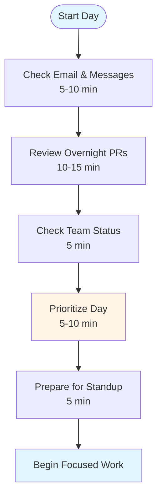
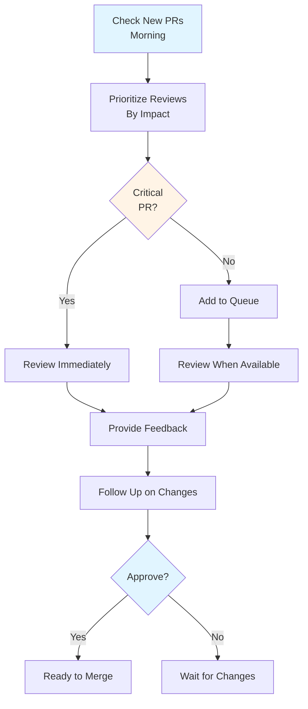
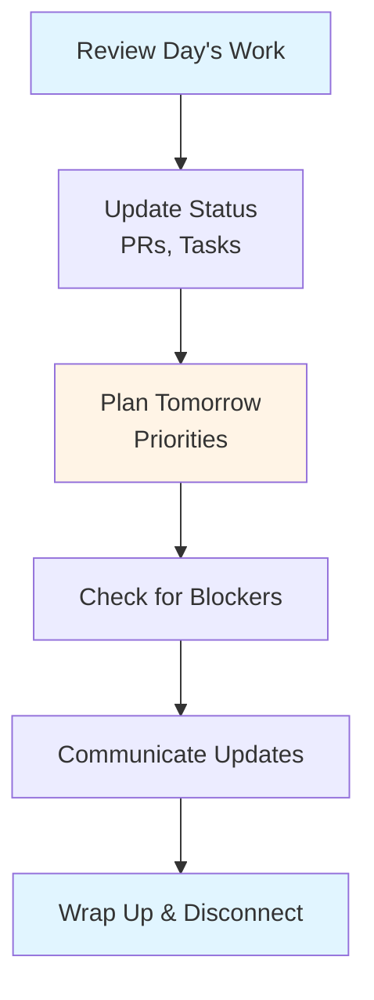

# Daily/Weekly Processes Guide - Team Lead

## Table of Contents
1. [Introduction](#introduction)
2. [Morning Routine](#morning-routine)
3. [Daily Stand-ups](#daily-stand-ups)
4. [Code Review Workflow](#code-review-workflow)
5. [Technical Discussions](#technical-discussions)
6. [One-on-One Meetings](#one-on-one-meetings)
7. [End-of-Day Routine](#end-of-day-routine)
8. [Weekly Routines](#weekly-routines)
9. [Sprint Routines](#sprint-routines)
10. [Time Management](#time-management)
11. [Best Practices](#best-practices)
12. [Common Pitfalls](#common-pitfalls)
13. [Summary](#summary)

---

## Introduction

Effective Team Leads have structured daily and weekly routines that help them balance technical work, leadership responsibilities, and team development. This guide provides practical workflows and processes for managing your time and responsibilities.

### Who This Guide Is For
- New Team Leads establishing routines
- Experienced Team Leads optimizing workflows
- Developers preparing for Team Lead role
- Anyone managing technical teams

### Key Learning Objectives
- Establish effective morning and daily routines
- Master stand-up meetings and team check-ins
- Optimize code review workflow
- Structure one-on-one meetings
- Plan weekly and sprint activities
- Manage time effectively

---

## Morning Routine

### Purpose

A good morning routine sets the tone for the day, helps you prioritize, and ensures you're prepared for team interactions.

### Typical Morning Routine (First 30-60 minutes)



### Morning Activities

#### 1. Check Communications (5-10 minutes)
- Review overnight emails
- Check Slack/chat messages
- Identify urgent items
- Flag items needing response

#### 2. Review Code (10-15 minutes)
- Check new pull requests
- Review overnight code reviews
- Identify blocking reviews
- Prioritize review queue

#### 3. Check Team Status (5 minutes)
- Review team's progress
- Check for blockers
- Identify issues
- Prepare for stand-up

#### 4. Prioritize Day (5-10 minutes)
- Review calendar
- Identify critical tasks
- Plan time blocks
- Set daily goals

### Best Practices

- **Start Early**: Begin before team arrives
- **Focus First**: Handle urgent items first
- **Don't Get Distracted**: Avoid rabbit holes
- **Set Boundaries**: Protect focus time
- **Be Prepared**: Ready for stand-up

---

## Daily Stand-ups

### Purpose

Stand-ups keep the team aligned, surface blockers early, and provide visibility into progress.

### Stand-up Structure

**Standard Format** (15 minutes):
1. **What did you do yesterday?** (2-3 min per person)
2. **What will you do today?** (2-3 min per person)
3. **Any blockers?** (1-2 min per person)

### Team Lead Role in Stand-up

#### Before Stand-up
- Review team's work
- Identify potential blockers
- Prepare questions
- Check sprint progress

#### During Stand-up
- **Facilitate**: Keep meeting on track
- **Listen**: Pay attention to blockers
- **Ask Questions**: Clarify when needed
- **Take Notes**: Record blockers and issues
- **Keep Time**: Ensure meeting stays on schedule

#### After Stand-up
- **Address Blockers**: Help resolve issues
- **Follow Up**: Check on items mentioned
- **Update Status**: Update project tracking
- **Coordinate**: Arrange needed meetings

### Stand-up Best Practices

- **Keep It Short**: 15 minutes maximum
- **Stay Focused**: Discuss only relevant items
- **Surface Blockers**: Don't let issues hide
- **Be Present**: Avoid distractions
- **Follow Up**: Address blockers promptly

### Common Stand-up Anti-patterns

- **Status Report to Manager**: Should be team sync
- **Too Long**: Exceeding time limit
- **Problem Solving**: Should happen after
- **Missing Members**: Inconsistent attendance
- **No Follow-up**: Blockers not addressed

---

## Code Review Workflow

### Daily Code Review Process



### Review Prioritization

**High Priority** (Review immediately):
- Critical bug fixes
- Security-related changes
- Breaking changes
- Production deployments
- Blocking other work

**Medium Priority** (Review within 4 hours):
- Feature implementations
- Refactoring
- Test improvements
- Documentation updates

**Low Priority** (Review within 24 hours):
- Minor fixes
- Style changes
- Non-critical updates

### Review Workflow

1. **Check PR List**: Review new and updated PRs
2. **Prioritize**: Identify critical reviews
3. **Review Code**: Thorough code examination
4. **Provide Feedback**: Constructive comments
5. **Follow Up**: Check on changes
6. **Approve/Merge**: When ready

### Time Management

- **Batch Reviews**: Review multiple PRs together
- **Set Time Blocks**: Dedicate time for reviews
- **Limit Interruptions**: Focus during review time
- **Use Tools**: Leverage automation
- **Delegate**: Have others review when appropriate

---

## Technical Discussions

### Types of Technical Discussions

#### 1. Architecture Discussions
- System design
- Technology choices
- Technical trade-offs
- Scalability concerns

#### 2. Problem-Solving Sessions
- Debugging complex issues
- Performance problems
- Root cause analysis
- Solution design

#### 3. Design Reviews
- Feature designs
- API designs
- Database schemas
- Integration approaches

### Facilitating Technical Discussions

#### Before Discussion
- **Prepare**: Review relevant materials
- **Set Agenda**: Define topics to cover
- **Invite Right People**: Include key stakeholders
- **Set Time**: Allocate appropriate time

#### During Discussion
- **Facilitate**: Keep discussion on track
- **Encourage Participation**: Get everyone involved
- **Ask Questions**: Probe deeper
- **Document**: Record decisions
- **Time Box**: Keep within time limit

#### After Discussion
- **Summarize**: Recap decisions
- **Document**: Write up outcomes
- **Follow Up**: Ensure action items completed
- **Share**: Communicate to team

### Best Practices

- **Be Inclusive**: Get input from all team members
- **Stay Focused**: Keep discussions on topic
- **Make Decisions**: Don't just discuss
- **Document**: Record important decisions
- **Follow Up**: Ensure outcomes are implemented

---

## One-on-One Meetings

### Purpose

One-on-ones are crucial for team development, relationship building, and understanding team members' needs.

### Meeting Structure

**Weekly One-on-One** (30-60 minutes):

1. **Check-in** (5 min): How are things going?
2. **Work Discussion** (15-20 min): Current work, challenges, progress
3. **Development** (10-15 min): Career, skills, growth
4. **Feedback** (5-10 min): Give and receive feedback
5. **Action Items** (5 min): Next steps and follow-ups

### One-on-One Topics

#### Work Topics
- Current projects and progress
- Challenges and blockers
- Technical questions
- Process improvements
- Team dynamics

#### Development Topics
- Career goals
- Skill development
- Learning opportunities
- Growth areas
- Interests and aspirations

#### Feedback Topics
- Performance feedback
- Recognition
- Areas for improvement
- Support needed
- Concerns or issues

### Best Practices

- **Be Consistent**: Regular schedule
- **Listen Actively**: Focus on team member
- **Be Present**: Avoid distractions
- **Take Notes**: Remember important points
- **Follow Up**: Complete action items

---

## End-of-Day Routine

### Purpose

End-of-day routine helps you wrap up, prepare for tomorrow, and maintain work-life balance.

### Typical End-of-Day Routine (15-30 minutes)



### End-of-Day Activities

#### 1. Review Day's Work (5 minutes)
- What was accomplished?
- What wasn't completed?
- What needs follow-up?

#### 2. Update Status (5 minutes)
- Update PR reviews
- Update task status
- Update project tracking
- Clear notifications

#### 3. Plan Tomorrow (5 minutes)
- Identify priorities
- Review calendar
- Plan time blocks
- Set goals

#### 4. Check Blockers (5 minutes)
- Any team blockers?
- Any issues to address?
- Any escalations needed?

#### 5. Communicate (5 minutes)
- Send status updates
- Respond to urgent items
- Share important information

### Best Practices

- **Set Boundaries**: End work at scheduled time
- **Don't Overwork**: Avoid working late regularly
- **Disconnect**: Step away from work
- **Reflect**: Think about what went well
- **Prepare**: Set up for tomorrow

---

## Weekly Routines

### Weekly Planning (Monday Morning)

**Weekly Planning Session** (30-60 minutes):

1. **Review Last Week**: What was accomplished?
2. **Review Sprint Progress**: Where are we in sprint?
3. **Plan This Week**: What are priorities?
4. **Identify Risks**: What could go wrong?
5. **Schedule Time**: Block calendar for important work

### Weekly Review (Friday Afternoon)

**Weekly Review Session** (30 minutes):

1. **Review Accomplishments**: What was completed?
2. **Review Blockers**: What issues came up?
3. **Review Team**: How is team doing?
4. **Plan Next Week**: What's coming up?
5. **Reflect**: What went well? What to improve?

### Weekly Activities

- **Team Retrospective**: Sprint retrospective (if applicable)
- **One-on-Ones**: Individual meetings with team members
- **Architecture Review**: Review technical designs
- **Planning**: Sprint planning or technical planning
- **Learning**: Dedicate time for learning

---

## Sprint Routines

### Sprint Planning (Beginning of Sprint)

**Team Lead Role**:
- Break down features into technical tasks
- Estimate complexity and effort
- Identify technical risks
- Plan technical dependencies
- Assign tasks based on skills

### Daily During Sprint

- **Stand-ups**: Daily team sync
- **Code Reviews**: Continuous review
- **Blockers**: Address immediately
- **Progress**: Monitor sprint progress
- **Adjustments**: Adapt as needed

### Sprint Review (End of Sprint)

**Team Lead Role**:
- Review technical accomplishments
- Demo technical work
- Discuss technical challenges
- Share learnings
- Plan improvements

### Sprint Retrospective

**Team Lead Role**:
- Facilitate retrospective
- Encourage honest feedback
- Identify improvements
- Create action items
- Follow up on improvements

---

## Time Management

### Time Blocking

**Recommended Daily Schedule**:

```
Morning (9:00-12:00)
- 9:00-9:30: Morning routine, stand-up prep
- 9:30-10:00: Stand-up and follow-ups
- 10:00-12:00: Focused work (code reviews, architecture)

Afternoon (1:00-5:00)
- 1:00-2:00: Code reviews (batch)
- 2:00-3:00: Technical discussions/meetings
- 3:00-4:00: One-on-ones or mentoring
- 4:00-5:00: Coding or focused work
```

### Protecting Focus Time

- **Block Calendar**: Schedule focus time
- **Limit Meetings**: Avoid unnecessary meetings
- **Batch Tasks**: Group similar activities
- **Say No**: Decline non-essential requests
- **Use Tools**: Leverage automation

### Managing Interruptions

- **Set Expectations**: Communicate availability
- **Use Status**: Update status (busy, available)
- **Schedule Office Hours**: Designated help time
- **Delegate**: Have others handle when possible
- **Prioritize**: Address urgent items first

---

## Best Practices

### Daily Best Practices

1. **Start with Priorities**: Focus on important work first
2. **Protect Focus Time**: Block time for deep work
3. **Be Available**: Make time for team
4. **Review Regularly**: Check progress throughout day
5. **End Well**: Wrap up properly

### Weekly Best Practices

1. **Plan Weekly**: Set weekly goals and priorities
2. **Review Weekly**: Reflect on accomplishments
3. **Balance Work**: Mix technical and leadership
4. **Invest in Team**: Dedicate time to mentoring
5. **Learn Continuously**: Set aside learning time

---

## Common Pitfalls

### Mistakes to Avoid

1. **No Routine**: Lack of structure leads to chaos
2. **Over-scheduling**: Too many meetings
3. **No Focus Time**: Constant interruptions
4. **Ignoring Blockers**: Not addressing issues promptly
5. **Poor Planning**: Not planning ahead
6. **Working Too Much**: No work-life balance

---

## Summary

### Key Takeaways

1. **Morning Routine**: Start day with structure and priorities
2. **Stand-ups**: Keep team aligned and surface blockers
3. **Code Reviews**: Prioritize and batch reviews efficiently
4. **One-on-Ones**: Regular meetings for team development
5. **Time Management**: Block time and protect focus time
6. **Weekly Routines**: Plan and review weekly

### Next Steps

- Review **[Code Review Excellence Guide](./CODE_REVIEW_EXCELLENCE_GUIDE.md)** for detailed review processes
- Study **[Communication & Coordination Guide](./COMMUNICATION_COORDINATION_GUIDE.md)** for communication workflows
- Learn **[Sprint/Iteration Management Guide](./SPRINT_ITERATION_MANAGEMENT_GUIDE.md)** for sprint processes

---

**Remember**: Effective routines create structure that enables you to be both technically excellent and a great leader. Find what works for you and your team.


