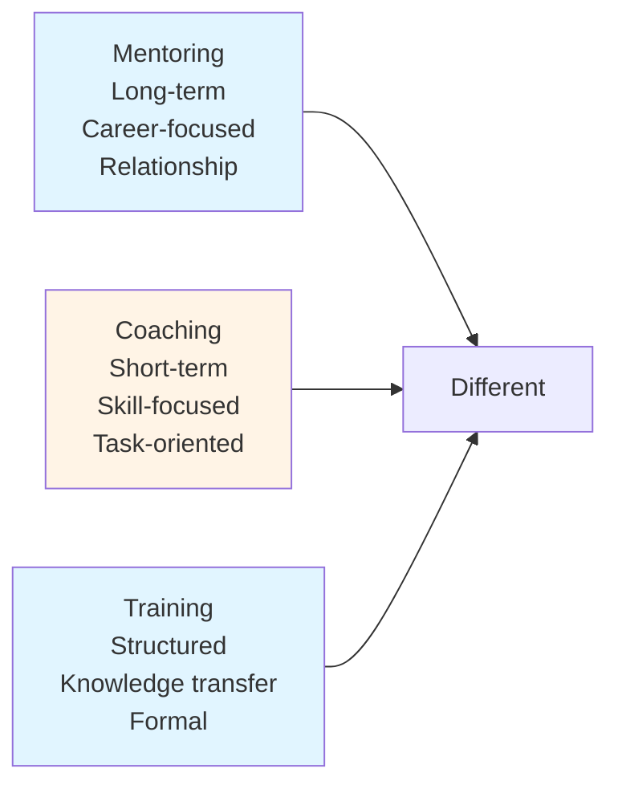
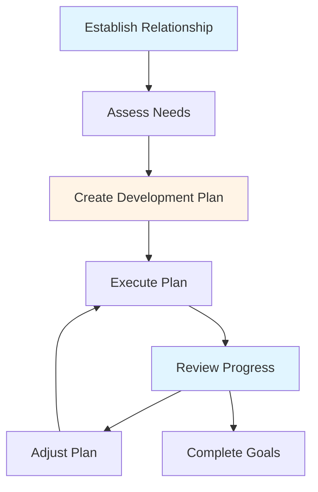
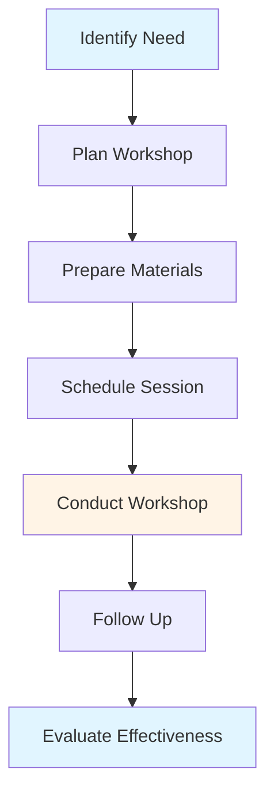
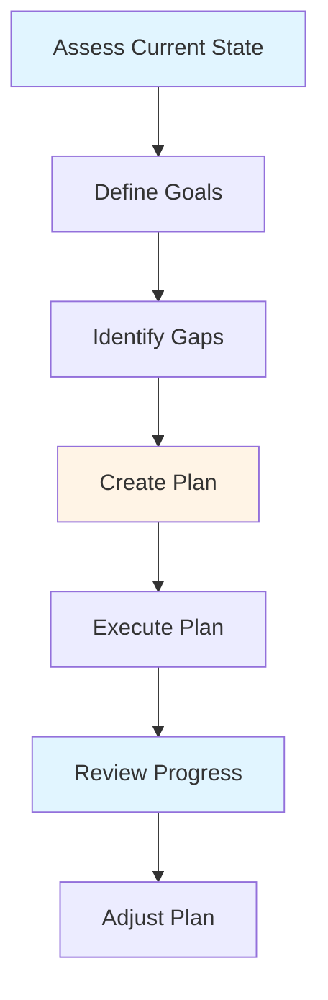

# Mentoring & Team Development Guide - Team Lead

## Table of Contents
1. [Introduction](#introduction)
2. [Mentoring Fundamentals](#mentoring-fundamentals)
3. [Mentoring Strategies](#mentoring-strategies)
4. [Pair Programming](#pair-programming)
5. [Technical Workshops](#technical-workshops)
6. [Career Development](#career-development)
7. [Skill Gap Identification](#skill-gap-identification)
8. [Creating Learning Opportunities](#creating-learning-opportunities)
9. [Best Practices](#best-practices)
10. [Common Pitfalls](#common-pitfalls)
11. [Summary](#summary)

---

## Introduction

Mentoring and team development are core responsibilities of a Team Lead. Developing your team members' skills and careers not only helps them grow but also strengthens your team's capabilities. This guide covers effective mentoring strategies and team development approaches.

### Who This Guide Is For
- Team Leads mentoring developers
- Senior developers coaching juniors
- Anyone responsible for team development
- Developers interested in mentoring

### Key Learning Objectives
- Understand mentoring fundamentals
- Learn effective mentoring strategies
- Master pair programming techniques
- Conduct technical workshops
- Guide career development
- Identify and address skill gaps

---

## Mentoring Fundamentals

### What is Mentoring?

Mentoring is a relationship in which an experienced person (mentor) helps a less experienced person (mentee) develop skills, knowledge, and capabilities.

### Mentoring vs. Coaching vs. Training

**Mentoring**: Long-term relationship, career-focused, guidance
**Coaching**: Short-term, skill-focused, task-oriented
**Training**: Structured, knowledge transfer, formal

### Benefits of Mentoring

#### For Mentee
- Faster skill development
- Career guidance
- Increased confidence
- Expanded network
- Better performance

#### For Mentor
- Leadership development
- Teaching skills
- Fresh perspectives
- Recognition
- Team capability

#### For Team
- Improved capabilities
- Knowledge sharing
- Better collaboration
- Reduced turnover
- Stronger culture

---

## Mentoring Strategies

### Mentoring Approaches

#### 1. Directive Mentoring
- **When**: Mentee needs specific guidance
- **How**: Provide direct instructions and solutions
- **Use**: Early stages, specific problems

#### 2. Socratic Mentoring
- **When**: Mentee can discover answers
- **How**: Ask questions to guide thinking
- **Use**: Problem-solving, learning

#### 3. Collaborative Mentoring
- **When**: Working together on problems
- **How**: Pair programming, joint problem-solving
- **Use**: Complex tasks, skill building

#### 4. Delegative Mentoring
- **When**: Mentee is ready for independence
- **How**: Assign tasks, provide support
- **Use**: Experienced mentees, growth

### Mentoring Process

### Step-by-Step Process

#### 1. Establish Relationship
- Build trust
- Set expectations
- Define goals
- Establish communication

#### 2. Assess Needs
- Identify skill gaps
- Understand goals
- Assess current level
- Determine learning style

#### 3. Create Plan
- Set objectives
- Define activities
- Set timeline
- Identify resources

#### 4. Execute Plan
- Conduct sessions
- Provide feedback
- Assign tasks
- Support learning

#### 5. Review Progress
- Regular check-ins
- Assess progress
- Gather feedback
- Adjust approach

---

## Pair Programming

### What is Pair Programming?

Pair programming is a collaborative programming technique where two developers work together at one workstation, with one writing code (driver) and the other reviewing and guiding (navigator).

### Pair Programming Benefits

- **Knowledge Sharing**: Transfer knowledge quickly
- **Code Quality**: Two sets of eyes catch more issues
- **Learning**: Both participants learn
- **Problem Solving**: Better solutions together
- **Team Building**: Strengthens relationships

### Pair Programming Styles

#### Driver-Navigator
- **Driver**: Writes code
- **Navigator**: Reviews, guides, thinks ahead
- **Switch**: Regularly switch roles

#### Ping-Pong
- **Driver 1**: Writes test
- **Driver 2**: Implements to pass test
- **Alternate**: Switch for each test

#### Strong-Style
- **Navigator**: Decides what to do
- **Driver**: Implements exactly as instructed
- **Benefit**: Forces clear communication

### Pair Programming Best Practices

1. **Set Goals**: Define what you'll accomplish
2. **Switch Regularly**: Change roles frequently
3. **Communicate**: Talk through decisions
4. **Be Patient**: Allow time for learning
5. **Take Breaks**: Rest to stay focused

---

## Technical Workshops

### Workshop Types

#### 1. Knowledge Sharing
- **Purpose**: Share expertise
- **Format**: Presentation + Q&A
- **Duration**: 30-60 minutes
- **Topics**: Technologies, patterns, practices

#### 2. Hands-On Training
- **Purpose**: Practice skills
- **Format**: Exercises + practice
- **Duration**: 1-2 hours
- **Topics**: Tools, frameworks, techniques

#### 3. Problem-Solving
- **Purpose**: Solve real problems
- **Format**: Collaborative problem-solving
- **Duration**: 1-2 hours
- **Topics**: Architecture, design, debugging

### Workshop Planning

### Workshop Structure

#### 1. Introduction (5-10 min)
- Welcome and agenda
- Learning objectives
- Set expectations

#### 2. Content (30-60 min)
- Main content delivery
- Examples and demos
- Interactive elements

#### 3. Practice (20-30 min)
- Hands-on exercises
- Group activities
- Problem-solving

#### 4. Wrap-up (10 min)
- Summary
- Q&A
- Next steps
- Resources

### Workshop Best Practices

- **Know Your Audience**: Tailor to skill level
- **Be Interactive**: Engage participants
- **Use Examples**: Real-world scenarios
- **Provide Resources**: Materials for later
- **Follow Up**: Check understanding

---

## Career Development

### Career Development Conversations

#### Topics to Cover

1. **Career Goals**
   - Short-term goals (6-12 months)
   - Long-term goals (2-5 years)
   - Career aspirations
   - Interests and passions

2. **Current Role**
   - Strengths and achievements
   - Areas for growth
   - Challenges and concerns
   - Satisfaction and engagement

3. **Development Needs**
   - Skills to develop
   - Knowledge gaps
   - Experience needed
   - Learning opportunities

4. **Action Plan**
   - Development activities
   - Learning resources
   - Projects and assignments
   - Timeline and milestones

### Career Development Framework

### Supporting Career Growth

#### 1. Provide Opportunities
- Challenging assignments
- New technologies
- Cross-functional work
- Leadership opportunities

#### 2. Give Feedback
- Regular performance feedback
- Recognition of achievements
- Constructive improvement areas
- Career guidance

#### 3. Connect Resources
- Learning materials
- Training opportunities
- Internal networks
- External communities

#### 4. Advocate
- Recommend for opportunities
- Support promotions
- Provide references
- Champion achievements

---

## Skill Gap Identification

### Identifying Skill Gaps

#### Methods

1. **Observation**
   - Watch work performance
   - Review code quality
   - Assess problem-solving
   - Note struggles

2. **Conversation**
   - Ask about challenges
   - Discuss goals
   - Understand interests
   - Identify concerns

3. **Assessment**
   - Technical assessments
   - Code reviews
   - Project outcomes
   - Peer feedback

4. **Self-Assessment**
   - Ask mentee to assess
   - Identify own gaps
   - Compare to goals
   - Review together

### Skill Gap Categories

#### Technical Skills
- Programming languages
- Frameworks and tools
- Architecture and design
- Testing and quality
- DevOps and infrastructure

#### Soft Skills
- Communication
- Collaboration
- Problem-solving
- Time management
- Leadership

#### Domain Knowledge
- Business domain
- Industry knowledge
- System knowledge
- Process understanding

### Addressing Skill Gaps

1. **Prioritize**: Focus on most important gaps
2. **Plan**: Create development plan
3. **Provide Resources**: Learning materials
4. **Create Opportunities**: Practice opportunities
5. **Support**: Provide guidance and feedback
6. **Review**: Track progress regularly

---

## Creating Learning Opportunities

### Types of Learning Opportunities

#### 1. On-the-Job Learning
- **Challenging Assignments**: Stretch capabilities
- **New Technologies**: Learn by doing
- **Cross-Functional Work**: Broaden experience
- **Problem-Solving**: Real challenges

#### 2. Formal Learning
- **Training Courses**: Structured learning
- **Certifications**: Credential programs
- **Conferences**: Industry events
- **Workshops**: Focused sessions

#### 3. Informal Learning
- **Code Reviews**: Learn from feedback
- **Pair Programming**: Learn together
- **Tech Talks**: Internal presentations
- **Reading**: Books and articles

#### 4. Community Learning
- **Meetups**: Local communities
- **Online Forums**: Discussion groups
- **Open Source**: Contribute to projects
- **Blogging**: Share knowledge

### Creating Opportunities

1. **Identify Needs**: What skills are needed?
2. **Match Interests**: Align with interests
3. **Provide Resources**: Access to materials
4. **Create Time**: Allocate learning time
5. **Support**: Provide guidance
6. **Recognize**: Acknowledge learning

---

## Best Practices

### Mentoring Best Practices

1. **Be Available**: Make time for mentees
2. **Listen Actively**: Understand needs
3. **Be Patient**: Allow time for learning
4. **Provide Feedback**: Regular, constructive
5. **Celebrate Growth**: Recognize progress
6. **Be Honest**: Direct but kind
7. **Lead by Example**: Demonstrate values

### Team Development Best Practices

1. **Invest Time**: Prioritize development
2. **Create Culture**: Learning culture
3. **Provide Resources**: Access to learning
4. **Recognize Effort**: Acknowledge growth
5. **Measure Progress**: Track development
6. **Adjust Approach**: Adapt to needs

---

## Common Pitfalls

### Mistakes to Avoid

1. **Not Making Time**: Too busy to mentor
2. **Being Too Directive**: Not allowing discovery
3. **Ignoring Individual Needs**: One-size-fits-all
4. **Not Following Up**: Abandoning mentees
5. **Being Impatient**: Expecting too much too soon
6. **Not Providing Feedback**: Missing growth opportunities
7. **Overwhelming**: Too much information

---

## Summary

### Key Takeaways

1. **Mentoring** is a long-term relationship focused on career development
2. **Pair programming** is an effective way to share knowledge
3. **Technical workshops** help build team capabilities
4. **Career development** conversations guide growth
5. **Skill gaps** should be identified and addressed systematically
6. **Learning opportunities** should be created and supported

### Next Steps

- Review **[Core Responsibilities Guide](./CORE_RESPONSIBILITIES_GUIDE.md)** for role context
- Study **[Team Dynamics Guide](./TEAM_DYNAMICS_GUIDE.md)** for team building
- Explore **[Communication & Coordination Guide](./COMMUNICATION_COORDINATION_GUIDE.md)** for communication skills

---

**Remember**: Investing in your team's development is investing in your team's success. Be patient, be supportive, and celebrate growth.

