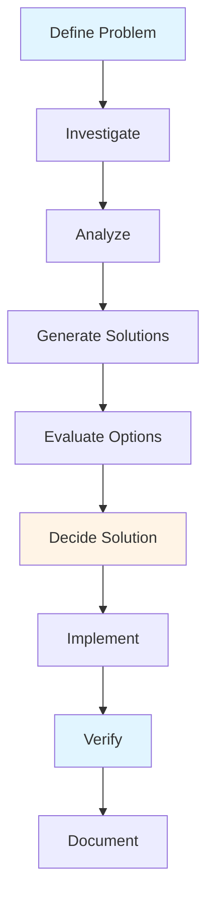
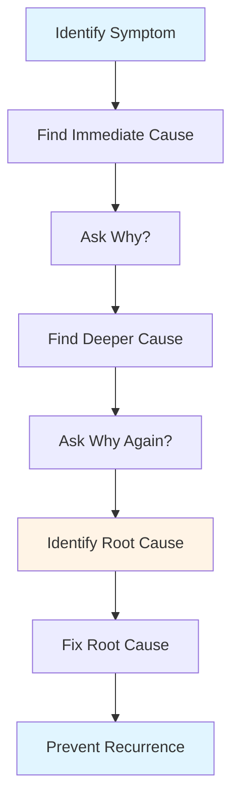
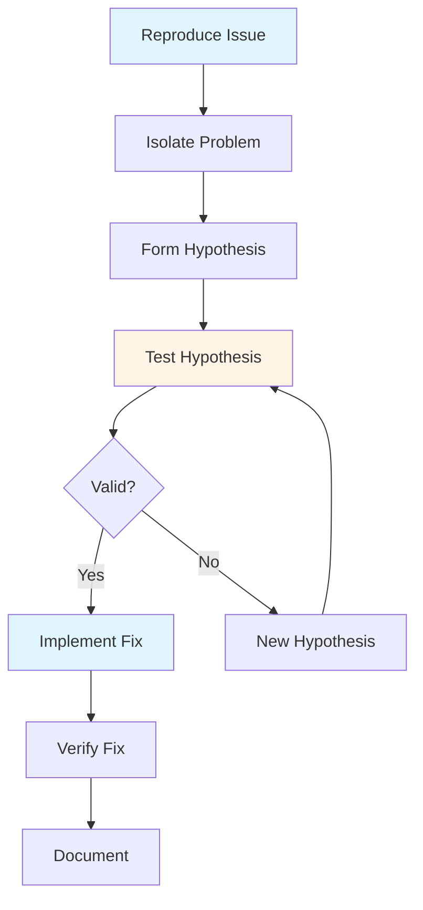
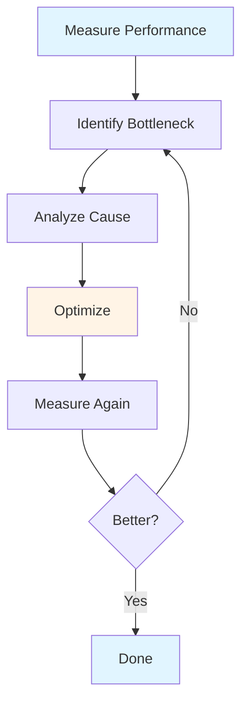
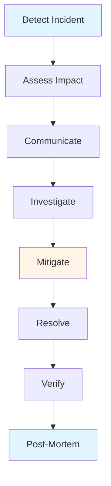
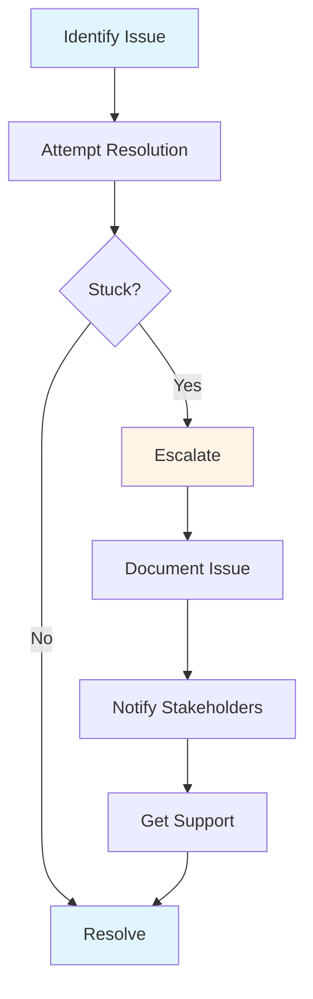

# Problem Solving & Troubleshooting Guide - Team Lead

## Table of Contents
1. [Introduction](#introduction)
2. [Problem-Solving Frameworks](#problem-solving-frameworks)
3. [Root Cause Analysis](#root-cause-analysis)
4. [Debugging Complex Issues](#debugging-complex-issues)
5. [Performance Optimization](#performance-optimization)
6. [Production Incident Response](#production-incident-response)
7. [Escalation Procedures](#escalation-procedures)
8. [Best Practices](#best-practices)
9. [Common Pitfalls](#common-pitfalls)
10. [Summary](#summary)

---

## Introduction

Team Leads are often called upon to solve the most complex technical problems. This guide covers systematic approaches to problem-solving, root cause analysis, debugging, and incident response.

### Who This Guide Is For
- Team Leads troubleshooting issues
- Senior developers solving complex problems
- Anyone involved in incident response
- Teams establishing problem-solving processes

### Key Learning Objectives
- Understand problem-solving frameworks
- Master root cause analysis techniques
- Learn systematic debugging approaches
- Handle performance issues
- Respond to production incidents
- Know when and how to escalate

---

## Problem-Solving Frameworks

### General Problem-Solving Process

### Step-by-Step Framework

#### 1. Define the Problem
- What exactly is the problem?
- What are the symptoms?
- When does it occur?
- Who is affected?
- What's the impact?

#### 2. Investigate
- Gather information
- Collect logs and data
- Reproduce the issue
- Understand context
- Identify patterns

#### 3. Analyze
- Break down the problem
- Identify possible causes
- Analyze data
- Look for patterns
- Consider hypotheses

#### 4. Generate Solutions
- Brainstorm options
- Consider alternatives
- Evaluate feasibility
- Think creatively
- Get input from team

#### 5. Evaluate Options
- Assess pros and cons
- Consider trade-offs
- Evaluate risks
- Estimate effort
- Choose best option

#### 6. Implement Solution
- Plan implementation
- Execute carefully
- Monitor results
- Adjust as needed
- Verify fix

#### 7. Document
- Record problem
- Document solution
- Share learnings
- Update documentation
- Prevent recurrence

---

## Root Cause Analysis

### What is Root Cause Analysis?

Root Cause Analysis (RCA) is a method of problem-solving used to identify the underlying cause of a problem rather than just addressing symptoms.

### RCA Process

### 5 Whys Technique

The 5 Whys is a simple but effective technique for finding root causes by repeatedly asking "Why?" until you reach the root cause.

**Example**:
1. **Problem**: Application is slow
   - **Why?** Database queries are slow
2. **Why?** Queries are not using indexes
3. **Why?** Indexes were not created
4. **Why?** Database migration script was incomplete
5. **Why?** Code review missed the migration script
   - **Root Cause**: Incomplete code review process

### Fishbone Diagram (Ishikawa)

A visual tool for organizing potential causes of a problem.

**Categories**:
- **People**: Skills, training, errors
- **Process**: Procedures, workflows
- **Technology**: Tools, systems, infrastructure
- **Environment**: Conditions, context
- **Materials**: Resources, data
- **Methods**: Approaches, techniques

### RCA Best Practices

1. **Don't Stop at Symptoms**: Dig deeper
2. **Be Systematic**: Use structured approach
3. **Gather Data**: Base on facts, not assumptions
4. **Involve Team**: Get different perspectives
5. **Document**: Record findings
6. **Prevent**: Address root cause, not just symptoms

---

## Debugging Complex Issues

### Debugging Process

### Debugging Strategies

#### 1. Reproduce the Issue
- Can you reproduce it?
- What are the steps?
- Is it consistent?
- What's the environment?

#### 2. Isolate the Problem
- Narrow down scope
- Identify affected components
- Isolate variables
- Use binary search
- Remove non-essential parts

#### 3. Form Hypotheses
- What could cause this?
- What changed recently?
- What's different?
- What patterns exist?

#### 4. Test Hypotheses
- Add logging
- Use debugger
- Add tests
- Check assumptions
- Verify hypotheses

#### 5. Implement Fix
- Make minimal change
- Test thoroughly
- Verify fix
- Check for side effects
- Document changes

### Debugging Tools

- **Logging**: Add detailed logs
- **Debuggers**: Step through code
- **Profilers**: Identify bottlenecks
- **Monitoring**: Track system behavior
- **Testing**: Isolate with tests

---

## Performance Optimization

### Performance Investigation Process

### Performance Optimization Steps

#### 1. Measure
- Establish baseline
- Identify metrics
- Use profiling tools
- Monitor in production
- Track over time

#### 2. Identify Bottleneck
- Where is time spent?
- What's the slowest part?
- What's using resources?
- What's the constraint?

#### 3. Analyze
- Why is it slow?
- What's the root cause?
- What are the options?
- What are trade-offs?

#### 4. Optimize
- Apply optimization
- Make targeted changes
- Test thoroughly
- Verify improvement

#### 5. Verify
- Measure improvement
- Check for regressions
- Monitor in production
- Document changes

### Common Performance Issues

#### Database
- Slow queries
- Missing indexes
- N+1 queries
- Connection pool issues

#### Application
- Inefficient algorithms
- Unnecessary computations
- Memory leaks
- Blocking operations

#### Infrastructure
- Resource constraints
- Network latency
- Cache misses
- Load balancing

### Optimization Strategies

- **Caching**: Reduce computation
- **Indexing**: Speed up queries
- **Async Processing**: Non-blocking operations
- **Connection Pooling**: Reuse connections
- **Load Balancing**: Distribute load

---

## Production Incident Response

### Incident Response Process

### Incident Response Steps

#### 1. Detect
- Monitor alerts
- User reports
- System monitoring
- Error tracking

#### 2. Assess Impact
- How many users affected?
- What's the severity?
- What's the scope?
- What's the business impact?

#### 3. Communicate
- Notify stakeholders
- Update status page
- Keep team informed
- Set expectations

#### 4. Investigate
- Gather information
- Check logs
- Reproduce issue
- Identify cause

#### 5. Mitigate
- Stop the bleeding
- Rollback if needed
- Apply quick fix
- Reduce impact

#### 6. Resolve
- Implement proper fix
- Verify solution
- Monitor stability
- Confirm resolution

#### 7. Post-Mortem
- Document incident
- Analyze root cause
- Identify improvements
- Prevent recurrence

### Incident Severity Levels

#### P0 - Critical
- System down
- Data loss
- Security breach
- Immediate response

#### P1 - High
- Major feature broken
- Significant impact
- Response within 1 hour

#### P2 - Medium
- Minor feature broken
- Limited impact
- Response within 4 hours

#### P3 - Low
- Minor issue
- Minimal impact
- Response within 24 hours

---

## Escalation Procedures

### When to Escalate

- **Beyond Expertise**: Outside your knowledge
- **Resource Constraints**: Need additional resources
- **Business Impact**: Significant business risk
- **Time Pressure**: Urgent deadline
- **Authority Needed**: Requires management decision

### Escalation Process

### Escalation Best Practices

1. **Try First**: Attempt to resolve yourself
2. **Document**: Record what you've tried
3. **Be Clear**: Explain the issue clearly
4. **Provide Context**: Share relevant information
5. **Suggest Solutions**: Propose options
6. **Follow Up**: Track escalation

---

## Best Practices

### Problem-Solving Best Practices

1. **Be Systematic**: Use structured approach
2. **Gather Data**: Base on facts
3. **Think Critically**: Question assumptions
4. **Collaborate**: Get team input
5. **Document**: Record process and solution
6. **Learn**: Extract learnings

### Troubleshooting Best Practices

1. **Reproduce First**: Understand the issue
2. **Isolate**: Narrow down scope
3. **Hypothesize**: Form theories
4. **Test**: Verify hypotheses
5. **Fix Root Cause**: Not just symptoms
6. **Verify**: Confirm fix works

---

## Common Pitfalls

### Mistakes to Avoid

1. **Jumping to Solutions**: Not understanding problem
2. **Fixing Symptoms**: Not addressing root cause
3. **Not Documenting**: Forgetting learnings
4. **Working Alone**: Not asking for help
5. **Panic**: Losing calm under pressure
6. **Not Testing**: Not verifying fixes

---

## Summary

### Key Takeaways

1. **Problem-solving** requires systematic approach
2. **Root cause analysis** finds underlying causes
3. **Debugging** is methodical investigation
4. **Performance optimization** requires measurement
5. **Incident response** needs clear process
6. **Escalation** should be timely and clear

### Next Steps

- Review **[Core Responsibilities Guide](./CORE_RESPONSIBILITIES_GUIDE.md)** for role context
- Study **[Real-World Scenarios Guide](./REAL_WORLD_SCENARIOS_GUIDE.md)** for examples
- Explore **[Templates & Checklists Guide](./TEMPLATES_CHECKLISTS_GUIDE.md)** for incident response templates

---

**Remember**: Good problem-solving is systematic, data-driven, and collaborative. Take time to understand the problem before jumping to solutions.

