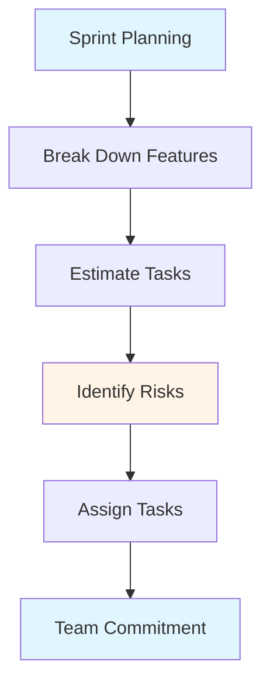
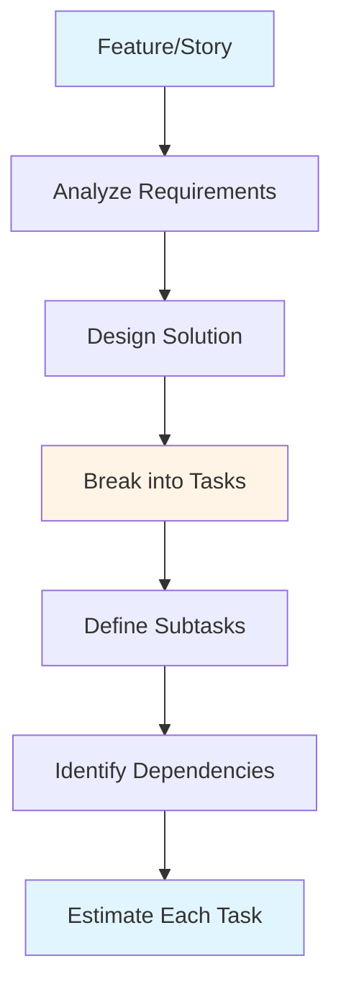
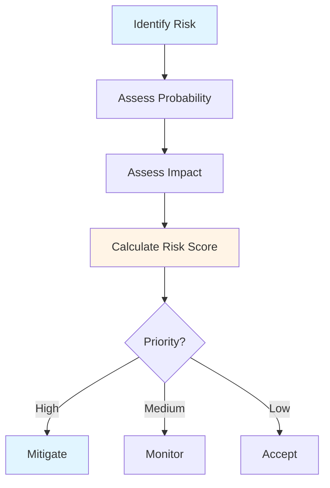
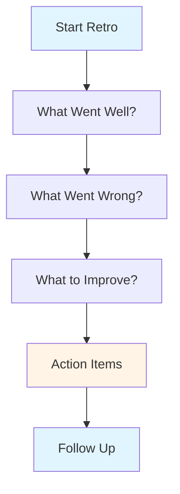

# Sprint/Iteration Management Guide - Team Lead

## Table of Contents
1. [Introduction](#introduction)
2. [Sprint Planning (Technical Aspects)](#sprint-planning-technical-aspects)
3. [Task Breakdown and Estimation](#task-breakdown-and-estimation)
4. [Risk Identification](#risk-identification)
5. [Sprint Execution and Monitoring](#sprint-execution-and-monitoring)
6. [Sprint Review and Retrospective](#sprint-review-and-retrospective)
7. [Technical Debt Tracking](#technical-debt-tracking)
8. [Best Practices](#best-practices)
9. [Common Pitfalls](#common-pitfalls)
10. [Summary](#summary)

---

## Introduction

As a Team Lead, you play a crucial role in sprint planning, execution, and review from a technical perspective. This guide covers your responsibilities in managing sprints and iterations effectively.

### Who This Guide Is For
- Team Leads managing sprints
- Developers involved in sprint planning
- Teams using Agile/Scrum
- Anyone planning technical work

### Key Learning Objectives
- Understand technical aspects of sprint planning
- Master task breakdown and estimation
- Identify and manage technical risks
- Monitor sprint execution
- Conduct effective reviews and retrospectives
- Track technical debt

---

## Sprint Planning (Technical Aspects)

### Team Lead Role in Sprint Planning

### Technical Planning Activities

#### 1. Feature Analysis
- Understand requirements
- Identify technical approach
- Assess complexity
- Identify dependencies
- Plan implementation

#### 2. Technical Design
- Design solution
- Review architecture
- Define interfaces
- Plan integration
- Document decisions

#### 3. Task Breakdown
- Break into tasks
- Define subtasks
- Identify dependencies
- Sequence work
- Estimate effort

#### 4. Risk Assessment
- Identify technical risks
- Assess probability
- Evaluate impact
- Plan mitigation
- Document risks

### Sprint Planning Best Practices

1. **Prepare**: Review backlog before planning
2. **Involve Team**: Get team input
3. **Be Realistic**: Don't overcommit
4. **Consider Dependencies**: Plan accordingly
5. **Document**: Record decisions

---

## Task Breakdown and Estimation

### Task Breakdown Process

### Breakdown Guidelines

#### Task Size
- **Ideal**: 1-2 days of work
- **Maximum**: 3-5 days
- **Too Small**: Less than 4 hours (combine)
- **Too Large**: Break down further

#### Task Characteristics
- **Independent**: Can work on separately
- **Testable**: Can verify completion
- **Clear**: Well-defined scope
- **Assignable**: Can assign to developer

### Estimation Techniques

#### Story Points
- **Relative sizing**: Compare to other stories
- **Fibonacci sequence**: 1, 2, 3, 5, 8, 13
- **Team consensus**: Planning poker
- **Velocity tracking**: Historical data

#### Time Estimation
- **Hours or days**: Absolute time
- **Consider complexity**: Not just size
- **Account for unknowns**: Add buffer
- **Team velocity**: Based on history

### Estimation Factors

- **Complexity**: How complex is it?
- **Uncertainty**: How much is unknown?
- **Dependencies**: What does it depend on?
- **Risk**: What could go wrong?
- **Team capability**: Who will work on it?

---

## Risk Identification

### Technical Risk Categories

#### 1. Technical Complexity
- **Risk**: More complex than expected
- **Impact**: Delays, rework
- **Mitigation**: Proof of concept, research

#### 2. Dependencies
- **Risk**: External dependencies delayed
- **Impact**: Blocking work
- **Mitigation**: Early communication, alternatives

#### 3. Technology
- **Risk**: New technology challenges
- **Impact**: Learning curve, issues
- **Mitigation**: Research, training, POC

#### 4. Integration
- **Risk**: Integration problems
- **Impact**: Delays, rework
- **Mitigation**: Early integration, testing

#### 5. Performance
- **Risk**: Performance issues
- **Impact**: Rework, delays
- **Mitigation**: Performance testing, monitoring

### Risk Assessment

### Risk Mitigation Strategies

1. **Avoid**: Change approach to avoid risk
2. **Mitigate**: Reduce probability or impact
3. **Transfer**: Move risk to another party
4. **Accept**: Acknowledge and monitor

---

## Sprint Execution and Monitoring

### Daily Monitoring

#### Stand-up Focus
- Progress on tasks
- Blockers and issues
- Dependencies
- Risks materializing
- Help needed

#### Progress Tracking
- Task completion
- Burndown chart
- Velocity tracking
- Blockers
- Risks

### Monitoring Tools

- **Task Board**: Visual progress
- **Burndown Chart**: Progress tracking
- **Velocity**: Team capacity
- **Metrics**: Cycle time, lead time

### Intervention Strategies

#### When to Intervene
- **Blockers**: Help remove obstacles
- **Risks**: Address materializing risks
- **Scope Creep**: Manage changes
- **Quality Issues**: Address early
- **Team Issues**: Resolve conflicts

---

## Sprint Review and Retrospective

### Sprint Review (Technical)

#### Technical Review Activities
- **Demo Technical Work**: Show accomplishments
- **Discuss Challenges**: Share learnings
- **Review Metrics**: Technical metrics
- **Gather Feedback**: From stakeholders
- **Plan Next Steps**: Technical planning

### Sprint Retrospective

#### Retrospective Process

#### Technical Retrospective Topics
- **Code Quality**: Review quality trends
- **Technical Debt**: Address debt items
- **Process**: Development processes
- **Tools**: Tool effectiveness
- **Knowledge**: Knowledge sharing

### Retrospective Best Practices

1. **Be Honest**: Encourage honest feedback
2. **Focus on Process**: Not people
3. **Actionable**: Create specific actions
4. **Follow Up**: Track action items
5. **Celebrate**: Recognize achievements

---

## Technical Debt Tracking

### Technical Debt in Sprints

#### Debt Identification
- **Code Reviews**: Identify during reviews
- **Retrospectives**: Discuss in retros
- **Monitoring**: Track metrics
- **Team Input**: Team reports

#### Debt Prioritization
- **Impact**: How does it affect work?
- **Urgency**: How urgent is it?
- **Effort**: How much work to fix?
- **Risk**: What's the risk if not fixed?

### Debt Management in Sprints

#### Allocation Strategies
- **Dedicated Time**: Allocate time each sprint
- **As You Go**: Fix while working
- **Dedicated Sprints**: Occasional debt sprints
- **Mix**: Combination approach

#### Tracking Debt
- **Debt Backlog**: Maintain debt items
- **Track Progress**: Monitor reduction
- **Report**: Include in status
- **Prioritize**: Regular prioritization

---

## Best Practices

### Sprint Management Best Practices

1. **Plan Realistically**: Don't overcommit
2. **Break Down Well**: Good task breakdown
3. **Identify Risks**: Early risk identification
4. **Monitor Closely**: Daily monitoring
5. **Adapt Quickly**: Adjust as needed
6. **Learn Continuously**: Improve each sprint

### Technical Planning Best Practices

1. **Design First**: Design before coding
2. **Consider Dependencies**: Plan dependencies
3. **Estimate Accurately**: Realistic estimates
4. **Track Debt**: Manage technical debt
5. **Document Decisions**: Record important decisions

---

## Common Pitfalls

### Mistakes to Avoid

1. **Overcommitting**: Taking on too much
2. **Poor Breakdown**: Tasks too large
3. **Ignoring Risks**: Not addressing risks
4. **No Monitoring**: Not tracking progress
5. **Scope Creep**: Allowing uncontrolled changes
6. **Ignoring Debt**: Not managing debt

---

## Summary

### Key Takeaways

1. **Sprint planning** requires technical analysis and task breakdown
2. **Estimation** should consider complexity, uncertainty, and dependencies
3. **Risk identification** helps prevent problems
4. **Monitoring** ensures sprint success
5. **Retrospectives** drive continuous improvement
6. **Technical debt** must be actively managed

### Next Steps

- Review **[Core Responsibilities Guide](./CORE_RESPONSIBILITIES_GUIDE.md)** for role context
- Study **[Daily/Weekly Processes Guide](./DAILY_WEEKLY_PROCESSES_GUIDE.md)** for daily workflows
- Explore **[Best Practices & Common Pitfalls Guide](./BEST_PRACTICES_COMMON_PITFALLS_GUIDE.md)** for more practices

---

**Remember**: Effective sprint management balances planning, execution, and learning. Be realistic, monitor closely, and adapt quickly.

