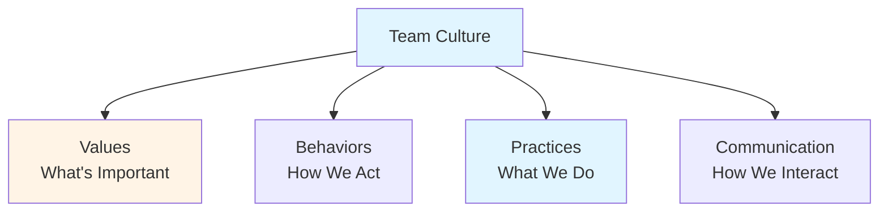
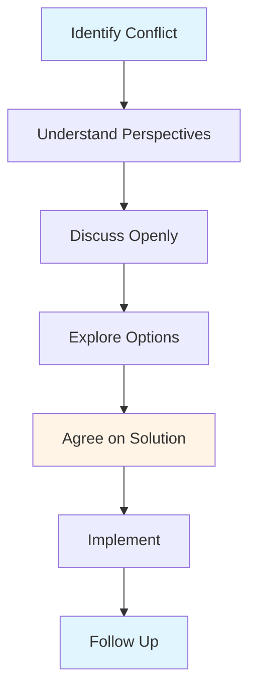
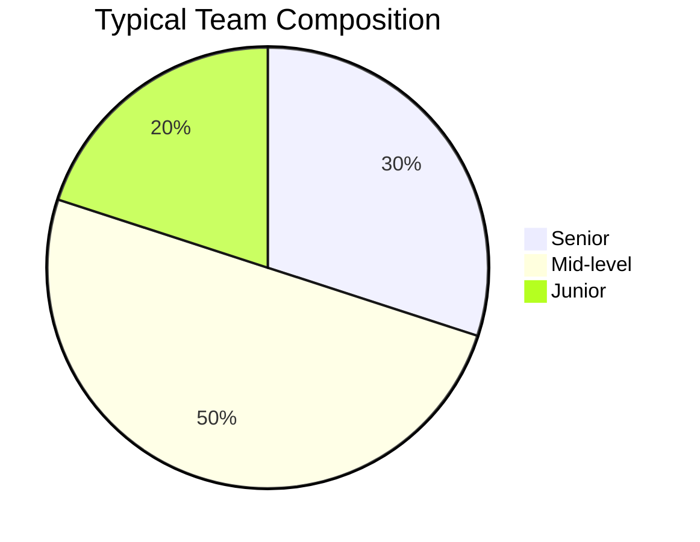

# Team Dynamics Guide - Team Lead

## Table of Contents
1. [Introduction](#introduction)
2. [Building Team Culture](#building-team-culture)
3. [Handling Conflicts](#handling-conflicts)
4. [Motivating Team Members](#motivating-team-members)
5. [Recognizing Achievements](#recognizing-achievements)
6. [Managing Different Skill Levels](#managing-different-skill-levels)
7. [Remote Team Leadership](#remote-team-leadership)
8. [Best Practices](#best-practices)
9. [Common Pitfalls](#common-pitfalls)
10. [Summary](#summary)

---

## Introduction

Team dynamics significantly impact team performance and satisfaction. As a Team Lead, understanding and managing team dynamics is crucial for building a high-performing team. This guide covers culture building, conflict resolution, motivation, and managing diverse teams.

### Who This Guide Is For
- Team Leads managing teams
- Developers transitioning to leadership
- Anyone building team culture
- Teams improving dynamics

### Key Learning Objectives
- Build positive team culture
- Handle conflicts effectively
- Motivate team members
- Recognize achievements appropriately
- Manage different skill levels
- Lead remote teams effectively

---

## Building Team Culture

### What is Team Culture?

Team culture is the shared values, beliefs, behaviors, and practices that characterize a team.

### Culture Elements

### Building Positive Culture

#### 1. Define Values
- What does the team value?
- What behaviors are important?
- What principles guide work?
- Document and share

#### 2. Lead by Example
- Demonstrate values
- Model behaviors
- Show commitment
- Be consistent

#### 3. Reinforce Culture
- Recognize aligned behaviors
- Address misalignment
- Celebrate culture
- Regular reinforcement

#### 4. Evolve Culture
- Assess regularly
- Adapt as needed
- Involve team
- Continuous improvement

### Culture Best Practices

1. **Be Intentional**: Actively shape culture
2. **Be Consistent**: Align actions with values
3. **Be Inclusive**: Include all team members
4. **Be Patient**: Culture takes time
5. **Be Open**: Welcome feedback

---

## Handling Conflicts

### Types of Conflicts

#### 1. Technical Conflicts
- **Cause**: Disagreement on technical approach
- **Resolution**: Discuss options, make decision
- **Approach**: Focus on technical merits

#### 2. Process Conflicts
- **Cause**: Disagreement on process
- **Resolution**: Review process, adjust
- **Approach**: Focus on effectiveness

#### 3. Interpersonal Conflicts
- **Cause**: Personal differences
- **Resolution**: Address directly, mediate
- **Approach**: Focus on relationship

#### 4. Resource Conflicts
- **Cause**: Competing priorities
- **Resolution**: Prioritize, allocate
- **Approach**: Focus on needs

### Conflict Resolution Process

### Conflict Resolution Strategies

#### 1. Address Early
- Don't let conflicts fester
- Address when small
- Prevent escalation
- Be proactive

#### 2. Listen Actively
- Understand all perspectives
- Don't take sides prematurely
- Show empathy
- Ask questions

#### 3. Focus on Issues
- Separate people from problem
- Focus on facts
- Avoid personal attacks
- Stay professional

#### 4. Find Common Ground
- Identify shared interests
- Build on agreements
- Find win-win solutions
- Compromise when needed

#### 5. Make Decisions
- Don't let conflicts drag on
- Make timely decisions
- Explain reasoning
- Move forward

---

## Motivating Team Members

### Motivation Factors

#### Intrinsic Motivation
- **Autonomy**: Control over work
- **Mastery**: Skill development
- **Purpose**: Meaningful work
- **Recognition**: Acknowledgment

#### Extrinsic Motivation
- **Compensation**: Salary, benefits
- **Rewards**: Bonuses, perks
- **Status**: Titles, recognition
- **Security**: Job security

### Motivation Strategies

#### 1. Provide Autonomy
- Give ownership
- Allow decision-making
- Trust team members
- Provide flexibility

#### 2. Support Mastery
- Provide learning opportunities
- Offer challenging work
- Give feedback
- Support growth

#### 3. Connect to Purpose
- Explain why work matters
- Show impact
- Connect to goals
- Share vision

#### 4. Recognize Achievements
- Acknowledge contributions
- Celebrate successes
- Provide feedback
- Show appreciation

### Motivation Best Practices

1. **Know Your Team**: Understand what motivates each person
2. **Be Genuine**: Authentic recognition
3. **Be Consistent**: Regular recognition
4. **Be Specific**: Specific achievements
5. **Be Timely**: Recognize promptly

---

## Recognizing Achievements

### Recognition Types

#### 1. Public Recognition
- **When**: Significant achievements
- **How**: Team meetings, announcements
- **Impact**: High visibility
- **Use**: Major accomplishments

#### 2. Private Recognition
- **When**: Personal achievements
- **How**: One-on-one, email
- **Impact**: Personal appreciation
- **Use**: Individual preferences

#### 3. Peer Recognition
- **When**: Team contributions
- **How**: Peer nominations, shout-outs
- **Impact**: Team appreciation
- **Use**: Team culture building

### Recognition Best Practices

1. **Be Specific**: What exactly was achieved?
2. **Be Timely**: Recognize soon after
3. **Be Sincere**: Genuine appreciation
4. **Be Fair**: Recognize all contributors
5. **Be Appropriate**: Match recognition to achievement

---

## Managing Different Skill Levels

### Team Composition

### Managing by Level

#### Junior Developers
- **Support**: More guidance needed
- **Tasks**: Simpler, learning-focused
- **Mentoring**: Regular mentoring
- **Patience**: Allow learning time
- **Recognition**: Celebrate growth

#### Mid-level Developers
- **Support**: Moderate guidance
- **Tasks**: Standard complexity
- **Mentoring**: Occasional mentoring
- **Growth**: Stretch assignments
- **Recognition**: Acknowledge contributions

#### Senior Developers
- **Support**: Minimal guidance
- **Tasks**: Complex, challenging
- **Mentoring**: They mentor others
- **Leadership**: Technical leadership
- **Recognition**: Acknowledge expertise

### Skill Development

1. **Assess Skills**: Understand current level
2. **Identify Gaps**: What needs development?
3. **Create Plans**: Development plans
4. **Provide Opportunities**: Challenging work
5. **Support Growth**: Resources and guidance

---

## Remote Team Leadership

### Remote Leadership Challenges

- **Communication**: Less face-to-face
- **Connection**: Harder to build relationships
- **Coordination**: More difficult
- **Culture**: Harder to build
- **Isolation**: Team members may feel isolated

### Remote Leadership Strategies

#### 1. Over-communicate
- More frequent communication
- Multiple channels
- Clear expectations
- Regular updates

#### 2. Build Connection
- Virtual team building
- Casual conversations
- Personal check-ins
- Shared experiences

#### 3. Establish Structure
- Clear processes
- Regular meetings
- Defined workflows
- Documented practices

#### 4. Use Technology
- Video calls
- Collaboration tools
- Shared documentation
- Communication platforms

#### 5. Be Flexible
- Understand time zones
- Accommodate schedules
- Respect boundaries
- Trust team

### Remote Best Practices

1. **Regular Check-ins**: Frequent one-on-ones
2. **Video Calls**: Use video when possible
3. **Clear Communication**: Written and verbal
4. **Document Everything**: Share knowledge
5. **Build Trust**: Trust and verify

---

## Best Practices

### Team Dynamics Best Practices

1. **Build Culture Intentionally**: Actively shape culture
2. **Address Conflicts Early**: Don't let them fester
3. **Motivate Appropriately**: Understand what motivates
4. **Recognize Regularly**: Acknowledge achievements
5. **Support Growth**: Develop all team members
6. **Communicate Clearly**: Keep team informed

---

## Common Pitfalls

### Mistakes to Avoid

1. **Ignoring Conflicts**: Letting conflicts escalate
2. **Playing Favorites**: Unequal treatment
3. **Not Recognizing**: Missing achievements
4. **Poor Communication**: Not keeping team informed
5. **Ignoring Culture**: Not shaping culture
6. **Not Adapting**: Same approach for all

---

## Summary

### Key Takeaways

1. **Team culture** should be intentionally built and maintained
2. **Conflicts** should be addressed early and constructively
3. **Motivation** requires understanding individual needs
4. **Recognition** should be specific, timely, and genuine
5. **Different skill levels** require different approaches
6. **Remote teams** need extra attention to communication and connection

### Next Steps

- Review **[Core Responsibilities Guide](./CORE_RESPONSIBILITIES_GUIDE.md)** for role context
- Study **[Mentoring & Team Development Guide](./MENTORING_TEAM_DEVELOPMENT_GUIDE.md)** for development strategies
- Explore **[Communication & Coordination Guide](./COMMUNICATION_COORDINATION_GUIDE.md)** for communication skills

---

**Remember**: Great teams are built through intentional culture, effective conflict resolution, and genuine care for team members. Invest in your team's dynamics.

