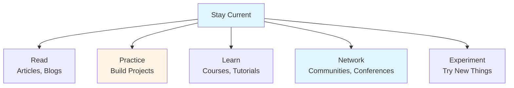
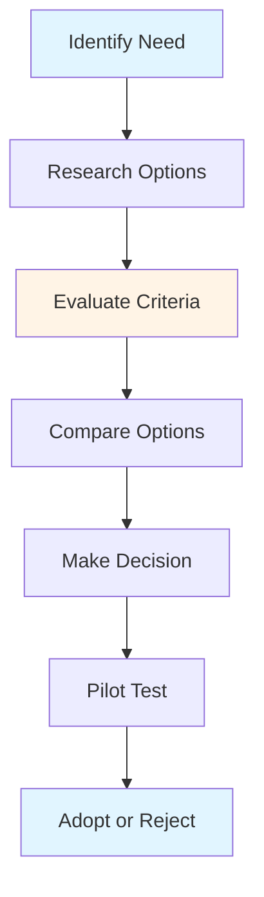

# Technical Skills & Knowledge Guide - Team Lead

## Table of Contents
1. [Introduction](#introduction)
2. [Staying Current with Technology](#staying-current-with-technology)
3. [Evaluating New Technologies](#evaluating-new-technologies)
4. [Technology Stack Decisions](#technology-stack-decisions)
5. [Best Practices and Patterns](#best-practices-and-patterns)
6. [Security Considerations](#security-considerations)
7. [Performance Optimization](#performance-optimization)
8. [Learning Strategies](#learning-strategies)
9. [Best Practices](#best-practices)
10. [Summary](#summary)

---

## Introduction

As a Team Lead, maintaining and expanding your technical skills is essential. You need to stay current with technology trends, evaluate new technologies, and make informed decisions about technology choices. This guide covers technical skill development and knowledge management.

### Who This Guide Is For
- Team Leads maintaining technical skills
- Senior developers staying current
- Anyone making technology decisions
- Teams evaluating new technologies

### Key Learning Objectives
- Stay current with technology trends
- Evaluate new technologies effectively
- Make informed technology decisions
- Apply best practices and patterns
- Consider security and performance
- Develop effective learning strategies

---

## Staying Current with Technology

### Why Stay Current?

- **Make Better Decisions**: Informed technology choices
- **Guide Team**: Help team adopt new technologies
- **Solve Problems**: Use modern solutions
- **Stay Relevant**: Maintain expertise
- **Innovate**: Apply new approaches

### Staying Current Strategies

### Learning Sources

#### 1. Reading
- **Tech Blogs**: Industry blogs, company blogs
- **Newsletters**: Weekly tech newsletters
- **Documentation**: Official documentation
- **Books**: Technical books
- **Research Papers**: Academic papers

#### 2. Practice
- **Side Projects**: Personal projects
- **Open Source**: Contribute to projects
- **Experiments**: Try new technologies
- **Code Challenges**: Practice problems
- **Refactoring**: Improve existing code

#### 3. Learning
- **Online Courses**: MOOCs, platforms
- **Tutorials**: Step-by-step guides
- **Workshops**: Hands-on sessions
- **Certifications**: Credential programs
- **Internal Training**: Company training

#### 4. Networking
- **Conferences**: Industry events
- **Meetups**: Local communities
- **Online Forums**: Discussion groups
- **Social Media**: Tech Twitter, LinkedIn
- **Communities**: Discord, Slack groups

---

## Evaluating New Technologies

### Evaluation Framework

### Evaluation Criteria

#### 1. Technical Criteria
- **Functionality**: Does it meet needs?
- **Performance**: Is it fast enough?
- **Scalability**: Can it scale?
- **Reliability**: Is it stable?
- **Security**: Is it secure?

#### 2. Ecosystem Criteria
- **Community**: Active community?
- **Documentation**: Good documentation?
- **Support**: Available support?
- **Ecosystem**: Rich ecosystem?
- **Maturity**: How mature is it?

#### 3. Team Criteria
- **Learning Curve**: How hard to learn?
- **Team Skills**: Does team have skills?
- **Training**: Training available?
- **Adoption**: Easy to adopt?
- **Migration**: Migration path?

#### 4. Business Criteria
- **Cost**: What's the cost?
- **Licensing**: License terms?
- **Vendor**: Vendor reliability?
- **Roadmap**: Future plans?
- **Risk**: What are the risks?

### Evaluation Process

1. **Define Requirements**: What do we need?
2. **Research Options**: What's available?
3. **Evaluate Criteria**: Score each option
4. **Compare Options**: Side-by-side comparison
5. **Pilot Test**: Try in small scale
6. **Make Decision**: Choose best option
7. **Document**: Record decision

---

## Technology Stack Decisions

### Stack Selection Factors

#### 1. Project Requirements
- **Scale**: Expected scale
- **Performance**: Performance needs
- **Features**: Required features
- **Constraints**: Technical constraints

#### 2. Team Capabilities
- **Skills**: Team's skills
- **Experience**: Team's experience
- **Learning**: Willingness to learn
- **Size**: Team size

#### 3. Ecosystem
- **Libraries**: Available libraries
- **Tools**: Development tools
- **Community**: Community support
- **Resources**: Learning resources

#### 4. Long-term Considerations
- **Maintenance**: Long-term maintenance
- **Evolution**: Technology evolution
- **Support**: Ongoing support
- **Migration**: Future migration

### Stack Decision Process

1. **Assess Needs**: Understand requirements
2. **Evaluate Options**: Research stacks
3. **Consider Team**: Team capabilities
4. **Evaluate Trade-offs**: Pros and cons
5. **Make Decision**: Choose stack
6. **Document**: Record decision (ADR)
7. **Review**: Revisit as needed

---

## Best Practices and Patterns

### Design Patterns

#### Creational Patterns
- **Factory**: Create objects
- **Builder**: Construct complex objects
- **Singleton**: Single instance
- **Prototype**: Clone objects

#### Structural Patterns
- **Adapter**: Interface adaptation
- **Decorator**: Add behavior
- **Facade**: Simplify interface
- **Proxy**: Control access

#### Behavioral Patterns
- **Observer**: Event handling
- **Strategy**: Algorithm selection
- **Command**: Encapsulate requests
- **State**: State management

### Best Practices

#### Code Quality
- **SOLID Principles**: Design principles
- **DRY**: Don't repeat yourself
- **KISS**: Keep it simple
- **YAGNI**: You aren't gonna need it

#### Testing
- **Test-Driven Development**: Write tests first
- **Unit Tests**: Test units
- **Integration Tests**: Test integration
- **Test Coverage**: Adequate coverage

#### Security
- **Input Validation**: Validate inputs
- **Authentication**: Secure authentication
- **Authorization**: Proper authorization
- **Encryption**: Encrypt sensitive data

---

## Security Considerations

### Security Principles

#### 1. Defense in Depth
- Multiple layers of security
- Don't rely on single defense
- Redundant protections
- Comprehensive approach

#### 2. Least Privilege
- Minimum necessary access
- Principle of least privilege
- Limit permissions
- Regular review

#### 3. Secure by Default
- Secure configurations
- Safe defaults
- Explicit insecure options
- Security first

### Common Security Concerns

#### 1. Authentication & Authorization
- Secure authentication
- Proper authorization
- Session management
- Password policies

#### 2. Input Validation
- Validate all inputs
- Sanitize inputs
- Prevent injection attacks
- Handle edge cases

#### 3. Data Protection
- Encrypt sensitive data
- Secure data transmission
- Protect data at rest
- Access controls

#### 4. Dependencies
- Keep dependencies updated
- Scan for vulnerabilities
- Review dependencies
- Use trusted sources

---

## Performance Optimization

### Performance Principles

#### 1. Measure First
- Profile before optimizing
- Identify bottlenecks
- Measure improvements
- Don't guess

#### 2. Optimize Bottlenecks
- Focus on slowest parts
- 80/20 rule
- Measure impact
- Verify improvements

#### 3. Consider Trade-offs
- Performance vs. complexity
- Performance vs. maintainability
- Performance vs. cost
- Balance factors

### Optimization Strategies

#### 1. Caching
- Cache frequently accessed data
- Reduce computation
- Improve response time
- Consider cache invalidation

#### 2. Database Optimization
- Optimize queries
- Use indexes
- Avoid N+1 queries
- Connection pooling

#### 3. Code Optimization
- Efficient algorithms
- Avoid unnecessary work
- Lazy loading
- Async processing

---

## Learning Strategies

### Effective Learning

#### 1. Active Learning
- **Practice**: Hands-on practice
- **Build**: Create projects
- **Teach**: Explain to others
- **Apply**: Use in real work

#### 2. Spaced Repetition
- **Review**: Regular review
- **Practice**: Repeated practice
- **Reinforce**: Strengthen learning
- **Retain**: Better retention

#### 3. Deliberate Practice
- **Focus**: Focused practice
- **Challenge**: Appropriate challenge
- **Feedback**: Get feedback
- **Improve**: Continuous improvement

### Learning Plan

1. **Set Goals**: What to learn?
2. **Plan Time**: Allocate time
3. **Choose Resources**: Select materials
4. **Practice**: Hands-on practice
5. **Review**: Regular review
6. **Apply**: Use in work
7. **Share**: Teach others

---

## Best Practices

### Technical Skills Best Practices

1. **Stay Current**: Regular learning
2. **Practice Regularly**: Hands-on practice
3. **Share Knowledge**: Teach others
4. **Evaluate Critically**: Don't follow trends blindly
5. **Balance**: Breadth and depth
6. **Apply**: Use in real work

---

## Summary

### Key Takeaways

1. **Staying current** requires continuous learning
2. **Evaluating technologies** needs structured approach
3. **Technology decisions** should consider multiple factors
4. **Best practices** guide quality work
5. **Security** must be considered from start
6. **Performance** requires measurement and optimization

### Next Steps

- Review **[Architecture & Technical Design Guide](./ARCHITECTURE_TECHNICAL_DESIGN_GUIDE.md)** for design decisions
- Study **[Problem Solving & Troubleshooting Guide](./PROBLEM_SOLVING_TROUBLESHOOTING_GUIDE.md)** for optimization
- Explore **[Tools & Workflows Guide](./TOOLS_WORKFLOWS_GUIDE.md)** for technology tools

---

**Remember**: Technical skills are the foundation of technical leadership. Stay current, evaluate critically, and apply knowledge to make better decisions.

