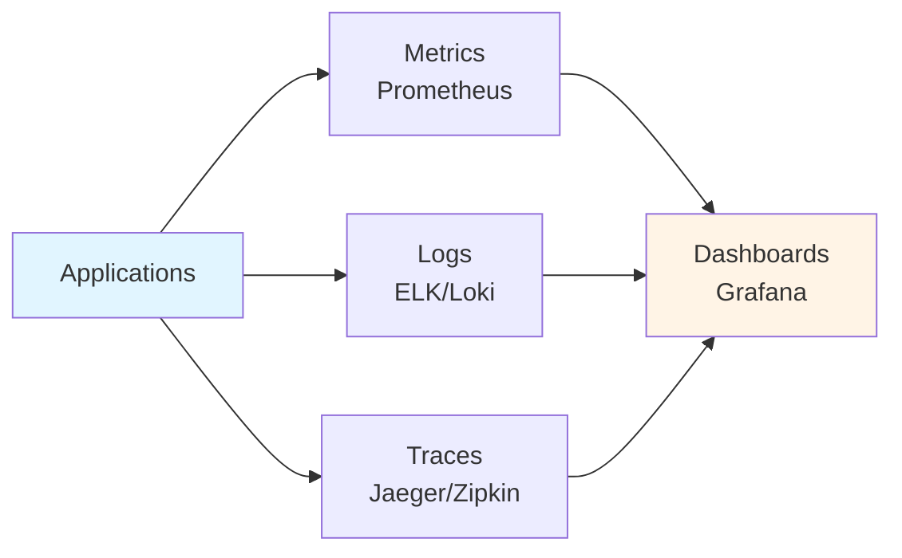
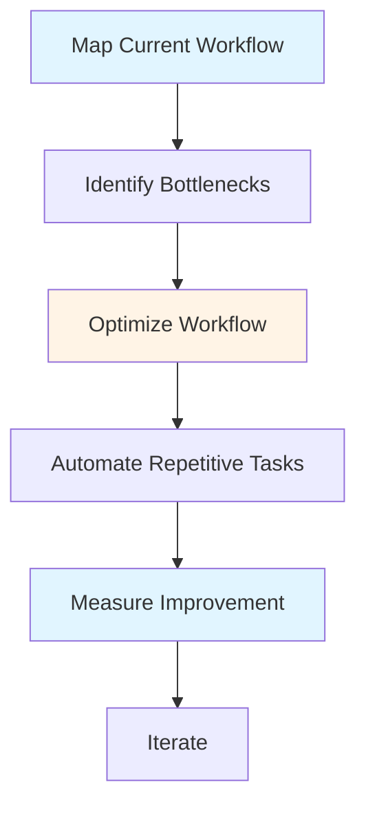

# Tools & Workflows Guide - Team Lead

## Table of Contents
1. [Introduction](#introduction)
2. [Code Review Tools](#code-review-tools)
3. [Project Management Tools](#project-management-tools)
4. [Communication Tools](#communication-tools)
5. [Documentation Tools](#documentation-tools)
6. [Monitoring and Observability](#monitoring-and-observability)
7. [CI/CD and Automation](#cicd-and-automation)
8. [Workflow Optimization](#workflow-optimization)
9. [Best Practices](#best-practices)
10. [Summary](#summary)

---

## Introduction

Effective Team Leads leverage tools and workflows to increase productivity, improve quality, and streamline processes. This guide covers essential tools and workflow optimization strategies for technical leadership.

### Who This Guide Is For
- Team Leads selecting and using tools
- Teams establishing workflows
- Anyone optimizing development processes
- Organizations improving tooling

### Key Learning Objectives
- Understand code review tools
- Master project management tools
- Use communication tools effectively
- Leverage documentation tools
- Implement monitoring and observability
- Automate with CI/CD

---

## Code Review Tools

### Popular Code Review Platforms

#### GitHub
- **Features**: Pull requests, inline comments, review requests
- **Best for**: Git-based workflows
- **Integration**: CI/CD, project management
- **Pros**: Large ecosystem, great UI
- **Cons**: Can be expensive for large teams

#### GitLab
- **Features**: Merge requests, code review, CI/CD built-in
- **Best for**: All-in-one platform
- **Integration**: Native CI/CD, project management
- **Pros**: Comprehensive, self-hostable
- **Cons**: Can be complex

#### Bitbucket
- **Features**: Pull requests, code review
- **Best for**: Atlassian ecosystem
- **Integration**: Jira, Confluence
- **Pros**: Good integration, free for small teams
- **Cons**: Smaller community

### Code Quality Tools

#### Static Analysis
- **SonarQube**: Comprehensive code quality
- **ESLint/TSLint**: JavaScript/TypeScript linting
- **Checkstyle**: Java code style
- **RuboCop**: Ruby style guide

#### Test Coverage
- **Coverage.py**: Python coverage
- **JaCoCo**: Java coverage
- **Istanbul**: JavaScript coverage
- **Coveralls**: Coverage reporting

---

## Project Management Tools

### Task Management

#### Jira
- **Features**: Issue tracking, sprint planning, reporting
- **Best for**: Agile teams
- **Integration**: Development tools
- **Pros**: Comprehensive, customizable
- **Cons**: Can be complex

#### Asana
- **Features**: Task management, projects, timelines
- **Best for**: General project management
- **Integration**: Various tools
- **Pros**: User-friendly, flexible
- **Cons**: Less technical focus

#### Trello
- **Features**: Kanban boards, cards, lists
- **Best for**: Simple task tracking
- **Integration**: Power-ups
- **Pros**: Simple, visual
- **Cons**: Limited features

#### Monday.com
- **Features**: Work management, automation
- **Best for**: Team collaboration
- **Integration**: Many tools
- **Pros**: Visual, customizable
- **Cons**: Can be expensive

### Choosing Project Management Tools

Consider:
- **Team Size**: Small vs. large teams
- **Methodology**: Agile vs. traditional
- **Integration**: Need for integrations
- **Budget**: Cost considerations
- **Complexity**: Simple vs. comprehensive

---

## Communication Tools

### Team Communication

#### Slack
- **Features**: Channels, direct messages, integrations
- **Best for**: Team communication
- **Integration**: Many tools
- **Pros**: Great integrations, searchable
- **Cons**: Can be distracting

#### Microsoft Teams
- **Features**: Chat, meetings, collaboration
- **Best for**: Microsoft ecosystem
- **Integration**: Office 365
- **Pros**: Integrated, comprehensive
- **Cons**: Can be heavy

#### Discord
- **Features**: Voice, video, text channels
- **Best for**: Community, gaming teams
- **Integration**: Bots, integrations
- **Pros**: Free, voice channels
- **Cons**: Less professional

### Video Conferencing

#### Zoom
- **Features**: Video calls, screen sharing, recording
- **Best for**: Remote meetings
- **Integration**: Calendar tools
- **Pros**: Reliable, good quality
- **Cons**: Security concerns (addressed)

#### Google Meet
- **Features**: Video calls, screen sharing
- **Best for**: Google Workspace users
- **Integration**: Google Calendar
- **Pros**: Integrated, simple
- **Cons**: Less features

---

## Documentation Tools

### Documentation Platforms

#### Confluence
- **Features**: Wiki, documentation, collaboration
- **Best for**: Team documentation
- **Integration**: Jira, other Atlassian tools
- **Pros**: Comprehensive, searchable
- **Cons**: Can be complex

#### Notion
- **Features**: Notes, docs, databases, wikis
- **Best for**: Flexible documentation
- **Integration**: Various tools
- **Pros**: Flexible, modern UI
- **Cons**: Can be slow

#### GitHub Wiki
- **Features**: Markdown wiki, version control
- **Best for**: Code documentation
- **Integration**: GitHub
- **Pros**: Free, versioned
- **Cons**: Basic features

#### GitBook
- **Features**: Documentation, knowledge base
- **Best for**: Technical documentation
- **Integration**: Git, various tools
- **Pros**: Great for docs, versioned
- **Cons**: Can be expensive

### Documentation Best Practices

1. **Keep Updated**: Maintain documentation
2. **Make Searchable**: Good structure
3. **Use Examples**: Show, don't tell
4. **Version Control**: Track changes
5. **Collaborate**: Team contributions

---

## Monitoring and Observability

### Monitoring Tools

#### Application Performance Monitoring (APM)
- **New Relic**: Application monitoring
- **Datadog**: Infrastructure and APM
- **AppDynamics**: Application performance
- **Elastic APM**: Open source APM

#### Logging
- **ELK Stack**: Elasticsearch, Logstash, Kibana
- **Splunk**: Log analysis
- **CloudWatch**: AWS logging
- **Loki**: Log aggregation

#### Metrics
- **Prometheus**: Metrics collection
- **Grafana**: Visualization
- **CloudWatch**: AWS metrics
- **Datadog**: Metrics and monitoring

### Observability Stack

---

## CI/CD and Automation

### CI/CD Platforms

#### GitHub Actions
- **Features**: CI/CD, automation, workflows
- **Best for**: GitHub repositories
- **Integration**: GitHub ecosystem
- **Pros**: Integrated, free for public
- **Cons**: Limited for complex workflows

#### GitLab CI/CD
- **Features**: Built-in CI/CD, pipelines
- **Best for**: GitLab projects
- **Integration**: GitLab ecosystem
- **Pros**: Comprehensive, integrated
- **Cons**: GitLab-specific

#### Jenkins
- **Features**: Automation server, plugins
- **Best for**: Complex automation
- **Integration**: Many tools
- **Pros**: Flexible, extensible
- **Cons**: Can be complex

#### CircleCI
- **Features**: CI/CD, testing, deployment
- **Best for**: Cloud-based CI/CD
- **Integration**: Various tools
- **Pros**: Easy setup, good performance
- **Cons**: Can be expensive

### CI/CD Best Practices

1. **Automate Everything**: Tests, builds, deployments
2. **Fast Feedback**: Quick CI runs
3. **Fail Fast**: Catch issues early
4. **Version Control**: Everything in version control
5. **Security**: Secure pipelines

---

## Workflow Optimization

### Workflow Analysis

### Optimization Strategies

#### 1. Eliminate Waste
- Remove unnecessary steps
- Reduce waiting time
- Eliminate rework
- Streamline processes

#### 2. Automate
- Automate repetitive tasks
- Use CI/CD
- Script common operations
- Reduce manual work

#### 3. Standardize
- Standardize processes
- Use templates
- Create checklists
- Document workflows

#### 4. Measure
- Track metrics
- Monitor performance
- Identify improvements
- Measure impact

---

## Best Practices

### Tool Selection Best Practices

1. **Assess Needs**: Understand requirements
2. **Evaluate Options**: Compare tools
3. **Consider Integration**: Tool compatibility
4. **Start Simple**: Don't over-engineer
5. **Iterate**: Improve over time

### Workflow Best Practices

1. **Document**: Document workflows
2. **Standardize**: Consistent processes
3. **Automate**: Automate repetitive tasks
4. **Measure**: Track effectiveness
5. **Improve**: Continuous improvement

---

## Summary

### Key Takeaways

1. **Code review tools** improve code quality and collaboration
2. **Project management tools** help organize and track work
3. **Communication tools** enable effective team collaboration
4. **Documentation tools** preserve and share knowledge
5. **Monitoring tools** provide visibility into systems
6. **CI/CD tools** automate development workflows

### Next Steps

- Review **[Code Review Excellence Guide](./CODE_REVIEW_EXCELLENCE_GUIDE.md)** for review tools
- Study **[Daily/Weekly Processes Guide](./DAILY_WEEKLY_PROCESSES_GUIDE.md)** for workflows
- Explore **[Templates & Checklists Guide](./TEMPLATES_CHECKLISTS_GUIDE.md)** for workflow templates

---

**Remember**: Tools are enablers, not solutions. Choose tools that fit your team's needs and workflows, and optimize processes continuously.

