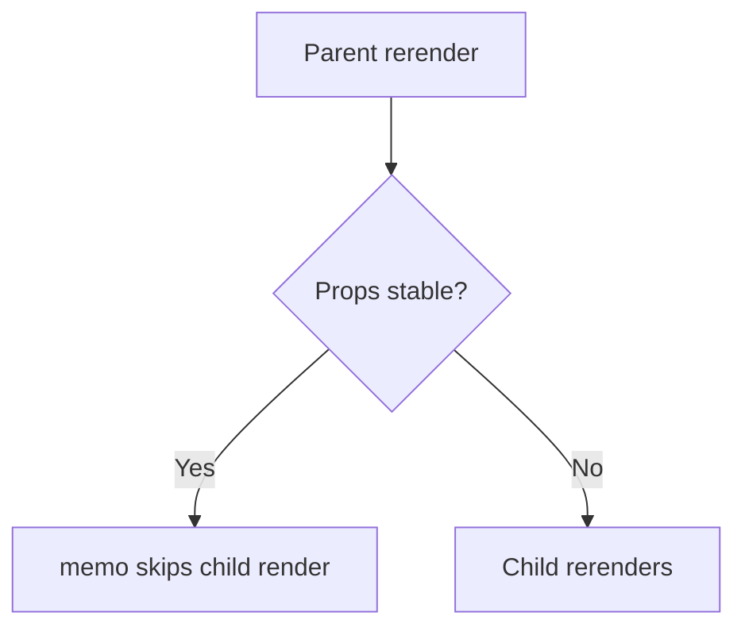

# Cách Dùng `memo` và HOC Một Cách Có Chủ Đích

[<- Quay lại Tuần 2 - Tối Ưu Re-render](./README.md)

## Vì sao bài này quan trọng

`memo` chỉ có ích khi chi phí compare thấp hơn chi phí rerender và props đủ ổn định. HOC là pattern composition lịch sử vẫn hữu ích ở một vài boundary, nhưng ngày nay thường nên dùng custom hook + wrapper rõ ràng hơn.

## Điều kiện trước

- Đã học hoặc đọc các khái niệm nền của Tối Ưu Re-render.
- Sẵn sàng ghi chú lại trade-off và câu hỏi thực chiến thay vì chỉ ghi nhớ định nghĩa.

## Core concepts

- pure render
- referential equality
- composition

## Giải thích chi tiết

`memo` chỉ có ích khi chi phí compare thấp hơn chi phí rerender và props đủ ổn định. HOC là pattern composition lịch sử vẫn hữu ích ở một vài boundary, nhưng ngày nay thường nên dùng custom hook + wrapper rõ ràng hơn.

Đừng bọc toàn app trong `memo`.

So sánh props không ổn định sẽ làm `memo` mất ý nghĩa.

HOC tốt khi bạn cần đóng gói concern ở component boundary.

## Sơ đồ



## Code ví dụ

```tsx
import { memo } from "react";

const Row = memo(function Row({ item }: { item: { id: string; name: string } }) {
  return <li>{item.name}</li>;
});
```

## Common mistakes

- Nhớ tên khái niệm nhưng không gắn nó với một bài toán sản phẩm cụ thể trong bài “Cách Dùng `memo` và HOC Một Cách Có Chủ Đích”.
- Tối ưu hoặc trừu tượng hóa quá sớm trước khi đo, trước khi nhìn rõ boundary và trước khi hiểu cost thật.
- Chỉ học cú pháp mà không mô tả được dòng chảy dữ liệu, trạng thái và trách nhiệm của từng tầng.

## Performance / debugging notes

- Khi debug, hãy luôn hỏi: điều gì kích hoạt thay đổi, điều gì thực sự tốn chi phí, và chi phí đó xảy ra ở client, server hay network.
- Ghi lại giả thuyết trước khi sửa. Sau đó đo lại để biết tối ưu có hiệu quả thật hay chỉ làm code phức tạp hơn.
- Nếu một vấn đề lặp lại nhiều lần, hãy nâng nó thành quy ước kiến trúc hoặc checklist cho dự án sau.

## Bài tập thực hành

1. Viết lại bằng lời của bạn mental model cho bài “Cách Dùng `memo` và HOC Một Cách Có Chủ Đích” mà không nhìn tài liệu.
2. Tạo một ví dụ nhỏ trong codebase hoặc sandbox để nhìn thấy hành vi của khái niệm này thay vì chỉ đọc mô tả.
3. Ghi lại ít nhất 3 trade-off hoặc quyết định kiến trúc bạn sẽ áp dụng nếu xây một app thật.

## Review checklist

- Bạn có thể giải thích được bài “Cách Dùng `memo` và HOC Một Cách Có Chủ Đích” bằng ngôn ngữ của riêng mình.
- Bạn biết khái niệm nào là nền tảng, khái niệm nào là optimization, và khái niệm nào là production concern.
- Bạn có thể chỉ ra ít nhất một ví dụ thực tế nơi bài học này tạo khác biệt rõ ràng cho UX hoặc maintainability.

## Further reading / sources

- https://react.dev/learn/render-and-commit
- https://react.dev/reference/react/memo
- https://react.dev/reference/react/useDeferredValue
- https://react.dev/reference/react/useTransition
