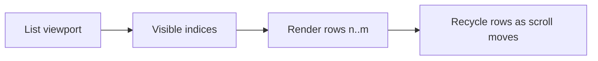

# `react-window` Trong Thực Tế

[<- Quay lại Tuần 3 - Infinite Loading và Virtualization](./README.md)

## Vì sao bài này quan trọng

`react-window` phù hợp khi bạn muốn một thư viện nhỏ, rõ ràng và cực kỳ tập trung vào windowing. Nó mạnh nhất khi kích thước item tương đối ổn định.

## Điều kiện trước

- Đã học hoặc đọc các khái niệm nền của Infinite Loading và Virtualization.
- Sẵn sàng ghi chú lại trade-off và câu hỏi thực chiến thay vì chỉ ghi nhớ định nghĩa.

## Core concepts

- fixed size list
- row renderer
- item style

## Giải thích chi tiết

`react-window` phù hợp khi bạn muốn một thư viện nhỏ, rõ ràng và cực kỳ tập trung vào windowing. Nó mạnh nhất khi kích thước item tương đối ổn định.

Cần truyền `style` xuống row để thư viện đặt vị trí item đúng.

Không nên tự ý bọc row làm mất style positioning.

Thích hợp cho table/list đơn giản, predictable height.

## Sơ đồ

## Common mistakes

- Nhớ tên khái niệm nhưng không gắn nó với một bài toán sản phẩm cụ thể trong bài “`react-window` Trong Thực Tế”.
- Tối ưu hoặc trừu tượng hóa quá sớm trước khi đo, trước khi nhìn rõ boundary và trước khi hiểu cost thật.
- Chỉ học cú pháp mà không mô tả được dòng chảy dữ liệu, trạng thái và trách nhiệm của từng tầng.

## Performance / debugging notes

- Khi debug, hãy luôn hỏi: điều gì kích hoạt thay đổi, điều gì thực sự tốn chi phí, và chi phí đó xảy ra ở client, server hay network.
- Ghi lại giả thuyết trước khi sửa. Sau đó đo lại để biết tối ưu có hiệu quả thật hay chỉ làm code phức tạp hơn.
- Nếu một vấn đề lặp lại nhiều lần, hãy nâng nó thành quy ước kiến trúc hoặc checklist cho dự án sau.

## Bài tập thực hành

1. Viết lại bằng lời của bạn mental model cho bài “`react-window` Trong Thực Tế” mà không nhìn tài liệu.
2. Tạo một ví dụ nhỏ trong codebase hoặc sandbox để nhìn thấy hành vi của khái niệm này thay vì chỉ đọc mô tả.
3. Ghi lại ít nhất 3 trade-off hoặc quyết định kiến trúc bạn sẽ áp dụng nếu xây một app thật.

## Review checklist

- Bạn có thể giải thích được bài “`react-window` Trong Thực Tế” bằng ngôn ngữ của riêng mình.
- Bạn biết khái niệm nào là nền tảng, khái niệm nào là optimization, và khái niệm nào là production concern.
- Bạn có thể chỉ ra ít nhất một ví dụ thực tế nơi bài học này tạo khác biệt rõ ràng cho UX hoặc maintainability.

## Further reading / sources

- https://developer.mozilla.org/en-US/docs/Web/API/Intersection_Observer_API
- https://github.com/bvaughn/react-window
- https://tanstack.com/virtual/latest/docs/introduction
