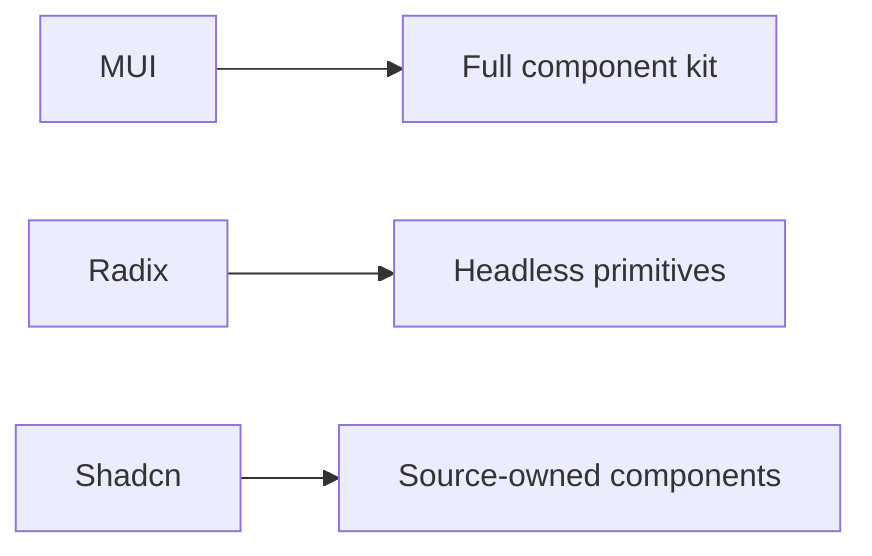

# So Sánh Material UI, Radix UI và Shadcn UI

[<- Quay lại Tuần 6 - Routing + UI Libraries](./README.md)

## Vì sao bài này quan trọng

Ba hướng tiếp cận này đại diện cho ba triết lý khác nhau: component library full-styled, headless accessibility primitives và source-based composable components. Chọn đúng hướng sẽ giảm rất nhiều chi phí về sau.

## Điều kiện trước

- Đã học hoặc đọc các khái niệm nền của Routing + UI Libraries.
- Sẵn sàng ghi chú lại trade-off và câu hỏi thực chiến thay vì chỉ ghi nhớ định nghĩa.

## Core concepts

- design system level
- headless vs styled
- DX trade-offs

## Giải thích chi tiết

Ba hướng tiếp cận này đại diện cho ba triết lý khác nhau: component library full-styled, headless accessibility primitives và source-based composable components. Chọn đúng hướng sẽ giảm rất nhiều chi phí về sau.

MUI phù hợp khi cần tốc độ dựng product UI nhanh với hệ component đầy đủ.

Radix UI tốt khi bạn cần accessibility primitives và tự làm visual layer.

Shadcn UI phù hợp khi muốn source ownership và Tailwind-centric workflow.

## Sơ đồ

## Common mistakes

- Nhớ tên khái niệm nhưng không gắn nó với một bài toán sản phẩm cụ thể trong bài “So Sánh Material UI, Radix UI và Shadcn UI”.
- Tối ưu hoặc trừu tượng hóa quá sớm trước khi đo, trước khi nhìn rõ boundary và trước khi hiểu cost thật.
- Chỉ học cú pháp mà không mô tả được dòng chảy dữ liệu, trạng thái và trách nhiệm của từng tầng.

## Performance / debugging notes

- Khi debug, hãy luôn hỏi: điều gì kích hoạt thay đổi, điều gì thực sự tốn chi phí, và chi phí đó xảy ra ở client, server hay network.
- Ghi lại giả thuyết trước khi sửa. Sau đó đo lại để biết tối ưu có hiệu quả thật hay chỉ làm code phức tạp hơn.
- Nếu một vấn đề lặp lại nhiều lần, hãy nâng nó thành quy ước kiến trúc hoặc checklist cho dự án sau.

## Bài tập thực hành

1. Viết lại bằng lời của bạn mental model cho bài “So Sánh Material UI, Radix UI và Shadcn UI” mà không nhìn tài liệu.
2. Tạo một ví dụ nhỏ trong codebase hoặc sandbox để nhìn thấy hành vi của khái niệm này thay vì chỉ đọc mô tả.
3. Ghi lại ít nhất 3 trade-off hoặc quyết định kiến trúc bạn sẽ áp dụng nếu xây một app thật.

## Review checklist

- Bạn có thể giải thích được bài “So Sánh Material UI, Radix UI và Shadcn UI” bằng ngôn ngữ của riêng mình.
- Bạn biết khái niệm nào là nền tảng, khái niệm nào là optimization, và khái niệm nào là production concern.
- Bạn có thể chỉ ra ít nhất một ví dụ thực tế nơi bài học này tạo khác biệt rõ ràng cho UX hoặc maintainability.

## Further reading / sources

- https://reactrouter.com/home
- https://mui.com/material-ui/getting-started/
- https://www.radix-ui.com/primitives
- https://ui.shadcn.com/docs
- https://tailwindcss.com/docs
- https://developer.mozilla.org/en-US/docs/Web/Accessibility
