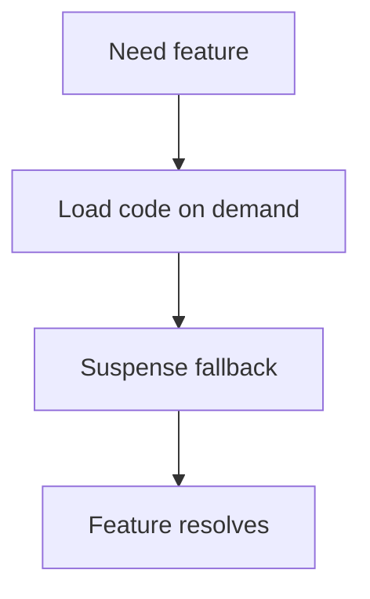

# Lazy Loading và Suspense

[<- Quay lại Tuần 7 - Tối Ưu Hiệu Năng I](./README.md)

## Vì sao bài này quan trọng

Lazy loading cho phép trì hoãn việc tải code hoặc data cho tới khi cần. Suspense cung cấp ranh giới trình bày loading rõ ràng để app hiển thị tiến dần thay vì đóng băng.

## Điều kiện trước

- Đã học hoặc đọc các khái niệm nền của Tối Ưu Hiệu Năng I.
- Sẵn sàng ghi chú lại trade-off và câu hỏi thực chiến thay vì chỉ ghi nhớ định nghĩa.

## Core concepts

- bundle splitting
- fallback UI
- progressive reveal

## Giải thích chi tiết

Lazy loading cho phép trì hoãn việc tải code hoặc data cho tới khi cần. Suspense cung cấp ranh giới trình bày loading rõ ràng để app hiển thị tiến dần thay vì đóng băng.

Lazy giúp giảm bundle initial nhưng tăng complexity route transitions nếu dùng bừa.

Fallback nên phản ánh bố cục thật.

Không phải mọi component nhỏ đều đáng lazy-load.

## Sơ đồ



## Code ví dụ

```tsx
import { lazy, Suspense } from "react";

const ChartPanel = lazy(() => import("./ChartPanel"));

export function Dashboard() {
  return (
    <Suspense fallback={<p>Dang tai bieu do...</p>}>
      <ChartPanel />
    </Suspense>
  );
}
```

## Common mistakes

- Nhớ tên khái niệm nhưng không gắn nó với một bài toán sản phẩm cụ thể trong bài “Lazy Loading và Suspense”.
- Tối ưu hoặc trừu tượng hóa quá sớm trước khi đo, trước khi nhìn rõ boundary và trước khi hiểu cost thật.
- Chỉ học cú pháp mà không mô tả được dòng chảy dữ liệu, trạng thái và trách nhiệm của từng tầng.

## Performance / debugging notes

- Khi debug, hãy luôn hỏi: điều gì kích hoạt thay đổi, điều gì thực sự tốn chi phí, và chi phí đó xảy ra ở client, server hay network.
- Ghi lại giả thuyết trước khi sửa. Sau đó đo lại để biết tối ưu có hiệu quả thật hay chỉ làm code phức tạp hơn.
- Nếu một vấn đề lặp lại nhiều lần, hãy nâng nó thành quy ước kiến trúc hoặc checklist cho dự án sau.

## Bài tập thực hành

1. Viết lại bằng lời của bạn mental model cho bài “Lazy Loading và Suspense” mà không nhìn tài liệu.
2. Tạo một ví dụ nhỏ trong codebase hoặc sandbox để nhìn thấy hành vi của khái niệm này thay vì chỉ đọc mô tả.
3. Ghi lại ít nhất 3 trade-off hoặc quyết định kiến trúc bạn sẽ áp dụng nếu xây một app thật.

## Review checklist

- Bạn có thể giải thích được bài “Lazy Loading và Suspense” bằng ngôn ngữ của riêng mình.
- Bạn biết khái niệm nào là nền tảng, khái niệm nào là optimization, và khái niệm nào là production concern.
- Bạn có thể chỉ ra ít nhất một ví dụ thực tế nơi bài học này tạo khác biệt rõ ràng cho UX hoặc maintainability.

## Further reading / sources

- https://developer.mozilla.org/en-US/docs/Web/Performance
- https://react.dev/reference/react/lazy
- https://vite.dev/guide/
- https://webpack.js.org/concepts/
