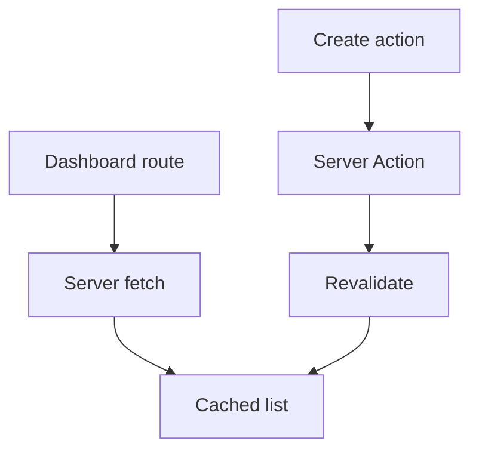

# Thực Hành: Dashboard Dữ Liệu Với Cached Reads và Write Flows

[<- Quay lại Tuần 10 - Data Fetching và Rendering trong Next.js](./README.md)

## Vì sao bài này quan trọng

Bài thực hành tuần 10 nên tạo một dashboard có danh sách entity, create/update action, loading states và data freshness policy rõ ràng. Đây là nơi tất cả khái niệm rendering của App Router bắt đầu dính vào bài toán sản phẩm thực.

## Điều kiện trước

- Đã học hoặc đọc các khái niệm nền của Data Fetching và Rendering trong Next.js.
- Sẵn sàng ghi chú lại trade-off và câu hỏi thực chiến thay vì chỉ ghi nhớ định nghĩa.

## Core concepts

- dashboard state
- server actions
- cache policy

## Giải thích chi tiết

Bài thực hành tuần 10 nên tạo một dashboard có danh sách entity, create/update action, loading states và data freshness policy rõ ràng. Đây là nơi tất cả khái niệm rendering của App Router bắt đầu dính vào bài toán sản phẩm thực.

Nên chọn một entity cụ thể như invoices, projects hoặc orders.

Viết rõ route nào dynamic, route nào cache được.

Sau bài này, bạn nên có nền đủ chắc để gắn auth và DB ở tuần 11.

## Sơ đồ

## Common mistakes

- Nhớ tên khái niệm nhưng không gắn nó với một bài toán sản phẩm cụ thể trong bài “Thực Hành: Dashboard Dữ Liệu Với Cached Reads và Write Flows”.
- Tối ưu hoặc trừu tượng hóa quá sớm trước khi đo, trước khi nhìn rõ boundary và trước khi hiểu cost thật.
- Chỉ học cú pháp mà không mô tả được dòng chảy dữ liệu, trạng thái và trách nhiệm của từng tầng.

## Performance / debugging notes

- Khi debug, hãy luôn hỏi: điều gì kích hoạt thay đổi, điều gì thực sự tốn chi phí, và chi phí đó xảy ra ở client, server hay network.
- Ghi lại giả thuyết trước khi sửa. Sau đó đo lại để biết tối ưu có hiệu quả thật hay chỉ làm code phức tạp hơn.
- Nếu một vấn đề lặp lại nhiều lần, hãy nâng nó thành quy ước kiến trúc hoặc checklist cho dự án sau.

## Bài tập thực hành

1. Viết lại bằng lời của bạn mental model cho bài “Thực Hành: Dashboard Dữ Liệu Với Cached Reads và Write Flows” mà không nhìn tài liệu.
2. Tạo một ví dụ nhỏ trong codebase hoặc sandbox để nhìn thấy hành vi của khái niệm này thay vì chỉ đọc mô tả.
3. Ghi lại ít nhất 3 trade-off hoặc quyết định kiến trúc bạn sẽ áp dụng nếu xây một app thật.

## Review checklist

- Bạn có thể giải thích được bài “Thực Hành: Dashboard Dữ Liệu Với Cached Reads và Write Flows” bằng ngôn ngữ của riêng mình.
- Bạn biết khái niệm nào là nền tảng, khái niệm nào là optimization, và khái niệm nào là production concern.
- Bạn có thể chỉ ra ít nhất một ví dụ thực tế nơi bài học này tạo khác biệt rõ ràng cho UX hoặc maintainability.

## Further reading / sources

- https://nextjs.org/docs/app/getting-started/caching-and-revalidating
- https://nextjs.org/docs/app/building-your-application/data-fetching
- https://react.dev/reference/react/Suspense
