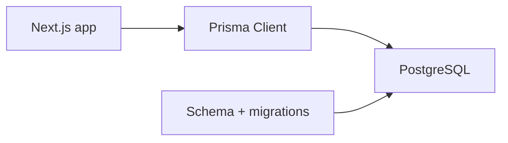

# Tích Hợp PostgreSQL + Prisma

[<- Quay lại Tuần 11 - Auth, Database và System Flows](./README.md)

## Vì sao bài này quan trọng

CSDL quan hệ là xương sống của nhiều SaaS systems. Prisma mang đến typed client và workflow migrations rõ ràng, nhưng điều quan trọng hơn là bạn model domain theo access patterns và authorization rules.

## Điều kiện trước

- Đã học hoặc đọc các khái niệm nền của Auth, Database và System Flows.
- Sẵn sàng ghi chú lại trade-off và câu hỏi thực chiến thay vì chỉ ghi nhớ định nghĩa.

## Core concepts

- schema design
- migrations
- typed data access

## Giải thích chi tiết

CSDL quan hệ là xương sống của nhiều SaaS systems. Prisma mang đến typed client và workflow migrations rõ ràng, nhưng điều quan trọng hơn là bạn model domain theo access patterns và authorization rules.

Schema phải phục vụ query pattern thật.

Migration discipline quan trọng khi nhiều môi trường cùng tồn tại.

Không nên để business constraints chỉ nằm ở UI.

## Sơ đồ



## Code ví dụ

```prisma
model Project {
  id          String   @id @default(cuid())
  name        String
  ownerUserId String
  createdAt   DateTime @default(now())
}
```

## Common mistakes

- Nhớ tên khái niệm nhưng không gắn nó với một bài toán sản phẩm cụ thể trong bài “Tích Hợp PostgreSQL + Prisma”.
- Tối ưu hoặc trừu tượng hóa quá sớm trước khi đo, trước khi nhìn rõ boundary và trước khi hiểu cost thật.
- Chỉ học cú pháp mà không mô tả được dòng chảy dữ liệu, trạng thái và trách nhiệm của từng tầng.

## Performance / debugging notes

- Khi debug, hãy luôn hỏi: điều gì kích hoạt thay đổi, điều gì thực sự tốn chi phí, và chi phí đó xảy ra ở client, server hay network.
- Ghi lại giả thuyết trước khi sửa. Sau đó đo lại để biết tối ưu có hiệu quả thật hay chỉ làm code phức tạp hơn.
- Nếu một vấn đề lặp lại nhiều lần, hãy nâng nó thành quy ước kiến trúc hoặc checklist cho dự án sau.

## Bài tập thực hành

1. Viết lại bằng lời của bạn mental model cho bài “Tích Hợp PostgreSQL + Prisma” mà không nhìn tài liệu.
2. Tạo một ví dụ nhỏ trong codebase hoặc sandbox để nhìn thấy hành vi của khái niệm này thay vì chỉ đọc mô tả.
3. Ghi lại ít nhất 3 trade-off hoặc quyết định kiến trúc bạn sẽ áp dụng nếu xây một app thật.

## Review checklist

- Bạn có thể giải thích được bài “Tích Hợp PostgreSQL + Prisma” bằng ngôn ngữ của riêng mình.
- Bạn biết khái niệm nào là nền tảng, khái niệm nào là optimization, và khái niệm nào là production concern.
- Bạn có thể chỉ ra ít nhất một ví dụ thực tế nơi bài học này tạo khác biệt rõ ràng cho UX hoặc maintainability.

## Further reading / sources

- https://authjs.dev/getting-started
- https://www.prisma.io/docs/guides/nextjs
- https://zod.dev/
- https://vercel.com/docs/storage
