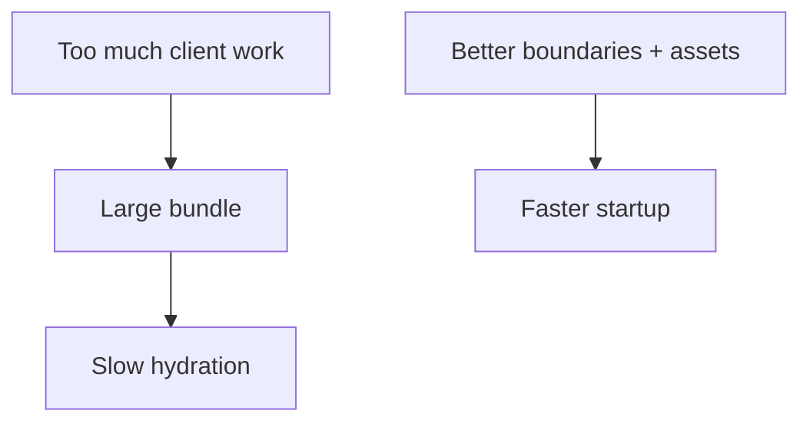

# Performance Tuning: RSC Boundaries, Bundles, Images và Fonts

[<- Quay lại Tuần 12 - Production Architecture với Next.js](./README.md)

## Vì sao bài này quan trọng

Hiệu năng của Next.js không chỉ ở một kỹ thuật đơn lẻ. Nó là tổng hòa giữa boundary server/client, kích thước bundle, chiến lược ảnh, font loading và mức độ interactivity trên từng route.

## Điều kiện trước

- Đã học hoặc đọc các khái niệm nền của Production Architecture với Next.js.
- Sẵn sàng ghi chú lại trade-off và câu hỏi thực chiến thay vì chỉ ghi nhớ định nghĩa.

## Core concepts

- bundle budget
- RSC islands
- asset delivery

## Giải thích chi tiết

Hiệu năng của Next.js không chỉ ở một kỹ thuật đơn lẻ. Nó là tổng hòa giữa boundary server/client, kích thước bundle, chiến lược ảnh, font loading và mức độ interactivity trên từng route.

Giảm client JavaScript thường cho lợi ích lớn nhất.

Fonts và images có thể phá startup performance nếu tải sai.

Performance budget nên được định nghĩa sớm.

## Sơ đồ

## Common mistakes

- Nhớ tên khái niệm nhưng không gắn nó với một bài toán sản phẩm cụ thể trong bài “Performance Tuning: RSC Boundaries, Bundles, Images và Fonts”.
- Tối ưu hoặc trừu tượng hóa quá sớm trước khi đo, trước khi nhìn rõ boundary và trước khi hiểu cost thật.
- Chỉ học cú pháp mà không mô tả được dòng chảy dữ liệu, trạng thái và trách nhiệm của từng tầng.

## Performance / debugging notes

- Khi debug, hãy luôn hỏi: điều gì kích hoạt thay đổi, điều gì thực sự tốn chi phí, và chi phí đó xảy ra ở client, server hay network.
- Ghi lại giả thuyết trước khi sửa. Sau đó đo lại để biết tối ưu có hiệu quả thật hay chỉ làm code phức tạp hơn.
- Nếu một vấn đề lặp lại nhiều lần, hãy nâng nó thành quy ước kiến trúc hoặc checklist cho dự án sau.

## Bài tập thực hành

1. Viết lại bằng lời của bạn mental model cho bài “Performance Tuning: RSC Boundaries, Bundles, Images và Fonts” mà không nhìn tài liệu.
2. Tạo một ví dụ nhỏ trong codebase hoặc sandbox để nhìn thấy hành vi của khái niệm này thay vì chỉ đọc mô tả.
3. Ghi lại ít nhất 3 trade-off hoặc quyết định kiến trúc bạn sẽ áp dụng nếu xây một app thật.

## Review checklist

- Bạn có thể giải thích được bài “Performance Tuning: RSC Boundaries, Bundles, Images và Fonts” bằng ngôn ngữ của riêng mình.
- Bạn biết khái niệm nào là nền tảng, khái niệm nào là optimization, và khái niệm nào là production concern.
- Bạn có thể chỉ ra ít nhất một ví dụ thực tế nơi bài học này tạo khác biệt rõ ràng cho UX hoặc maintainability.

## Further reading / sources

- https://nextjs.org/docs/app/building-your-application/optimizing
- https://nextjs.org/docs/app/guides/testing
- https://nextjs.org/docs/app/guides/open-telemetry
- https://vercel.com/docs
