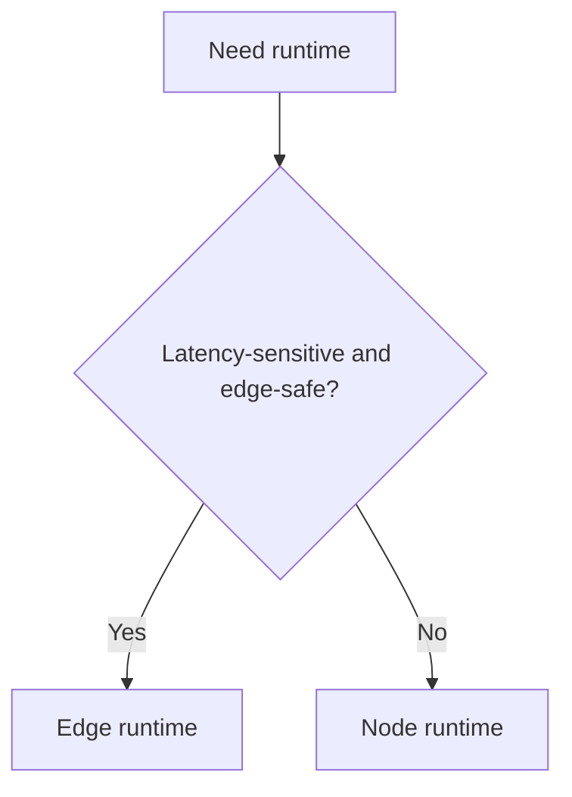

# Edge vs Node Runtime

[<- Quay lại Tuần 12 - Production Architecture với Next.js](./README.md)

## Vì sao bài này quan trọng

Edge runtime hấp dẫn vì latency thấp và phân phối toàn cầu, nhưng không phải route nào cũng hợp. Node runtime vẫn là lựa chọn đúng cho nhiều workload cần compatibility hoặc xử lý nặng hơn.

## Điều kiện trước

- Đã học hoặc đọc các khái niệm nền của Production Architecture với Next.js.
- Sẵn sàng ghi chú lại trade-off và câu hỏi thực chiến thay vì chỉ ghi nhớ định nghĩa.

## Core concepts

- latency
- compatibility
- workload fit

## Giải thích chi tiết

Edge runtime hấp dẫn vì latency thấp và phân phối toàn cầu, nhưng không phải route nào cũng hợp. Node runtime vẫn là lựa chọn đúng cho nhiều workload cần compatibility hoặc xử lý nặng hơn.

Chọn runtime theo workload chứ không theo hype.

Kiểm tra compatibility của thư viện và APIs trước khi quyết định.

Một app thực thường dùng cả Edge lẫn Node ở các vùng khác nhau.

## Sơ đồ

## Common mistakes

- Nhớ tên khái niệm nhưng không gắn nó với một bài toán sản phẩm cụ thể trong bài “Edge vs Node Runtime”.
- Tối ưu hoặc trừu tượng hóa quá sớm trước khi đo, trước khi nhìn rõ boundary và trước khi hiểu cost thật.
- Chỉ học cú pháp mà không mô tả được dòng chảy dữ liệu, trạng thái và trách nhiệm của từng tầng.

## Performance / debugging notes

- Khi debug, hãy luôn hỏi: điều gì kích hoạt thay đổi, điều gì thực sự tốn chi phí, và chi phí đó xảy ra ở client, server hay network.
- Ghi lại giả thuyết trước khi sửa. Sau đó đo lại để biết tối ưu có hiệu quả thật hay chỉ làm code phức tạp hơn.
- Nếu một vấn đề lặp lại nhiều lần, hãy nâng nó thành quy ước kiến trúc hoặc checklist cho dự án sau.

## Bài tập thực hành

1. Viết lại bằng lời của bạn mental model cho bài “Edge vs Node Runtime” mà không nhìn tài liệu.
2. Tạo một ví dụ nhỏ trong codebase hoặc sandbox để nhìn thấy hành vi của khái niệm này thay vì chỉ đọc mô tả.
3. Ghi lại ít nhất 3 trade-off hoặc quyết định kiến trúc bạn sẽ áp dụng nếu xây một app thật.

## Review checklist

- Bạn có thể giải thích được bài “Edge vs Node Runtime” bằng ngôn ngữ của riêng mình.
- Bạn biết khái niệm nào là nền tảng, khái niệm nào là optimization, và khái niệm nào là production concern.
- Bạn có thể chỉ ra ít nhất một ví dụ thực tế nơi bài học này tạo khác biệt rõ ràng cho UX hoặc maintainability.

## Further reading / sources

- https://nextjs.org/docs/app/building-your-application/optimizing
- https://nextjs.org/docs/app/guides/testing
- https://nextjs.org/docs/app/guides/open-telemetry
- https://vercel.com/docs
